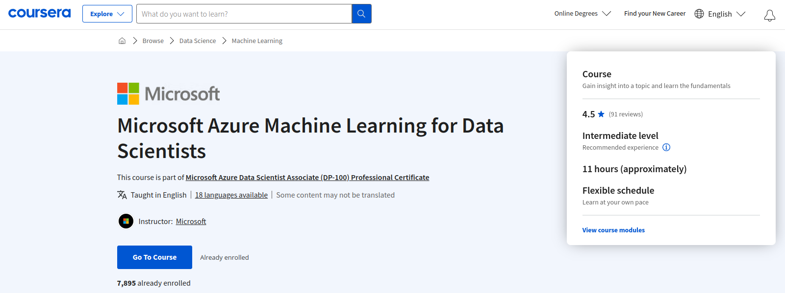

# Microsoft Azure Machine Learning for Data Scientists

Este curso es parte del [Certificado Profesional de Microsoft Azure Data Scientist Associate (DP-100)](https://www.coursera.org/professional-certificates/azure-data-scientist).



Al inscribirte en [este curso](https://www.coursera.org/learn/microsoft-azure-machine-learning-for-data-scientist?specialization=azure-data-scientist), también estarás inscrito en este Certificado Profesional.
- Aprende nuevos conceptos de expertos de la industria.
- Obtén una comprensión fundamental de un tema o herramienta.
- Desarrolla habilidades relevantes para el trabajo con proyectos prácticos.
- Obtén un certificado profesional compartible de Microsoft.

## INTRODUCTION

El aprendizaje automático está en el núcleo de la inteligencia artificial, y muchas aplicaciones y servicios modernos dependen de modelos predictivos de aprendizaje automático. Entrenar un modelo de aprendizaje automático es un proceso iterativo que requiere tiempo y recursos informáticos. El aprendizaje automático automatizado puede facilitar este proceso. En este curso, aprenderás cómo utilizar Azure Machine Learning para crear y publicar modelos sin necesidad de escribir código.

Este es el segundo curso en un programa de cinco cursos que te prepara para realizar el examen de certificación DP-100: Designing and Implementing a Data Science Solution on Azure.

El examen de certificación es una oportunidad para demostrar conocimientos y experiencia en la operación de soluciones de aprendizaje automático a escala en la nube utilizando Azure Machine Learning. Esta especialización te enseña a aprovechar tus conocimientos existentes de Python y aprendizaje automático para gestionar la ingestión y preparación de datos, el entrenamiento y la implementación de modelos, y la supervisión de soluciones de aprendizaje automático en Microsoft Azure. Cada curso te enseña los conceptos y habilidades que se evalúan en el examen.

Esta especialización está destinada a científicos de datos con conocimientos previos de Python y marcos de aprendizaje automático como Scikit-Learn, PyTorch y Tensorflow, que desean construir y operar soluciones de aprendizaje automático en la nube. Enseña a los científicos de datos cómo crear soluciones de extremo a extremo en Microsoft Azure. Los estudiantes aprenderán a gestionar los recursos de Azure para el aprendizaje automático; ejecutar experimentos y entrenar modelos; implementar y operacionalizar soluciones de aprendizaje automático, e implementar un aprendizaje automático responsable. También aprenderán a utilizar Azure Databricks para explorar, preparar y modelar datos; e integrar los procesos de aprendizaje automático de Databricks con Azure Machine Learning.

## 0 INDICE:

- [1 Welcome to the Course](#1-welcome-to-the-course)
- [2 Azure Machine Learning to Train and Deploy a Predictive Model](#2-azure-machine-learning-to-train-and-deploy-a-predictive-model)
- [3 Create a Regression Model with Azure Machine Learning Designer](#3-create-a-regression-model-with-azure-machine-learning-designer)
- [4 Create a Classification Model with Azure Machine Learning Designer](#4-create-a-classification-model-with-azure-machine-learning-designer)
- [5 Create a Clustering Model with Azure Machine Learning Designer](#5-create-a-clustering-model-with-azure-machine-learning-designer)
- [6 Course Wrap-Up](#6-course-wrap-up)

# 1 Welcome to the Course 
[<-HOME](#0-indice)

## INDICE:

- [Introduction to Create No-code Predictive Models with Azure Machine Learning](#introduction-to-create-no-code-predictive-models-with-azure-machine-learning)
- [Course Syllabus](#course-syllabus)
- [How to be successful in this course](#how-to-be-successful-in-this-course)
- [How Does Machine Learning Influence Your Day-to-day Life?](#how-does-machine-learning-influence-your-day-to-day-life)

## Introduction to Create No-code Predictive Models with Azure Machine Learning


Hola y bienvenidos. Este curso tiene como objetivo ayudarlo a aprender cómo usar Microsoft Azure Machine Learning para crear y publicar máquinas modelos de aprendizaje sin escribir código. El aprendizaje automático de Microsoft Azure es un servicio basado en la nube con una amplia gama de funciones y capacidades que ayudan a los datos los científicos preparan datos, entrenan modelos, publican servicios predictivos, y supervisan su uso. 


En este curso, explorarás las siguientes lecciones. Aprendizaje automático de Microsoft Azure para entrenar e implementar un modelo predictivo, crear un modelo de regresión, crear un modelo de clasificación y cree un modelo de agrupamiento en clústeres con Azure AI. 


También trabajarás en una serie de ejercicios prácticos. Al completar los ejercicios, estarás puede crear modelos predictivos sin código con Azure Machine Learning. 


Este enfoque práctico le ayudará en tu preparación para el examen AI 900. Para completar los ejercicios prácticos, utilizarás un espacio de trabajo de Azure Machine Learning. A continuación, puede usar este espacio de trabajo para administrar datos, recursos informáticos, modelos de código y otros artefactos relacionados con su cargas de trabajo de aprendizaje automático. 


Para usar Azure Machine Learning, crea un espacio de trabajo en su Suscripción a Microsoft Azure. Si aún no tienes una cuenta de Azure suscripción, puede registrarse para obtener una prueba gratuita accediendo a Microsoft página web de Azure o mediante el enlace proporcionado. 


Tendrás acceso al proceso sobre cómo para limpiar al final de cada lección. También tendrás la oportunidad de completar verificaciones de conocimiento que lo mantendrán en el buen camino y le permitirán saber cómo está lo que está haciendo y lo que ha aprendido hasta ahora. Y preguntas de preparación para el examen, que tú puede utilizarlas para comprobar su progreso y prepararse eficazmente para el examen AI 900. 

## Course Syllabus

### Programa del curso

Este curso tiene como objetivo ayudarle a aprender más sobre Microsoft Azure Machine Learning. El aprendizaje automático es 
la base de las soluciones modernas de IA. En este curso, aprenderá algunos conceptos fundamentales del aprendizaje automático 
y a utilizar el servicio Azure Machine Learning para crear y publicar modelos de aprendizaje automático. Este curso forma 
parte de la preparación para el examen AI 900. Cuando apruebe el examen AI-900, obtendrá la certificación Microsoft 
Certified Azure AI Fundamentals.


### Módulo 1: Azure Machine Learning para entrenar y desplegar un modelo predictivo

En esta lección, aprenderá algunos conceptos fundamentales del aprendizaje automático y a utilizar el servicio Azure 
Machine Learning para crear y publicar modelos de aprendizaje automático. Tras completar esta lección, será capaz de: 

1) Identificar los diferentes tipos de modelos de aprendizaje automático; 
2) Utilizar la capacidad de aprendizaje automático automatizado de Azure Machine Learning para entrenar y desplegar un modelo predictivo.

### Módulo 2: Crear un modelo de regresión con Azure AI

En esta lección, aprenderá a entrenar y publicar un modelo de regresión con el diseñador de Azure Machine Learning sin 
necesidad de escribir ningún código. Tras completar esta lección, será capaz de: 

1) Utilizar Azure Machine Learning designer para entrenar un modelo de regresión; 
2) Utilizar un modelo de regresión para inferencias; 
3) Desplegar un modelo de regresión como servicio.


### Módulo 3: Crear un modelo de clasificación con Azure AI

En esta lección, aprenderá a entrenar y publicar un modelo de clasificación con el diseñador de Azure Machine Learning. 
Tras completar esta lección, será capaz de: 

1) Utilizar el diseñador de Azure Machine Learning para entrenar un modelo de clasificación; 
2) Utilizar un modelo de clasificación para inferencias; 
3) Desplegar un modelo de clasificación como servicio.


### Módulo 4: Crear un modelo de agrupación con Azure AI

En esta lección, aprenderá a entrenar y publicar un modelo de agrupación con el diseñador de Azure Machine Learning. 
Tras completar esta lección, será capaz de: 

1) Utilizar el diseñador de Azure Machine Learning para entrenar un modelo de agrupamiento; 
2) Utilizar un modelo de agrupamiento para inferencias; 
3) Desplegar un modelo de agrupamiento como servicio.

4) 

### Ejercicios prácticos

En este curso hay una serie de ejercicios prácticos. Le animamos a que complete estos ejercicios para ayudarle a adquirir 
más conocimientos sobre Azure y los modelos de aprendizaje automático. Al completar los ejercicios, obtendrá una comprensión 
más práctica sobre cómo crear modelos predictivos sin código con Azure Machine Learning. Este enfoque práctico le ayudará 
en su preparación para el examen AI 900.

### Crear un espacio de trabajo de Azure Machine Learning

Para completar los ejercicios prácticos, hará uso de un espacio de trabajo de Azure Machine Learning. Para utilizar Azure 
Machine Learning, deberá crear un espacio de trabajo en su suscripción Azure. A continuación, podrá utilizar este espacio 
de trabajo para gestionar datos, recursos informáticos, código, modelos y otros artefactos relacionados con sus cargas 
de trabajo de aprendizaje automático.

También necesitará una suscripción a Microsoft Azure . Si aún no tiene una, puede inscribirse para una prueba gratuita en
https://azure.microsoft.com/. Puede encontrar más información sobre cómo obtener una suscripción a Azure más adelante en este curso.

### Limpieza

Después de completar cada lección, asegúrese de seguir las instrucciones de Limpieza al final de la lección para detener 
los recursos de computación.

> Nota: Si decide no completar este curso, asegúrese de detener su instancia de computación. Si está utilizando su 
> suscripción Azure existente, esto le ayudará a evitar incurrir en cargos innecesarios.

## Actividades Prácticas y Ejercicios

Participará en ejercicios interactivos a lo largo de este programa. Esta actividad práctica le ofrece oportunidades para 
practicar y poner en práctica lo aprendido. Dependiendo del curso, podrá utilizar Microsoft Learn Sandbox, trabajar 
directamente con servicios y recursos en el Portal de Microsoft Azure, operar en modo VM, utilizar un entorno de código 
Python en Visual Studio Code y utilizar archivos de laboratorio de GitHub. Explorará Microsoft Azure y obtendrá experiencia 
práctica trabajando con recursos y servicios de Microsoft Azure en vivo. Trabajará en tiempo real con tecnología real, 
pero en un entorno controlado, lo que le permitirá aplicar con seguridad lo aprendido a su propio ritmo.

### Cuenta Microsoft

Necesita una cuenta Microsoft para iniciar sesión en el Sandbox, el portal Azure y otros servicios. Si no tiene una cuenta, 
puede crear una de forma gratuita. El Learn Sandbox permite el acceso gratuito y por tiempo determinado a una suscripción 
en la nube sin necesidad de tarjeta de crédito. Los alumnos pueden explorar, crear y gestionar recursos de forma segura 
sin temor a incurrir en costes o "romper la producción".

### VOIP no disponible para el registro de cuentas Microsoft

No se puede utilizar directamente un número de teléfono de voz sobre IP (VoiP) durante el proceso de verificación del 
teléfono de la cuenta. Compruebe que el teléfono que está utilizando puede recibir llamadas y mensajes SMS de un número 
de teléfono con sede en Estados Unidos.

### Verificación por SMS de la cuenta Microsoft

El proceso de creación de la cuenta Microsoft puede utilizar la validación por SMS, enviando un mensaje de texto a su teléfono. 
Si no dispone de un teléfono para someterse a la verificación, puede pedir a un familiar o a un amigo que utilice su teléfono 
para completar este paso. Si no tiene acceso a la mensajería de texto SMS puede llamar por teléfono a Al soporte de Microsoft 
de su región el soporte de Microsoft podrá verificar su cuenta en tiempo real sin necesidad de SMS.

### Solucione los problemas del proceso de registro de su nueva cuenta

En la mayoría de los casos, el registro de la cuenta Azure es un proceso sencillo y sin problemas. Si necesita más información 
sobre el registro de una nueva cuenta en el portal Azure o en el centro de cuentas Azure, visite el Sitio web de 
Microsoft - Solucionar problemas de registro de cuentas nuevas.

## How to be successful in this course

Hacer un curso en línea puede resultar abrumador. ¿Cómo puede aprender a su propio ritmo y alcanzar con éxito sus objetivos?

He aquí algunos consejos generales que pueden ayudarle a mantenerse centrado y en el buen camino:

#### 1: Fíjese objetivos diarios de estudio
Pregúntese qué espera conseguir en su curso cada día. Establecer un objetivo claro puede ayudarle a mantenerse motivado y 
a vencer la procrastinación. El objetivo debe ser específico y fácil de medir, como "Veré todos los vídeos del módulo 2 
y completaré la primera tarea de programación" Y no olvide recompensarse cuando avance hacia su objetivo.

### 2: Cree un espacio dedicado al estudio
Es más fácil recordar la información si se está en el mismo lugar donde se aprendió por primera vez, por lo que tener un 
espacio dedicado en casa para tomar cursos en línea puede hacer que su aprendizaje sea más eficaz. Elimine cualquier 
distracción del espacio y, si es posible, sepárelo de su cama o sofá. Una clara distinción entre el lugar donde estudia 
y el lugar donde se toma los descansos puede ayudarle a concentrarse.

### 3: Programe tiempo para estudiar en su calendario
Abra su calendario y elija un horario predecible y fiable que pueda dedicar a ver las clases y completar las tareas. 
Esto le ayudará a asegurarse de que sus cursos no se conviertan en la última cosa de su lista de tareas.

> Consejo: Puede añadir las fechas límite de un curso de Coursera su calendario de Google, al calendario de Apple o a otra aplicación de calendario.

### 4: Hágase responsable
Cuénteles a sus amigos los cursos que está realizando, publique sus logros en sus cuentas de las redes sociales o publique 
en un blog sus tareas. Contar con una comunidad y una red de apoyo de amigos y familiares que le animen marca la diferencia.

### 5: Tome notas activamente
Tomar apuntes puede fomentar el pensamiento activo, impulsar la comprensión y ampliar su capacidad de atención. Es una 
buena estrategia para interiorizar los conocimientos tanto si aprende en línea como en el aula. Así pues, coja un cuaderno 
o encuentre la aplicación digital que mejor se adapte a usted y empiece a sintetizar los puntos clave.

> Consejo: Mientras ve una clase en Coursera, puede hacer clic en el botón "Guardar nota" situado debajo del vídeo para guardar una captura de pantalla en sus notas del curso y añadir sus propios comentarios.

### 6: Únase a la discusión
Los foros de discusión del curso son un lugar estupendo para hacer preguntas sobre las tareas, discutir temas, compartir 
recursos y hacer amigos. Nuestras investigaciones demuestran que los alumnos que participan en los foros de debate tienen 
un 37% más de probabilidades de completar un curso. Así que ¡haga un post hoy mismo!

### 7: Haga una cosa cada vez
La multitarea es menos productiva que centrarse en una sola tarea a la vez. Investigadores de la Universidad de Stanford 
descubrieron que "las personas que son bombardeadas regularmente con varios flujos de información electrónica no pueden 
prestar atención, recordar información o cambiar de un trabajo a otro tan bien como los que completan una tarea a la vez" 
Concéntrese en una cosa cada vez. Absorberá más información y completará las tareas con mayor productividad y facilidad 
que si intentara hacer muchas cosas a la vez.

### 8: Tómese descansos
Descansar el cerebro después de aprender es fundamental para un alto rendimiento. Si se encuentra trabajando en un problema 
difícil sin avanzar mucho durante una hora, tómese un descanso. Caminar al aire libre, darse una ducha o hablar con un amigo 
puede re-energizarle e incluso darle nuevas ideas sobre cómo abordar ese proyecto.

¡Su viaje de aprendizaje de Microsoft Azure comienza ahora!
Mientras se prepara para el examen o trabaja en la consecución de sus objetivos de aprendizaje, le animamos a:

- Revise las directrices del examen y las habilidades medidas como punto de partida.
- Trabaje a través de cada lección del itinerario de aprendizaje. 
- Intente no saltarse ninguna actividad o lección a menos que esté seguro de que ya conoce esta información lo suficientemente bien como para seguir adelante.
- Aproveche la oportunidad para volver atrás y ver un vídeo o leer la información adicional que se le proporcione antes de pasar a la siguiente lección o módulo.
- Complete todos los cuestionarios, las preguntas de práctica del examen y los ejercicios. Durante las sesiones de práctica, tendrá la oportunidad de volver a repasar las preguntas para asegurarse de que está satisfecho con su progreso.
- Lea atentamente los comentarios cuando responda a los cuestionarios o a los exámenes prácticos, ya que le ayudarán a reforzar lo que está aprendiendo.

Aproveche el entorno de aprendizaje práctico que le proporcionan los ejercicios. Podrá obtener un refuerzo sustancial de su aprendizaje mediante la aplicación paso a paso de sus conocimientos.

## How Does Machine Learning Influence Your Day-to-day Life?

Hoy en día, los ejemplos de aprendizaje automático nos rodean por todas partes. Los sitios web recomiendan productos, películas y música basándose en lo que hemos comprado, visto o escuchado anteriormente

¿Ha utilizado alguna vez el etiquetado de caras? Esta capacidad está presente en varias aplicaciones que muestran imágenes con rostros humanos y es un ejemplo típico de aprendizaje automático

¿Qué ejemplos de aprendizaje automático ha encontrado en su vida cotidiana que le hayan resultado útiles o quizá intrusivos?

¿Puede citar un ejemplo de aplicación positiva y negativa del aprendizaje automático que haya encontrado? Describa la aplicación y por qué cree que funciona bien o por qué la experiencia le ha parecido negativa

A medida que continúe su investigación, puede que también quiera investigar temas como el aprendizaje automático en

- Medios sociales

- Transporte automatizado

- Asistentes digitales

Comparta sus ideas con sus compañeros y vea lo que piensan otras personas sobre el aprendizaje automático y su influencia en nuestra vida cotidiana

# 2 Azure Machine Learning to Train and Deploy a Predictive Model 
[<-HOME](#0-indice)

## INDICE:

- [Azure Machine Learning to Train and Deploy a Predictive Model](#azure-machine-learning-to-train-and-deploy-a-predictive-model)
- [Azure Machine Learning](#azure-machine-learning)
- [2 Exercise Part 1: Create a Microsoft Azure Machine Learning Workspace](#2-exercise-part-1-create-a-microsoft-azure-machine-learning-workspace)
- [2 Exercise Part 2: Create Compute Resources](#2-exercise-part-2-create-compute-resources)
- [2 Exercise Part 3: Explore Data](#2-exercise-part-3-explore-data)
- [2 Exercise Part 4: Train a Machine Learning Model](#2-exercise-part-4-train-a-machine-learning-model)
- [2 Exercise Part 5: Deploy a Model as a Service](#2-exercise-part-5-deploy-a-model-as-a-service)
- [2 Exercise Part 6: Clean-up](#2-exercise-part-6-clean-up)
- [2 Exercise Quiz 1](#2-exercise-quiz-1)
- [2 Knowledge Check 1](#2-knowledge-check-1)
- [2 Test Prep 1](#2-test-prep-1)
- [2 Weekly Summary](#2-weekly-summary)

## Azure Machine Learning to Train and Deploy a Predictive Model


Bienvenido, en esta lección veremos cómo entrenar y desplegar un modelo predictivo en el aprendizaje automático de Microsoft Azure. 
Después de completar esta lección, será capaz de identificar diferentes tipos de modelos de aprendizaje automático. 
Y utilizar la capacidad de aprendizaje automático de Azure machine learning para entrenar e implantar un modelo predictivo. 


¿Qué es el aprendizaje automático? El aprendizaje automático es una técnica que utiliza las matemáticas y la estadística 
para crear un modelo que pueda predecir valores desconocidos. Es la base de la mayoría de las soluciones de inteligencia 
artificial. La creación de una solución de inteligencia artificial suele comenzar con el uso del aprendizaje automático 
para entrenar un modelo predictivo utilizando datos históricos que haya recopilado. 


Entrenar y desplegar un modelo de aprendizaje automático eficaz implica mucho trabajo. Puede ser un proceso que consuma 
mucho tiempo y recursos. Azure machine learning es un servicio basado en la nube con una amplia gama de funciones y 
capacidades que ayudan a los científicos de datos a preparar datos, entrenar modelos, publicar servicios predictivos y 
supervisar su uso. Y lo que es más importante, ayuda a los científicos de datos a aumentar su eficiencia automatizando 
muchas de las tareas asociadas al entrenamiento de modelos que consumen mucho tiempo


Por ejemplo, supongamos que Adventure Work Cycles es una empresa que alquila bicicletas. Para asegurarse de que siempre 
hay suficiente personal y bicicletas disponibles, la empresa podría utilizar datos históricos para entrenar un modelo que 
predijera la demanda diaria de alquiler Para ello, la empresa podría crear un modelo de aprendizaje automático que tome 
información sobre un día concreto, el día de la semana, las condiciones meteorológicas previstas, etc., como entrada. 

A continuación, el modelo predice el número previsto de alquileres como salida. Más adelante, verá más sobre cómo Adventure 
Work Cycles podría utilizar un modelo de aprendizaje automático. En el resto de esta lección, explorará el aprendizaje 
automático de Azure y, en particular, su capacidad de aprendizaje automático automatizado

## Azure Machine Learning

Tipos de modelos de Machine Learning:

### Supervisado:

**Regresión**: En este tipo de modelo, se busca predecir un valor numérico a partir de un conjunto de variables de entrada. 
Por ejemplo, una tienda de bicicletas podría utilizar la regresión para predecir cuántas bicicletas se alquilarán en un día 
en función de variables como el clima, la temperatura, el día de la semana, etc.


- **Features (X)**: Las características o variables independientes podrían incluir el clima (temperatura, humedad, condiciones meteorológicas), el día de la semana, la estación del año, la disponibilidad de bicicletas, etc.
- **Salida (Y)**: La variable de salida (o variable dependiente) en este caso es el número de bicicletas alquiladas en un día determinado. Y es una variable numérica que representa la cantidad de alquileres de bicicletas.


**Clasificación**: En un problema de clasificación, el objetivo es etiquetar o clasificar elementos en categorías o clases. Un ejemplo común es el diagnóstico de enfermedades, como la detección de diabetes en pacientes, donde el modelo clasifica a los pacientes en "diabéticos" o "no diabéticos" en función de características médicas.


- **Features (X)**: Las características incluyen datos médicos de los pacientes, como niveles de glucosa en sangre, edad, índice de masa corporal (IMC), historia familiar de diabetes, etc.
- **Salida (Y):** La variable de salida (Y) es una etiqueta binaria que clasifica a los pacientes en "diabéticos" (1) o "no diabéticos" (0). La clasificación es el objetivo y la variable Y es categórica.


### No supervisado:

**Clustering**: En el clustering, se agrupan datos en clústeres o grupos similares sin etiquetas predefinidas. Un ejemplo podría ser la clasificación de diferentes tipos de flores en función de características como el tamaño de los pétalos y sépalos, donde el modelo agrupa las flores en clústeres según su similitud.


- **Features (X):** En este caso, las características incluyen mediciones morfológicas de flores, como longitud de pétalos, ancho de pétalos, longitud de sépalos y ancho de sépalos.
- **Salida (Y):** En el clustering, no hay una salida específica Y, ya que se trata de un proceso no supervisado. El objetivo es agrupar las flores en clústeres sin etiquetas predefinidas. Cada flor se asigna a un clúster en función de su similitud con otras flores en el mismo grupo.

## Proceso General de Machine Learning:

1. **Data Ingestion:** En esta etapa, se recopilan los datos necesarios para el problema de machine learning. Esto puede involucrar la obtención de datos de diversas fuentes, como bases de datos, sensores, o archivos.

2. **Explore Data:** Se realiza un análisis exploratorio de los datos para comprender su estructura y características. Esto incluye visualizar los datos, calcular estadísticas descriptivas y detectar posibles valores atípicos o anomalías.

3. **Data Pre-processing:** En esta fase, los datos se preparan para su uso en el modelo. Esto puede incluir la eliminación de valores faltantes, la normalización de datos, la codificación de variables categóricas y la división de los datos en conjuntos de entrenamiento y prueba.

    

4. **Clean the Data:** Se realizan tareas de limpieza de datos, como la corrección de errores, la eliminación de duplicados y la manipulación de datos ruidosos o inconsistentes.

5. **Train a Model:** En esta etapa, se selecciona un algoritmo de machine learning apropiado y se entrena el modelo utilizando los datos de entrenamiento. El modelo aprende a hacer predicciones o clasificaciones basadas en los patrones presentes en los datos.

6. **Evaluate Performance:** Una vez que el modelo está entrenado, se evalúa su rendimiento utilizando datos de prueba o validación. Se utilizan métricas adecuadas para medir su precisión, como la precisión, el error cuadrático medio o el área bajo la curva ROC, según el tipo de problema.

7. **Deploy it to a Service:** Si el modelo muestra un rendimiento satisfactorio, se puede desplegar en un entorno de producción para su uso continuo. Esto implica integrar el modelo en una aplicación o servicio para que pueda tomar decisiones en tiempo real.

## 2 Exercise Part 1: Create a Microsoft Azure Machine Learning Workspace

Los científicos de datos invierten mucho esfuerzo explorando y pre-procesando datos, y probando varios tipos de algoritmos 
de entrenamiento de modelos para producir modelos precisos, lo que consume mucho tiempo y a menudo hace un uso ineficiente 
del costoso hardware de computación.

Microsoft Azure Machine Learning es una plataforma basada en la nube para construir y operar soluciones de aprendizaje 
automático en Azure. Incluye una amplia gama de características y capacidades que ayudan a los científicos de datos a 
preparar datos, entrenar modelos, publicar servicios predictivos y supervisar su uso. Una de estas características es 
una interfaz visual llamada `diseñador`, que puede utilizar para entrenar, probar y desplegar modelos de aprendizaje 
automático sin escribir ningún código.

### Crear un espacio de trabajo de Azure Machine Learning
Para utilizar Azure Machine Learning, debe crear un espacio de trabajo en su suscripción a Microsoft Azure. A continuación, 
puede utilizar este espacio de trabajo para gestionar datos, recursos informáticos, código, modelos y otros artefactos 
relacionados con sus cargas de trabajo de aprendizaje automático.

> ### Nota:
> Este módulo es uno de los muchos que hacen uso de un espacio de trabajo de aprendizaje automático de Azure. Si está 
> completando este módulo como preparación para la certificación Azure AI Fundamentals o Azure Data Scientist, considere 
> la posibilidad de crear el espacio de trabajo una vez y reutilizarlo en otros módulos. Después de completar cada módulo, 
> asegúrese de seguir las instrucciones de Limpieza al final del módulo para detener los recursos informáticos.

Si aún no dispone de uno, siga estos pasos para crear un espacio de trabajo:

1. Inicie sesión en el portal de Microsoft [Portal Azure](https://portal.azure.com/#home)
utilizando sus credenciales de Microsoft.

    

2. Seleccione ＋Crear un recurso, busque Aprendizaje automático y cree un nuevo recurso de Aprendizaje automático con la 
siguiente configuración:

   - **Suscripción:** su suscripción Azure

   - **Grupo de recursos:** cree o seleccione un grupo de recursos

   - **Nombre del espacio de trabajo:** Introduzca un nombre único para su espacio de trabajo

   - **Región:** seleccione la región geográfica más cercana a usted

   - **Cuenta de almacenamiento:** anote la nueva cuenta de almacenamiento que se creará por defecto para su espacio de trabajo

   - **Depósito de claves:** anote el nuevo almacén de claves que se creará por defecto para su espacio de trabajo

   - **Información sobre la aplicación:** anote el nuevo recurso de información sobre aplicaciones que se creará por defecto para su espacio de trabajo

   - **Registro de contenedores:** Ninguno(se creará uno automáticamente la primera vez que despliegue un modelo en un contenedor)

3. Espere a que se cree su espacio de trabajo (puede tardar unos minutos). A continuación, vaya a él en el portal.

    

4. En la página **Descripción general** de su espacio de trabajo, inicie Microsoft Azure Machine Learning Studio (o abra una nueva 
pestaña del navegador y vaya a https://ml.azure.com), e inicie sesión en Azure Machine Learning studio utilizando su cuenta Microsoft

    

5. En Azure Machine Learning studio, active el icono ☰ situado en la parte superior izquierda para ver las distintas páginas de la interfaz. Puede utilizar estas páginas para gestionar los recursos de su espacio de trabajo.

    

Puede gestionar su espacio de trabajo utilizando el portal de Azure, pero para los científicos de datos y los ingenieros de operaciones de Machine Learning, Azure Machine Learning studio proporciona una interfaz de usuario más centrada para gestionar los recursos del espacio de trabajo.

## 2 Exercise Part 2: Create Compute Resources

Después de haber creado un espacio de trabajo de Azure Machine Learning, puede utilizarlo para gestionar los distintos activos y recursos que necesita para crear soluciones de aprendizaje automático. En esencia, Azure Machine Learning es una plataforma para entrenar y gestionar modelos de aprendizaje automático, para lo que necesita computación en la que ejecutar el proceso de entrenamiento.

Crear objetivos de computación
Los objetivos de computación son recursos basados en la nube en los que puede ejecutar procesos de entrenamiento de modelos y exploración de datos.

1. En
[Azure Machine Learning studio](https://ml.azure.com/) Consulte la página Computación (en Gestionar). Aquí es donde gestiona los objetivos de computación para sus actividades de ciencia de datos. Hay cuatro tipos de recursos informáticos que puede crear:

   - **Instancias de computación:** Estaciones de trabajo de desarrollo que los científicos de datos pueden utilizar para trabajar con datos y modelos.

   - **Clústeres informáticos:** Clusters escalables de máquinas virtuales para el procesamiento bajo demanda de código de experimentos.

   - **Clústeres de inferencia:** Objetivos de despliegue para servicios predictivos que utilizan sus modelos entrenados.

   - **Computación Adjunta:** Enlaces a recursos de computación Azure existentes, como máquinas virtuales o clústeres Azure Databricks.

2. En la pestaña **Instancias** de computación, añada una nueva instancia de computación con la siguiente configuración. Utilizará esta instancia como estación de trabajo desde la que probar su modelo:

    

   - **Tipo de máquina virtual:** CPU

   - **Tamaño de la máquina virtual:** Standard_DS11_v2 (ElijaSeleccionar entre todas las opciones para buscar y seleccionar este tamaño de máquina)

   - **Nombre del ordenador:**introduzca un nombre único

   - **Habilitar acceso SSH:** No seleccionado

    

3. Mientras se crea la instancia de cálculo, cambie a la pestaña Clusters de cálculo y añada un nuevo cluster de cálculo con la siguiente configuración. Lo utilizará para entrenar un modelo de aprendizaje automático:

    

   - **Prioridad de la máquina virtual:** Dedicada

   - **Tipo de máquina virtual:** CPU

   - **Tamaño de la máquina virtual**: Standard_DS11_v2 (ElijaSeleccionar entre todas las opciones para buscar y seleccionar este tamaño de máquina)

   - **Nombre del ordenador:** introduzca un nombre único

   - **Número mínimo de nodos:** 0

   - **Número máximo de nodos:** 2

   - **Segundos de inactividad antes de la reducción:** 120

   - **Habilitar acceso SSH:** No seleccionado

    

> ### Nota:
>Si decide no completar este módulo, asegúrese de detener su instancia de cómputo para evitar incurrir en cargos innecesarios a su suscripción Azure. Los objetivos de cómputo tardarán algún tiempo en crearse. Puede pasar a la siguiente unidad mientras espera.


## 2 Exercise Part 3: Explore Data

En Azure Machine Learning, los datos para el entrenamiento del modelo y otras operaciones suelen encapsularse en un objeto 
denominado _conjunto de datos_.

1. Vea los datos separados por comas en https://aka.ms/bike-rentals en su navegador web. A continuación, guárdelos como 
un archivo local denominado **daily-bike-share.csv** (no importa dónde lo guarde).

2. En [Azure Machine Learning studio](https://ml.azure.com/home?tid=54f76ea3-fed9-41fc-a628-e91383900a39)consulte la página 
**Conjuntos de datos.** Los conjuntos de datos representan archivos o tablas de datos específicos con los que planea trabajar 
en Azure ML.

3. Cree un nuevo conjunto de datos a partir de archivos locales, utilizando la siguiente configuración:

   

   - **Información básica:**

     - **Nombre:** bike-rentals

     - **Tipo de conjunto de datos:** Tabular

     - **Descripción:** Datos de alquiler de bicicletas

   - **Almacén de datos y selección de archivos:**

     - **Seleccione o cree un almacén de datos:** Almacén de datos seleccionado actualmente

     - **Seleccione los archivos para su conjunto de datos:** Busque el archivo daily-bike-share.csv que ha descargado.

     - **Ruta de carga:** deje la selección por defecto

     - **Omitir validación de datos:** No seleccionado

   - **Configuración y vista previa:**

     - **Formato de archivo:** Delimitado

     - **Delimitador:** Coma

     - **Codificación:** UTF-8

     - **Cabeceras de columna:** Sólo el primer archivo tiene cabeceras

     - **Saltar filas:** Ninguna

   - **Esquema:**

     - Incluir todas las columnas excepto Ruta

     - Revisar los tipos detectados automáticamente

   - **Confirme los detalles:**

     - No perfilar el conjunto de datos después de la creación

4. Una vez creado el conjunto de datos, ábralo y consulte la página **Explorar** para ver una muestra de los datos. Estos datos contienen características históricas y etiquetas para el alquiler de bicicletas.

    


> **Cita**:estos datos proceden de [Capital Bikeshare](https://capitalbikeshare.com/system-data) y se utilizan de acuerdo con el [contrato de licencia](https://ride.capitalbikeshare.com/data-license-agreement) de datos publicado.

## 2 Exercise Part 4: Train a Machine Learning Model

Microsoft Azure Machine Learning incluye una capacidad automatizada de aprendizaje automático que aprovecha la escalabilidad 
de la computación en nube para probar automáticamente múltiples técnicas de preprocesamiento y algoritmos de formación de 
modelos en paralelo para encontrar el modelo de aprendizaje automático supervisado de mejor rendimiento para sus datos.

> ### nota
>La capacidad de aprendizaje automático automatizado de Azure Machine Learning admite modelos de aprendizaje automático 
> supervisado, es decir, modelos para los que los datos de entrenamiento incluyen valores de etiqueta conocidos. Puede 
> utilizar el aprendizaje automático automatizado para entrenar modelos para:

- **Clasificación**(predicción de categorías o clases)

- **Regresión**(predicción de valores numéricos)

- **Predicción de series temporales** (regresión con un elemento de serie temporal, que le permite predecir valores numéricos en un momento futuro)

### Ejecutar un experimento automatizado de aprendizaje automático

En Azure Machine Learning, las operaciones que ejecuta se denominan `experimentos`. Siga los pasos siguientes para ejecutar 
un experimento que utilice el aprendizaje automático automatizado para entrenar un modelo de regresión que prediga el 
alquiler de bicicletas.


1. En [Azure Machine Learning studio](https://ml.azure.com/home?tid=54f76ea3-fed9-41fc-a628-e91383900a39) consulte la página 
**Aprendizaje automático** (en **Autor**)
2. Cree una nueva ejecución de Automated ML con la siguiente configuración:
   - **Seleccione el conjunto de datos:**

     - **Conjunto de datos:** bike-rentals

   - **Configure la ejecución:**

     - **Nombre del nuevo experimento:** mslearn-bike-rental

     - **Columna objetivo:** alquileres(ésta es la etiqueta que el modelo se entrenará para predecir)

     - **Objetivo de cálculo de entrenamiento:** el clúster de cálculo que creó anteriormente

   - **Tipo de tarea y configuración:**

     - **Tipo de tarea:** Regresión(el modelo predecirá un valor numérico)

   - **Ajustes de configuración adicionales:**

     - **Métrica principal:** SeleccioneError cuadrático medio normalizado(¡más información sobre esta métrica más adelante!)

     - **Explicar mejor modelo:** Seleccionada:esta opción hace que el aprendizaje automático calcule la importancia de las características para el mejor modelo, lo que permite determinar la influencia de cada característica en la etiqueta predicha.

     - **Algoritmos bloqueados:**bloquee todos los que no sean RandomForest y LightGBM- normalmente querrá probar tantos como sea posible, ¡pero hacerlo puede llevar mucho tiempo!

   - **Criterio de salida:**

     - **Tiempo de trabajo de entrenamiento (horas):** 0.5 -esto hace que el experimento finalice tras un máximo de 30 minutos.

     - **Umbral de puntuación métrica:** 0.08 - esto hace que el experimento finalice si un modelo alcanza una puntuación métrica de error cuadrático medio normalizado de 0,08 o menos.

   - **Ajustes de featurización:**

     - **Habilitar featurización:** Seleccionado - esto hace que Azure Machine Learning preprocese automáticamente las características antes del entrenamiento.

3. Cuando termine de enviar los detalles de la ejecución automatizada de ML, ésta se iniciará automáticamente. Espere a que 
el estado de la ejecución cambie de **Preparando** a **Ejecutando**.

    

4. Cuando el estado de la ejecución cambie a En ejecución, consulte la pestaña Modelos y observe cómo se prueba cada posible 
combinación de algoritmo de entrenamiento y pasos de preprocesamiento y se evalúa el rendimiento del modelo resultante. 
La página se actualizará automáticamente de forma periódica, pero también puede seleccionar↻ Actualizar. Pueden pasar unos 
diez minutos antes de que empiecen a aparecer los modelos, ya que los nodos del clúster deben inicializarse antes de que 
pueda comenzar el entrenamiento.

    

    

5. Espere a que finalice el experimento. Puede tardar un rato - ¡ahora puede ser un buen momento para una pausa para el café!

    

    

### Revise el mejor modelo

Una vez finalizado el experimento, puede revisar el mejor modelo generado (tenga en cuenta que, en este caso, utilizamos 
criterios de salida para detener el experimento, por lo que el "mejor" modelo encontrado por el experimento puede no ser 
el mejor modelo posible, ¡sólo el mejor encontrado dentro del tiempo permitido para este ejercicio!)

1. En la pestaña **Detalles del experimento** de aprendizaje automático, observe el resumen del mejor modelo.

2. Seleccione el nombre del algoritmo del mejor modelo para ver sus detalles. El mejor modelo se identifica en función 
de la métrica de evaluación que haya especificado(error cuadrático medio normalizado). Para calcular esta métrica, el 
proceso de entrenamiento utilizó algunos de los datos para entrenar el modelo, y aplicó una técnica llamada 
`validación cruzada` para probar iterativamente el modelo entrenado con datos con los que no fue entrenado y comparar el 
valor predicho con el valor real conocido. 

    La diferencia entre el valor predicho y el real (conocida como los residuos) indica la cantidad de error en el modelo, 
y esta métrica de rendimiento en particular se calcula elevando al cuadrado los errores de todos los casos de prueba, hallando 
la media de estos cuadrados y sacando después la raíz cuadrada. Lo que todo esto significa es que cuanto más pequeño sea 
este valor, más precisa será la predicción del modelo.

    

3. Junto al valor del **error cuadrático medio normalizado**, seleccione **Ver todas las demás métricas** para ver los 
valores de otras métricas de evaluación posibles para un modelo de regresión.

    

4. Seleccione la pestaña **Métricas** y seleccione los **gráficos residuales y predicción_verdadera** si no están ya seleccionados. 
A continuación, revise los gráficos, que muestran el rendimiento del modelo comparando los valores predichos frente a los 
valores reales, y mostrando los residuos(diferencias entre los valores predichos y los reales) en forma de histograma.

    El gráfico **Predicción vs. Verdadero** debería mostrar una tendencia diagonal en la que el valor predicho se correlaciona 
estrechamente con el valor verdadero. Una línea de puntos muestra cómo debería funcionar un modelo perfecto, y cuanto más se 
acerque a ella la línea del valor medio predicho de su modelo, mejor será su rendimiento. Un histograma debajo del gráfico 
de líneas muestra la distribución de los valores verdaderos.

    

    El **histograma de residuales** muestra la frecuencia de los rangos de valores residuales. Los residuales representan 
la varianza entre los valores predichos y los verdaderos que no puede ser explicada por el modelo, en otras palabras, los 
errores; así que lo que debería esperar ver es que los valores residuales que se producen con más frecuencia se agrupan en 
torno a 0 (en otras palabras, la mayoría de los errores son pequeños), con menos errores en los extremos de la escala.

    

5. Seleccione la pestaña **Explicaciones**. Haga clic en las flechas **>>** junto a **ID de explicación** para ampliar la 
lista de explicaciones. Seleccione un **ID de explicación**, seleccione **Ver experiencia anterior** del cuadro de mando 
en la parte derecha. A continuación, seleccione **Importancia global**. Este gráfico muestra en qué medida influye cada 
característica del conjunto de datos en la predicción de la etiqueta, de esta forma:

    


## 2 Exercise Part 5: Deploy a Model as a Service

Después de haber utilizado el aprendizaje automático para entrenar algunos modelos, puede desplegar el modelo de mejor 
rendimiento como un servicio para que lo utilicen las aplicaciones cliente.

### Desplegar un servicio predictivo
En Azure Machine Learning, puede desplegar un servicio como Azure Container Instances (ACI) o en un clúster Azure Kubernetes Service (AKS). Para escenarios de producción, se recomienda un despliegue AKS, para el que debe crear un objetivo de computación declúster de inferencia. En este ejercicio, utilizará un servicio ACI, que es un objetivo de despliegue adecuado para realizar pruebas y no requiere que cree un clúster de inferencia.

1. En [Azure Machine Learning studio](https://ml.azure.com/home?tid=54f76ea3-fed9-41fc-a628-e91383900a39) en la página
**ML automatizado**, seleccione la ejecución para su experimento de aprendizaje automático automatizado y consulte la pestaña
Detalles.

2. Seleccione el nombre del algoritmo para el mejor modelo. A continuación, en la pestaña **Modelo**, utilice el botón Desplegar 
para desplegar el modelo con la siguiente configuración:

    
   (ojo cometí un error en el GIF, la autenticación debía estar seleccionada, esto se corrige en las siguientes capturas)
   - **Nombre:** predict-rentals

   - **Descripción:** Predecir alquileres de ciclo

   - **Tipo de computación:** Instancia de contenedor Azure

   - **Habilitar autenticación:** Seleccionado

3. Espere a que se inicie el despliegue - esto puede tardar unos segundos. A continuación, en la secciónResumen del modelo, 
observe el estado de despliegue para el servicio de alquileres predefinidos, que debería ser En ejecución. Espere a que 
este estado cambie a Exitoso. Puede que tenga que seleccionar↻ Actualizar periódicamente.

    
   (ojo ahora el endpoint NO se llamo predict-rentals sino **bike-rentals-2**)
4. En Azure Machine Learning studio, consulte la página Endpoints y seleccione el endpoint en tiempo real predict-rentals. 
A continuación, seleccione la pestaña Consume y anote allí la siguiente información. Necesitará esta información para 
conectarse a su servicio desplegado desde una aplicación cliente.

    

    - El punto final REST para su servicio

    - la clave principal de su servicio

5. Tenga en cuenta que puede utilizar el enlace ⧉ situado junto a estos valores para copiarlos en el portapapeles.

### Pruebe el servicio desplegado

Ahora que ha desplegado un servicio, puede probarlo utilizando algún código sencillo.

1. Con la página Consume del servicio predict-rentals abierta en su navegador, abra una nueva pestaña del navegador y 
abra una segunda instancia de Azure Machine Learning studio . A continuación, en la nueva pestaña, visualice la 
página Cuadernos(en Autor).

2. En la página Cuadernos, en Mis archivos, utilice el botón "Crear" para crear un nuevo archivo con la siguiente 
configuración:

    

    - **Ubicación del archivo:** Usuarios/su nombre de usuario

    - **Nombre del archivo:** Test-Bikes
    
    - **Tipo de archivo:** Cuaderno
    
    - **Sobrescribir si ya existe:** Seleccionado

3. Una vez creado el nuevo cuaderno, asegúrese de que la instancia de cálculo que creó anteriormente está seleccionada 
en el cuadro Cálculo y que tiene el estado En ejecución.

    

4. Utilice el botón ≪ para contraer el panel del explorador de archivos y disponer de más espacio para centrarse en la 
pestaña del cuaderno Test-Bikes.ipynb.

    > ### Nota importante
    > Tendrá que copiar y pegar todo el bloque de texto presentado en el bloque de código.
    > Asegúrese de que ha seleccionado todo el texto o los datos del bloque de código, incluidos los puntos finales, los corchetes, etc., antes de copiarlo y colocarlo en el lugar o sitio especificado en el ejercicio. Esto ayudará a evitar que se produzcan errores o que tenga que volver atrás y comenzar de nuevo el ejercicio.

    También puede utilizar los siguientes atajos para copiar y pegar el código:
Haga clic dentro del cuadro de código y seleccioneCTRL + A seguido de CTRL + C
Alternativamente, si utiliza un Mac seleccioneComando + A y Comando + C para copiar todo el código a su portapapeles

5. En la celda rectangular que se ha creado en el bloc de notas, pegue el siguiente código:

    ```python
    import urllib.request
    import json
    import os
    import ssl
    
    def allowSelfSignedHttps(allowed):
        # bypass the server certificate verification on client side
        if allowed and not os.environ.get('PYTHONHTTPSVERIFY', '') and getattr(ssl, '_create_unverified_context', None):
            ssl._create_default_https_context = ssl._create_unverified_context
    
    allowSelfSignedHttps(True) # this line is needed if you use self-signed certificate in your scoring service.
    
    # Request data goes here
    # The example below assumes JSON formatting which may be updated
    # depending on the format your endpoint expects.
    # More information can be found here:
    # https://docs.microsoft.com/azure/machine-learning/how-to-deploy-advanced-entry-script
    data =  {
      "Inputs": {
        "data": [
          {
            "day": 5,
            "mnth": 1,
            "year": 2022,
            "season": 1,
            "holiday": 0,
            "weekday": 3,
            "workingday": 1,
            "weathersit": 1,
            "temp": 0.226957,
            "atemp": 0.22927,
            "hum": 0.436957,
            "windspeed": 0.1869
          },
          {
            "day": 3,
            "mnth": 1,
            "year": 2022,
            "season": 1,
            "holiday": 0,
            "weekday": 6,
            "workingday": 0,
            "weathersit": 2,
            "temp": 0.344167,
            "atemp": 0.363625,
            "hum": 0.805833,
            "windspeed": 0.160446
          }
        ]
      },
      "GlobalParameters": 0.0
    }
    
    body = str.encode(json.dumps(data))
    
    url = 'http://6091605e-f54c-41ad-86a0-29fce59a0b26.eastus2.azurecontainer.io/score'
    # Replace this with the primary/secondary key or AMLToken for the endpoint
    api_key = 'CONSIGUE TU API KEY PRRO'
    if not api_key:
        raise Exception("A key should be provided to invoke the endpoint")
    
    
    headers = {'Content-Type':'application/json', 'Authorization':('Bearer '+ api_key)}
    
    req = urllib.request.Request(url, body, headers)
    
    try:
        response = urllib.request.urlopen(req)
    
        result = response.read()
        print(result)
    except urllib.error.HTTPError as error:
        print("The request failed with status code: " + str(error.code))
    
        # Print the headers - they include the requert ID and the timestamp, which are useful for debugging the failure
        print(error.info())
        print(error.read().decode("utf8", 'ignore'))
    ```
    
    > ### Nota
    > No se preocupe demasiado por los detalles del código. Sólo define las características para un periodo de cinco días 
    > utilizando datos hipotéticos de previsión meteorológica, y utiliza el servicio de predicción de alquileres que ha creado 
    > para predecir los alquileres de bicicletas para esos cinco días.

    
    (En el notebook real ya se debio haber copiado las credenciales del API)

6. Cambie a la pestaña del navegador que contiene la página **Consume** para el servicio predict-rentals, y copie el punto final REST para su servicio. Vuelva a la pestaña que contiene el cuaderno y pegue la clave en el código, sustituyendo YOUR_ENDPOINT.

7. Cambie a la pestaña del navegador que contiene la página **Consume** para el servicio predict-rentals, y copie la clave principal para su servicio. Vuelva a la pestaña que contiene el cuaderno y pegue la clave en el código, sustituyendo YOUR_KEY.

8. Guarde el cuaderno y, a continuación, utilice el botón▷situado junto a la celda para ejecutar el código.

9. Compruebe que se devuelve el número previsto de alquileres para cada día del periodo de cinco días.

    
    El modelo ha sido probado éxitosamente :D


## 2 Exercise Part 6: Clean-up

AzureContainer Instances(ACI) es un servicio que le permite desplegar contenedores en Microsoft Azure. El servicio web que ha creado está alojado enAzure Container Instance. Si no tiene intención de seguir experimentando con él, debería eliminar el endpoint para evitar acumular un uso innecesario de Azure. También debería detener la instancia de cómputo hasta que vuelva a necesitarla.


1. En Microsoft Azure Machine Learning studio en la pestaña Endpoints, seleccione el endpoint predict-auto-price. A 
continuación, seleccione Eliminar(🗑) y confirme que desea eliminar el endpoint.

2. En la página Compute, en la pestaña Compute Instances, seleccione su instancia de computación y, a continuación, 
seleccione Stop.

    

Si ha terminado de explorar Azure Machine Learning, puede eliminar el grupo de recursos que contiene su espacio de trabajo Azure Machine Learning de su suscripción Azure:

1. En el Portal Azure en la página Grupos de recursos, abra el grupo de recursos que especificó al crear su espacio de trabajo de Azure Machine Learning.

2. Haga clic en Eliminar grupo de recursos, escriba el nombre del grupo de recursos para confirmar que desea eliminarlo y seleccione Eliminar.

## 2 Exercise Quiz 1


## 2 Knowledge Check 1


## 2 Test Prep 1


## 2 Weekly Summary


Enhorabuena. Ha completado esta lección sobre el aprendizaje automático de Microsoft Azure para entrenar y desplegar un modelo predictivo. En esta lección, ha explorado el aprendizaje automático, ha identificado diferentes tipos de modelos de aprendizaje automático, y ha aprendido a utilizar las capacidades de aprendizaje automático automatizado del aprendizaje automático de Azure para entrenar y desplegar un modelo predictivo.


No olvide realizar la limpieza de final de lección. El servicio web que creó en las sesiones prácticas está alojado en una instancia de Azure Container. 


Si no va a experimentar más, debería eliminar el punto final para evitar acumular un uso innecesario de Azure. También debería detener el clúster de entrenamiento y el recurso Compute Instance hasta que vuelva a necesitarlos. Encontrará instrucciones de limpieza paso a paso en otra parte de esta lección.

# 3 Create a Regression Model with Azure Machine Learning Designer 
[<-HOME](#0-indice)

## INDICE:

- [What is Regression?](#what-is-regression)
- [3 Exercise Part 1: Create a Microsoft Azure Machine Learning Workspace](#3-exercise-part-1-create-a-microsoft-azure-machine-learning-workspace)
- [3 Exercise Part 2: Create Compute Resources](#3-exercise-part-2-create-compute-resources)
- [3 Exercise Part 3: Explore Data](#3-exercise-part-3-explore-data)
- [3 Exercise Part 4: Create and Run a Training Pipeline](#3-exercise-part-4-create-and-run-a-training-pipeline)
- [3 Exercise Part 5: Evaluate a Regression Model](#3-exercise-part-5-evaluate-a-regression-model)
- [3 Exercise Part 6: Create an Inference Pipeline](#3-exercise-part-6-create-an-inference-pipeline)
- [3 Exercise Part 7: Deploy a Predictive Service](#3-exercise-part-7-deploy-a-predictive-service)
- [3 Exercise Part 8: Clean-up](#3-exercise-part-8-clean-up)
- [3 Exercise Quiz 1](#3-exercise-quiz-1)
- [3 Knowledge Check 1](#3-knowledge-check-1)
- [3 Test Prep 1](#3-test-prep-1)
- [3 Weekly Summary](#3-weekly-summary)

## What is Regression?


Hola y bienvenido. En esta lección, aprenderá a entrenar y publicar un modelo de regresión con Microsoft Azure Machine Learning designer sin necesidad de escribir ningún código. Al final de esta lección, será capaz de utilizar Azure Machine Learning designer para entrenar un modelo de regresión, utilizar un modelo de regresión para inferencias, e implementar un modelo de regresión como servicio.


Anteriormente en este curso, usted exploró el aprendizaje automático. El aprendizaje automático utiliza algoritmos para identificar patrones dentro de los datos, y esos patrones se utilizan entonces para crear un modelo de datos que pueda hacer predicciones. 


La regresión es una forma de aprendizaje automático que se utiliza para predecir una etiqueta numérica basada en las características de un elemento. Por ejemplo, una empresa de venta de automóviles podría utilizar las características de un coche como el tamaño del motor, el número de asientos, el kilometraje, etc. para predecir su precio de venta probable. En este caso, las características del coche son las características y el precio de venta es la etiqueta. 


La regresión es un ejemplo de una técnica de aprendizaje automático supervisado en la que se entrena un modelo utilizando datos. Los datos incluyen tanto las características como los valores conocidos para la etiqueta de modo que el modelo aprende a ajustar las combinaciones de características a la etiqueta. Entonces, una vez completado el entrenamiento, puede utilizar el modelo entrenado para predecir etiquetas para nuevos elementos cuya etiqueta se desconoce.


Puede utilizar el diseñador de aprendizaje automático de Microsoft Azure para crear modelos de regresión mediante una interfaz visual de arrastrar y soltar sin necesidad de escribir ningún código.

## 3 Exercise Part 1: Create a Microsoft Azure Machine Learning Workspace

Para utilizar Azure Machine Learning, debe crear un espacio de trabajo en su suscripción a Microsoft Azure. A continuación, 
puede utilizar este espacio de trabajo para gestionar datos, recursos informáticos, código, modelos y otros artefactos 
relacionados con sus cargas de trabajo de aprendizaje automático.

> ### Nota:
> Este módulo es uno de los muchos que hacen uso de un espacio de trabajo de aprendizaje automático de Azure. Si está 
> completando este módulo como preparación para la certificación Azure AI Fundamentals o Azure Data Scientist, considere 
> la posibilidad de crear el espacio de trabajo una vez y reutilizarlo en otros módulos. Después de completar cada módulo, 
> asegúrese de seguir las instrucciones de Limpieza al final del módulo para detener los recursos informáticos.

Si aún no dispone de uno, siga estos pasos para crear un espacio de trabajo:

1. Inicie sesión en el portal de Microsoft [Portal Azure](https://portal.azure.com/#home)
utilizando sus credenciales de Microsoft.

    

2. Seleccione ＋Crear un recurso, busque Aprendizaje automático y cree un nuevo recurso de Aprendizaje automático con la 
siguiente configuración:

   - **Suscripción:** su suscripción Azure

   - **Grupo de recursos:** cree o seleccione un grupo de recursos

   - **Nombre del espacio de trabajo:** Introduzca un nombre único para su espacio de trabajo

   - **Región:** seleccione la región geográfica más cercana a usted

   - **Cuenta de almacenamiento:** anote la nueva cuenta de almacenamiento que se creará por defecto para su espacio de trabajo

   - **Depósito de claves:** anote el nuevo almacén de claves que se creará por defecto para su espacio de trabajo

   - **Información sobre la aplicación:** anote el nuevo recurso de información sobre aplicaciones que se creará por defecto para su espacio de trabajo

   - **Registro de contenedores:** Ninguno(se creará uno automáticamente la primera vez que despliegue un modelo en un contenedor)

3. Espere a que se cree su espacio de trabajo (puede tardar unos minutos). A continuación, vaya a él en el portal.

    

4. En la página **Descripción general** de su espacio de trabajo, inicie Microsoft Azure Machine Learning Studio (o abra una nueva 
pestaña del navegador y vaya a https://ml.azure.com), e inicie sesión en Azure Machine Learning studio utilizando su cuenta Microsoft

    

5. En Azure Machine Learning studio, active el icono ☰ situado en la parte superior izquierda para ver las distintas páginas de la interfaz. Puede utilizar estas páginas para gestionar los recursos de su espacio de trabajo.

    

Puede gestionar su espacio de trabajo utilizando el portal de Azure, pero para los científicos de datos y los ingenieros de operaciones de Machine Learning, Azure Machine Learning studio proporciona una interfaz de usuario más centrada para gestionar los recursos del espacio de trabajo.

## 3 Exercise Part 2: Create Compute Resources

Después de haber creado un espacio de trabajo de Azure Machine Learning, puede utilizarlo para gestionar los distintos activos y recursos que necesita para crear soluciones de aprendizaje automático. En esencia, Azure Machine Learning es una plataforma para entrenar y gestionar modelos de aprendizaje automático, para lo que necesita computación en la que ejecutar el proceso de entrenamiento.

Crear objetivos de computación
Los objetivos de computación son recursos basados en la nube en los que puede ejecutar procesos de entrenamiento de modelos y exploración de datos.

1. En
[Azure Machine Learning studio](https://ml.azure.com/) Consulte la página Computación (en Gestionar). Aquí es donde gestiona los objetivos de computación para sus actividades de ciencia de datos. Hay cuatro tipos de recursos informáticos que puede crear:

   - **Instancias de computación:** Estaciones de trabajo de desarrollo que los científicos de datos pueden utilizar para trabajar con datos y modelos.

   - **Clústeres informáticos:** Clusters escalables de máquinas virtuales para el procesamiento bajo demanda de código de experimentos.

   - **Clústeres de inferencia:** Objetivos de despliegue para servicios predictivos que utilizan sus modelos entrenados.

   - **Computación Adjunta:** Enlaces a recursos de computación Azure existentes, como máquinas virtuales o clústeres Azure Databricks.

2. En la pestaña **Instancias** de computación, añada una nueva instancia de computación con la siguiente configuración. Utilizará esta instancia como estación de trabajo desde la que probar su modelo:

    

   - **Tipo de máquina virtual:** CPU

   - **Tamaño de la máquina virtual:** Standard_DS11_v2 (ElijaSeleccionar entre todas las opciones para buscar y seleccionar este tamaño de máquina)

   - **Nombre del ordenador:**introduzca un nombre único

   - **Habilitar acceso SSH:** No seleccionado

    

3. Mientras se crea la instancia de cálculo, cambie a la pestaña Clusters de cálculo y añada un nuevo cluster de cálculo con la siguiente configuración. Lo utilizará para entrenar un modelo de aprendizaje automático:

    

   - **Prioridad de la máquina virtual:** Dedicada

   - **Tipo de máquina virtual:** CPU

   - **Tamaño de la máquina virtual**: Standard_DS11_v2 (ElijaSeleccionar entre todas las opciones para buscar y seleccionar este tamaño de máquina)

   - **Nombre del ordenador:** introduzca un nombre único

   - **Número mínimo de nodos:** 0

   - **Número máximo de nodos:** 2

   - **Segundos de inactividad antes de la reducción:** 120

   - **Habilitar acceso SSH:** No seleccionado

    

> ### Nota:
>Si decide no completar este módulo, asegúrese de detener su instancia de cómputo para evitar incurrir en cargos innecesarios a su suscripción Azure. Los objetivos de cómputo tardarán algún tiempo en crearse. Puede pasar a la siguiente unidad mientras espera.

## 3 Exercise Part 3: Explore Data

Para entrenar un modelo de regresión, necesita un conjunto de datos que incluya características históricas 
(características de la entidad para la que desea hacer una predicción) y valores de etiqueta conocidos (el valor numérico 
para cuya predicción desea entrenar un modelo).

### Crear un Pipeline

Para utilizar el diseñador de aprendizaje automático de Microsoft Azure, debe crear un Pipeline que utilizará para entrenar 
un modelo de aprendizaje automático. Este Pipeline comienza con el conjunto de datos a partir del cual desea entrenar el modelo.


1. En Microsoft
https://ml.azure.com,
 consulte la páginaDiseñador(enAutor), y seleccione + para crear una nueva canalización.

2. En el panel deConfiguración, cambie el nombre predeterminado del pipeline(Pipeline-Created-on-date) aAuto Price Training 
(si el panel de Configuración no está visible, seleccione el icono⚙situado junto al nombre del pipeline en la parte superior).

3. Observe que debe especificar un objetivo de cálculo en el que ejecutar la canalización. En el panelConfiguración, utilice Seleccionar
objetivo de cómputo para seleccionar el clúster de cómputo que creó anteriormente.

### Añadir y explorar un conjunto de datos

En este módulo, entrenará un modelo de regresión que predice el precio de un automóvil basándose en sus características. 
Azure Machine Learning incluye un conjunto de datos de muestra que puede utilizar para este modelo.


1. En la parte izquierda del diseñador, expanda la sección Conjuntos de datos de muestra y arrastre el conjunto de datos Datos 
del precio de un automóvil (sin procesar) de la sección Muestras al lienzo.

2. Haga clic con el botón derecho del ratón (Ctrl+clic en un Mac) en el conjunto de datos Datos de precios de automóviles 
(sin procesar) del lienzo y, en el menú Visualizar, seleccione Salida del conjunto de datos.

3. Revise el esquema de los datos, observando que puede ver las distribuciones de las distintas columnas como histogramas.

4. Desplácese hacia la derecha del conjunto de datos hasta que vea la columnaPrecio. Esta es la etiqueta que predecirá su modelo.

5. Seleccione la cabecera de la columna **Precio** y vea los detalles que aparecen en el panel de la derecha. Estos incluyen varias 
estadísticas para los valores de la columna y un histograma que muestra la distribución de los valores de la columna.

6. Desplácese de nuevo hacia la izquierda y seleccione la cabecera de la columna de pérdidas normalizadas. A continuación, 
revise las estadísticas de esta columna y observe que faltan bastantes valores en ella. Esto limitará su utilidad a la hora 
de predecir la etiqueta deprecio, por lo que quizá desee excluirla del entrenamiento.

7. Vea las estadísticas de las columnas **diámetro**,**carrera** y **caballos de potencia**, observando el número de **valores 
perdidos**. Estas columnas tienen **muchos menos valores perdidos** que las **pérdidas normalizadas**, por lo que aún pueden ser útiles 
para predecir el precio si excluye del entrenamiento las filas en las que faltan valores.

     

8. Compare los valores de las columnas **carrera,rpm máximas y mpg por ciudad**. Todos ellos se miden en **escalas diferentes**, 
y es posible que los valores más grandes para **el pico-rpm** puedan sesgar el algoritmo de entrenamiento y crear una dependencia 
excesiva de esta columna en comparación con las columnas con valores más bajos, como la **carrera**. Normalmente, los 
científicos de datos mitigan este posible sesgo **normalizandolas** columnas numéricas para que estén en escalas similares.

9. Cierre la ventana de visualización de resultados Datos de precios de automóviles (sin procesar) para que pueda ver el 
conjunto de datos en el lienzo de esta forma:

    


### Añadir transformaciones de datos

Normalmente se aplican transformaciones de datos para preparar los datos para el modelado. En el caso de los datos de precios 
de automóviles, añadirá transformaciones para abordar los problemas que identificó al explorar los datos.

1. En el panel de la izquierda, amplíe la sección Transformación de datos, que contiene una amplia gama de módulos que puede 
utilizar para transformar los datos antes del entrenamiento del modelo.

2. Arrastre un módulo Seleccionar columnas en el conjunto de datos al lienzo, debajo del módulo Datos de precios de automóviles 
(sin procesar). A continuación, conecte la salida situada en la parte inferior del módulo Datos de precios de automóviles 
(sin procesar) a la entrada situada en la parte superior del módulo Seleccionar columnas en conjunto de datos, de la siguiente 
manera:

    

3. Seleccione el módulo Seleccionar columnas en el conjunto de datosy, en su panel Configuración de la derecha, seleccione
Editar columna. A continuación, en la ventana Seleccionar columnas, seleccione Por nombre y utilice los enlaces + para añadir 
todas las columnas que no sean Pérdidas normalizadas, de este modo:

    

    En el resto de este ejercicio, va a crear una canalización con el siguiente aspecto:

    

    Siga los pasos restantes, utilizando la imagen anterior como referencia a medida que añade y configura los módulos necesarios.

4. Arrastre un módulo **Limpiar datos que faltan** de la sección **Transformaciones de datos** y colóquelo debajo del módulo 
**Seleccionar columnas** en el conjunto de datos. A continuación, conecte la salida del módulo **Seleccionar columnas** en 
conjunto de datos a la entrada del módulo Limpiar datos que faltan.

5. Seleccione el módulo **Limpiar datos que faltan** y, en el panel de configuración de la derecha, haga clic en Editar columna. 
A continuación, en la ventana **Seleccionar columnas**, seleccione **Con reglas**, en la lista **Incluir seleccione Nombres** 
de columnas, en el cuadro de nombres de columnas introduzca **diámetro,carrera y caballos de fuerza**(asegurándose de que la 
ortografía y las mayúsculas coinciden exactamente), de esta forma:

    

6. Con el módulo **Limpiar datos ausentes** aún seleccionado, en el panel de configuración, establezca los siguientes 
parámetros de configuración:

    - **Proporción mínima de valores perdidos:** 0,0

    - **Proporción máxima de valores perdidos:** 1,0

    - **Modo de limpieza:** Eliminar toda la fila

    

7. Arrastre un módulo **Normalizar datos** al lienzo, debajo del módulo **Limpiar datos perdidos**. A continuación, conecte 
la salida situada más a la izquierda del módulo Limpiar datos ausentes a la entrada del módulo Normalizar datos.

8. Seleccione el módulo Normalizar datos y visualice su configuración, observando que requiere que especifique el método de 
transformación y las columnas a transformar. A continuación, ajuste la transformación a **MinMax** y edite las columnas 
aplicando una regla para incluir los siguientes nombres de columnas (asegurándose de que coincide exactamente con la ortografía, 
las mayúsculas y el guión):

   - symboling
   - wheel-base
   - length
   - width
   - height
   - curb-weight
   - engine-size
   - bore
   - stroke
   - compression-ratio
   - horsepower
   - peak-rpm
   - city-mpg
   - highway-mpg 
   
    

    

### Ejecute el Pipeline
Para aplicar sus transformaciones de datos, necesita ejecutar el Pipeline como un experimento.

1. Asegúrese de que su pipeline tiene un aspecto similar al siguiente:

    

2. Seleccione Enviar, y ejecute el pipeline como un nuevo experimento llamado **mslearn-auto-training** en su cluster de computación. 

3. Espere a que finalice la ejecución. Esto puede tardar 5 minutos o más. Cuando la ejecución haya finalizado, los módulos 
deberían tener este aspecto:

    

    

### Ver los datos transformados

El conjunto de datos está ahora preparado para el entrenamiento del modelo.

1. Seleccione el módulo Normalizar datos completado y, en su panel Configuración de la derecha, en la pestañaSalidas + registros, 
seleccione el icono Visualizar para el conjunto de datos transformado.

2. Visualice los datos, observando que se ha eliminado la columna de pérdidas normalizadas, que todas las filas contienen datos 
de diámetro interior,carrera y potencia, y que las columnas numéricas que ha seleccionado se han normalizado a una escala común.

3. Cierre la visualización del resultado de los datos normalizados.

    

## 3 Exercise Part 4: Create and Run a Training Pipeline

Después de haber utilizado transformaciones de datos para preparar los datos, puede utilizarlos para entrenar un modelo de aprendizaje automático.

### Añadir módulos de entrenamiento

Es una práctica común entrenar el modelo utilizando un subconjunto de los datos, mientras se retienen algunos datos con los 
que probar el modelo entrenado. Esto le permite comparar las etiquetas que predice el modelo con las etiquetas reales conocidas 
en el conjunto de datos original.

En este ejercicio, va a ampliar el conducto de **formación automática** de precios como se muestra aquí:


(Nota: Esto es solo el esqueleto del experimento, cada uno de los bloques será configurado a continuación)

Siga los pasos que se indican a continuación, utilizando la imagen superior como referencia a medida que añade y configura los módulos necesarios.

1. Abra la canalización de Formación automática de precios que creó en la unidad anterior si no está ya abierta.

2. En el panel de la izquierda, en la sección Transformaciones de datos, arrastre un módulo Dividir datos al lienzo bajo el 
móduloNormalizar datos. A continuación, conecte la salida del Conjunto de datos transformados(izquierda) del módulo Normalizar 
datos a la entrada del módulo Dividir datos.

3. Seleccione el módulo Dividir datos y configure sus ajustes como sigue:

    - **Modo de división:** Dividir filas
    
    - **Fracción de filas en el primer conjunto de datos de salida:** 0.7
    
    - **Semilla aleatoria:** 123
    
    - **División estratificada:** Falso
   
    

4. Expanda la sección Entrenamiento del modelo en el panel de la izquierda y arrastre un módulo Entrenar modelo al lienzo, 
bajo el módulo Dividir datos. A continuación, conecte la salida Conjunto de datos de resultados 1(izquierda) del módulo Dividir
datos a la entradaConjunto de datos(derecha) del módulo Entrenar modelo.

5. El modelo que estamos entrenando predecirá el valor del precio, así que seleccione el módulo Entrenar modelo y modifique 
su configuración para establecer la columna Etiqueta en precio(¡que coincida exactamente con el caso y la ortografía!)

    

6. La etiqueta de precio que predecirá el modelo es un valor numérico, por lo que necesitamos entrenar el modelo utilizando 
un algoritmo de regresión. Expanda la sección Algoritmos de aprendizaje automático y, en Regresión, arrastre un módulo de
Regresión lineal al lienzo, a la izquierda del módulo Dividir datos y encima del móduloEntrenar modelo. A continuación, 
conecte su salida a la entrada Modelo no entrenado (izquierda) del módulo Entrenar modelo.

    > Nota
    > Existen múltiples algoritmos que puede utilizar para entrenar un modelo de regresión. Si necesita ayuda para elegir uno, 
    > eche un vistazo a https://docs.microsoft.com/en-us/azure/machine-learning/algorithm-cheat-sheet para el diseñador de 
    > Aprendizaje automático de Microsoft Azure.

    

7. Para probar el modelo entrenado, necesitamos utilizarlo para puntuar el conjunto de datos de validación que retuvimos 
cuando dividimos los datos originales; en otras palabras, predecir etiquetas para las características del conjunto de datos 
de validación. Expanda la sección Puntuación y evaluación del modelo y arrastre un módulo Modelo de puntuación al lienzo, 
debajo del módulo Modelo de entrenamiento. A continuación, conecte la salida del módulo Train Model a la entrada Trained model
(izquierda) del módulo Score Model; y arrastre la salida Results dataset2 (derecha) del módulo Split Data a la entrada
Dataset(derecha) del módulo Score Model.

    

8. Asegúrese de que su pipeline tiene este aspecto:

        

### Ejecute el pipeline de entrenamiento
Ahora ya está listo para ejecutar la canalización de entrenamiento y entrenar el modelo.

1. Seleccione **Enviar**, y ejecute el pipeline utilizando el experimento existente llamado **mslearn-auto-training**.

    

2. Espere a que se complete la ejecución del experimento. Esto puede tardar 5 minutos o más.

3. Cuando la ejecución del experimento haya finalizado, seleccione el módulo Modelo de puntuación y en el panel de configuración, 
en la pestaña Salidas + registros, en Salidas de datos en la sección Conjunto de datos puntuados, utilice el icono Visualizar
para ver los resultados.

4. Desplácese hacia la derecha y observe que junto a la columna de precios (que contiene los valores verdaderos conocidos 
de la etiqueta) hay una nueva columna denominada Etiquetas puntuadas, que contiene los valores predichos de la etiqueta.

    

5. Cierre la ventana de visualización de resultados del modelo de puntuación.

El modelo está prediciendo valores para la etiqueta precio, pero ¿hasta qué punto son fiables sus predicciones? Para saberlo, 
tiene que evaluar el modelo.

## 3 Exercise Part 5: Evaluate a Regression Model

Para evaluar un modelo de regresión, podría limitarse a comparar las etiquetas predichas con las etiquetas reales del 
conjunto de datos de validación que se retuvo durante el entrenamiento, pero se trata de un proceso impreciso y no 
proporciona una métrica sencilla que pueda utilizar para comparar el rendimiento de varios modelos.

### Añadir un módulo Evaluar modelo
1. Abra la canalización de formación automática de precios que creó en la unidad anterior si aún no está abierta.

2. En el panel de la izquierda, en la sección Calificación y evaluación de modelos, arrastre un módulo Evaluar modelo al 
lienzo, bajo el móduloCalificar modelo, y conecte la salida del módulo Calificar modelo a la entrada Conjunto de datos 
calificado (izquierda) del módulo Evaluar modelo.

3. Asegúrese de que su canalización tenga este aspecto:

    
    
4. Seleccione Enviar, y ejecute el pipeline utilizando el experimento existente denominado mslearn-auto-training.

5. Espere a que finalice la ejecución del experimento.

6. Cuando se haya completado la ejecución del experimento, seleccione el módulo Evaluar modelo y en el panel de configuración, 
en la pestaña Salidas + registros, en Salidas de datos de la sección Resultados de la evaluación, utilice el icono Visualizar
para ver los resultados. Estos incluyen las siguientes métricas de rendimiento de la regresión:

    

   - **Error absoluto medio (MAE)**: La diferencia media entre los valores predichos y los valores reales. Este valor se basa en las mismas unidades que la etiqueta, en este caso dólares. Cuanto más bajo sea este valor, mejor es la predicción del modelo.

   - **Error cuadrático medio (RMSE)**: La raíz cuadrada de la diferencia cuadrática media entre los valores predichos y los verdaderos. El resultado es una métrica basada en la misma unidad que la etiqueta (dólares). Cuando se compara con el MAE (arriba), una diferencia mayor indica una mayor varianza en los errores individuales (por ejemplo, con algunos errores muy pequeños, mientras que otros son grandes).

   - **Error cuadrático relativo (RSE)**: Una métrica relativa entre 0 y 1 basada en el cuadrado de las diferencias entre los valores predichos y los verdaderos. Cuanto más cerca de 0 esté esta métrica, mejor es el rendimiento del modelo. Como esta métrica es relativa, puede utilizarse para comparar modelos en los que las etiquetas están en unidades diferentes.

   - **Error absoluto relativo (RAE)**: Una métrica relativa entre 0 y 1 basada en las diferencias absolutas entre los valores predichos y los verdaderos. Cuanto más cerca de 0 esté esta métrica, mejor es el rendimiento del modelo. Al igual que el RSE, esta métrica puede utilizarse para comparar modelos en los que las etiquetas están en unidades diferentes.

   - **Coeficiente de determinación (R2)**: Esta métrica se conoce más comúnmente comoR-cuadrado, y resume qué parte de la varianza entre los valores predichos y los verdaderos explica el modelo. Cuanto más cerca de 1 esté este valor, mejor es el rendimiento del modelo

7. Cierre la ventana de visualización de resultados de Evaluar modelo.

Puede probar un algoritmo de regresión diferente y comparar los resultados conectando las mismas salidas del módulo Dividir 
datos a un segundo módulo Modelo de entrenamiento (con un algoritmo diferente) y a un segundo módulo Modelo de puntuación; 
y luego conectando las salidas de ambos módulos Modelo de puntuación al mismo módulo Evaluar modelo para una comparación 
lado a lado.


> (Nota: En general tuvo mejores resultados el primer modelo)

Cuando haya identificado un modelo con métricas de evaluación que satisfagan sus necesidades, puede prepararse para utilizar 
ese modelo con nuevos datos.

## 3 Exercise Part 6: Create an Inference Pipeline

Después de crear y ejecutar una canalización para entrenar el modelo, necesita un segundo Pipeline que realice las 
mismas transformaciones de datos para los nuevos datos y, a continuación, utilice el modelo entrenado para inferir 
(en otras palabras, predecir) valores de etiqueta basados en sus características. Esto constituirá la base de un servicio 
predictivo que podrá publicar para que lo utilicen las aplicaciones.

### Crear y ejecutar una canalización de inferencia

1. En Microsoft Azure Machine Learning Studio, haga clic en la página Diseñador para ver todas los Pipelines que ha creado.
A continuación, abra el Pipeline de formación automática de precios que creó anteriormente.

    

2. En la lista desplegable Crear Pipeline de inferencia, haga clic en Pipeline de inferencia en tiempo real. Tras unos 
segundos, se abrirá una nueva versión de su Pipeline denominada Formación automática de precios-inferencia en tiempo real.

    

    > Nota:
    > Si el Pipeline no incluye los módulos Entrada de servicio web y Salida de servicio web, vuelva a la página Diseñador
   > y abra de nuevo el Pipeline Formación automática de precios-inferencia en tiempo real.    

3. Cambie el nombre del nuevo Pipeline a Predecir precio automático y, a continuación, revise el nuevo Pipeline. Contiene 
un servicio web de entrada para los nuevos datos que se envíen, y un servicio web de salida para devolver los resultados. 
Algunas de las transformaciones y pasos de entrenamiento se han encapsulado en este Pipeline, de modo que las estadísticas 
de sus datos de entrenamiento se utilizarán para normalizar los valores de los nuevos datos, y el modelo entrenado se 
utilizará para puntuar los nuevos datos.

    

    Va a realizar los siguientes cambios en la tubería de inferencia:

    

   - Sustituya el conjunto de datos Precio del automóvil (sin procesar)por un módulo Introducir datos manualmente que no 
   incluya la columna de etiqueta(precio).

   - Modifique el módulo Seleccionar columnas en el conjunto de datos para eliminar cualquier referencia a la columna 
   (ahora ausente) precio.

   - Elimine el módulo Evaluar modelo.

   - Inserte un módulo Ejecutar Script Python antes de la salida del servicio web para devolver sólo la etiqueta predicha.

   Siga los pasos restantes a continuación, utilizando la imagen y la información anteriores como referencia a medida que modifica la canalización.

4. El Pipeline de inferencia asume que los nuevos datos coincidirán con el esquema de los datos de entrenamiento
originales, por lo que se incluye el conjunto de datos de precios de automóviles (sin procesar) del Pipeline de entrenamiento. 
Sin embargo, estos datos de entrada incluyen la etiqueta de precio que predice el modelo, lo que resulta poco intuitivo 
incluir en los nuevos datos de automóviles para los que aún no se ha realizado una predicción de precio. Elimine este módulo 
y sustitúyalo por un módulo Introducir datos manualmente de la sección Entrada y salida de datos, que contenga los 
siguientes datos CSV, que incluyen valores de características sin etiquetas para tres coches.

    

    **Datos CSV**
    ````commandline
    symboling,normalized-losses,make,fuel-type,aspiration,num-of-doors,body-style,drive-wheels,engine-location,wheel-base,length,width,height,curb-weight,engine-type,num-of-cylinders,engine-size,fuel-system,bore,stroke,compression-ratio,horsepower,peak-rpm,city-mpg,highway-mpg
    3,NaN,alfa-romero,gas,std,two,convertible,rwd,front,88.6,168.8,64.1,48.8,2548,dohc,four,130,mpfi,3.47,2.68,9,111,5000,21,27
    3,NaN,alfa-romero,gas,std,two,convertible,rwd,front,88.6,168.8,64.1,48.8,2548,dohc,four,130,mpfi,3.47,2.68,9,111,5000,21,27
    1,NaN,alfa-romero,gas,std,two,hatchback,rwd,front,94.5,171.2,65.5,52.4,2823,ohcv,six,152,mpfi,2.68,3.47,9,154,5000,19,26
    ````
   
5. Conecte el nuevo módulo Introducir datos manualmente a la misma entrada de conjunto de datos del módulo Seleccionar columnas 
en conjunto de datos que la entrada del servicio web.

    

6. Ahora que ha cambiado el esquema de los datos de entrada para excluir el campo de precio, necesita eliminar cualquier 
uso explícito de este campo en los módulos restantes. Seleccione el módulo Seleccionar columnas en conjunto de datos y, a 
continuación, en el panel de configuración, edite las columnas para eliminar el campo de precio.

    

7. El conducto de inferencia incluye el módulo Evaluar modelo, que no es útil cuando se realizan predicciones a partir de 
datos nuevos, así que elimine este módulo.

    

8. La salida del módulo Evaluar modelo incluye todas las características de entrada, así como la etiqueta predicha. Para 
modificar la salida e incluir sólo la predicción

    

   - Elimine la conexión entre el módulo Modelo de puntuación y la Salida del servicio web.

   - Añada un móduloEjecutar script Python de la secciónLenguaje Python, sustituyendo todo el script python por defecto por el siguiente código (que selecciona sólo la columnaEtiquetas puntuadas y le cambia el nombre aprecio_previsto):

    > Nota
    > Deberá copiar y pegar todo el bloque de texto que se presenta en el bloque de código. Asegúrese de haber seleccionado 
    > todo el texto o los datos del bloque de código, incluidos los puntos finales, los corchetes, etc., antes de copiarlo y colocarlo en el lugar o sitio especificado en el ejercicio. Esto ayudará a evitar que se produzcan errores o que tenga que volver atrás y comenzar de nuevo el ejercicio.

    ```python
    import pandas as pd
    
    def azureml_main(dataframe1 = None, dataframe2 = None):
    
        scored_results = dataframe1[['Scored Labels']]
        scored_results.rename(columns={'Scored Labels':'predicted_price'},
                            inplace=True)
        return scored_results
    ```
    - Conecte la salida del módulo Score Model a la entrada Dataset1(más a la izquierda) del módulo Execute Python Script, 
   y conecte la salida del módulo Execute Python Script a la salida Web Service Output.

9. Verifique que su pipeline tiene un aspecto similar al siguiente:

    

10. Envíe el pipeline como un nuevo experimento llamado **mslearn-auto-inference** en su cluster de computación. Esto puede tardar un poco

    

11. Cuando el pipeline se haya completado, seleccione el módulo Ejecutar script Python, y en el panel de configuración, 
en la pestaña Salida + registros, visualice el conjunto de datos Resultado para ver los precios predichos para los tres 
coches en los datos de entrada.

    
    
    > Nota: los ejemplos 1 y 2 son iguales, es por eso que las predicciones 1 y 2 también lo son

12. Cierre la ventana de visualización.

Su canal de inferencia predice los precios de los coches basándose en sus características. Ahora está listo para publicar la canalización para que las aplicaciones cliente puedan utilizarla.

## 3 Exercise Part 7: Deploy a Predictive Service

Después de haber creado y probado un Pipeline de inferencias en tiempo real, puede publicarla como servicio para que la 
utilicen las aplicaciones cliente.

> ### Nota
> En este ejercicio, desplegará el servicio web en una Microsoft Azure Container Instance (ACI). Este tipo de cómputo se crea 
> dinámicamente y es útil para el desarrollo y las pruebas. Para producción, debería crear un clúster de inferencia, que 
> proporciona un clúster del servicio Azure Kubernetes (AKS) que ofrece una mejor escalabilidad y seguridad.

### Despliegue un servicio

1. Visualice el Pipeline de inferencia Predecir precio automático que creó en la unidad anterior.

2. En la parte superior derecha, seleccione Desplegar, y despliegue un nuevo punto final en tiempo real, utilizando la siguiente configuración:

    

   - **Nombre**: predict-auto-price

   - **Descripción**: Regresión automática de precios.

   - **Tipo de cómputo**: Azure Container Instance

3. Espere a que se despliegue el servicio web - esto puede tardar varios minutos. El estado de despliegue se muestra en la 
parte superior izquierda de la interfaz del diseñador.

### Pruebe el servicio
Ahora puede probar su servicio desplegado desde una aplicación cliente - en este caso, utilizará el código de la celda 
inferior para simular una aplicación cliente.

1. En la página Endpoints, abra el endpoint en tiempo real predict-auto-price.

2. Cuando se abra el endpoint predict-auto-price, vea la pestaña Consume y anote allí la siguiente información. Necesitará 
esto para conectarse a su servicio desplegado desde una aplicación cliente.

    

    

   - El punto final REST para su servicio

   - La clave principal de su servicio

3. Observe que puede utilizar el enlace ⧉ situado junto a estos valores para copiarlos en el portapapeles.

4. Con la página Consume para la página del servicio de predicción de precios automática abierta en su navegador, abra 
una nueva pestaña del navegador y abra una segunda instancia de Azure Machine Learning studio. A continuación, en la nueva 
pestaña, visualice la página Cuadernos(en Autor).

5. En la página Cuadernos, en Mis archivos, utilice el botón 🗋 para crear un nuevo archivo con la siguiente configuración:

   - **Ubicación del archivo:** Usuarios/su nombre de usuario

   - **Nombre del archivo:** Test-Autos

   - **Tipo de archivo:** Cuaderno

   - **Sobrescribir si ya existe:** Seleccionado

6. Una vez creado el nuevo cuaderno, asegúrese de que la instancia de cálculo que creó anteriormente está seleccionada en 
el cuadro Cálculo y que tiene el estado En ejecución.

7. Utilice el botón ≪ para contraer el panel del explorador de archivos y disponer de más espacio para centrarse en la 
pestaña del cuaderno Test-Autos.ipynb.

8. En la celda rectangular que se ha creado en el cuaderno, pegue el siguiente código:

    

    ```python
    import urllib.request
    import json
    import os
    import ssl
    
    def allowSelfSignedHttps(allowed):
        # bypass the server certificate verification on client side
        if allowed and not os.environ.get('PYTHONHTTPSVERIFY', '') and getattr(ssl, '_create_unverified_context', None):
            ssl._create_default_https_context = ssl._create_unverified_context
    
    allowSelfSignedHttps(True) # this line is needed if you use self-signed certificate in your scoring service.
    api_key = 'AQUI IRIA TU API_KEY CAMPEON'
    # Request data goes here
    # The example below assumes JSON formatting which may be updated
    # depending on the format your endpoint expects.
    # More information can be found here:
    # https://docs.microsoft.com/azure/machine-learning/how-to-deploy-advanced-entry-script
    data =  {
      "Inputs": {
        "WebServiceInput0": [
          {
            "symboling": 3,
            "normalized-losses": 1.0,
            "make": "alfa-romero",
            "fuel-type": "gas",
            "aspiration": "std",
            "num-of-doors": "two",
            "body-style": "convertible",
            "drive-wheels": "rwd",
            "engine-location": "front",
            "wheel-base": 88.6,
            "length": 168.8,
            "width": 64.1,
            "height": 48.8,
            "curb-weight": 2548,
            "engine-type": "dohc",
            "num-of-cylinders": "four",
            "engine-size": 130,
            "fuel-system": "mpfi",
            "bore": 3.47,
            "stroke": 2.68,
            "compression-ratio": 9,
            "horsepower": 111,
            "peak-rpm": 5000,
            "city-mpg": 21,
            "highway-mpg": 27
          },
          {
            "symboling": 3,
            "normalized-losses": 1.0,
            "make": "alfa-romero",
            "fuel-type": "gas",
            "aspiration": "std",
            "num-of-doors": "two",
            "body-style": "convertible",
            "drive-wheels": "rwd",
            "engine-location": "front",
            "wheel-base": 88.6,
            "length": 168.8,
            "width": 64.1,
            "height": 48.8,
            "curb-weight": 2548,
            "engine-type": "dohc",
            "num-of-cylinders": "four",
            "engine-size": 130,
            "fuel-system": "mpfi",
            "bore": 3.47,
            "stroke": 2.68,
            "compression-ratio": 9,
            "horsepower": 111,
            "peak-rpm": 5000,
            "city-mpg": 21,
            "highway-mpg": 27
          },
          {
            "symboling": 1,
            "normalized-losses": 1.0,
            "make": "alfa-romero",
            "fuel-type": "gas",
            "aspiration": "std",
            "num-of-doors": "two",
            "body-style": "hatchback",
            "drive-wheels": "rwd",
            "engine-location": "front",
            "wheel-base": 94.5,
            "length": 171.2,
            "width": 65.5,
            "height": 52.4,
            "curb-weight": 2823,
            "engine-type": "ohcv",
            "num-of-cylinders": "six",
            "engine-size": 152,
            "fuel-system": "mpfi",
            "bore": 2.68,
            "stroke": 3.47,
            "compression-ratio": 9,
            "horsepower": 154,
            "peak-rpm": 5000,
            "city-mpg": 19,
            "highway-mpg": 26
          }
        ]
      },
      "GlobalParameters": {}
    }
    
    body = str.encode(json.dumps(data))
    
    url = 'http://8ed46f33-81d2-4cea-bdbc-e7caa0f4c0dc.eastus2.azurecontainer.io/score'
    # Replace this with the primary/secondary key or AMLToken for the endpoint
    
    if not api_key:
        raise Exception("A key should be provided to invoke the endpoint")
    
    
    headers = {'Content-Type':'application/json', 'Authorization':('Bearer '+ api_key)}
    
    req = urllib.request.Request(url, body, headers)
    
    try:
        response = urllib.request.urlopen(req)
    
        result = response.read()
        print(result)
    except urllib.error.HTTPError as error:
        print("The request failed with status code: " + str(error.code))
    
        # Print the headers - they include the requert ID and the timestamp, which are useful for debugging the failure
        print(error.info())
        print(error.read().decode("utf8", 'ignore'))
    ```

    > Nota
    > No se preocupe demasiado por los detalles del código. Simplemente envía los datos de un coche y utiliza el servicio 
    > de predicción de precios que ha creado para obtener un precio previsto.

9. Cambie a la pestaña del navegador que contiene la página Consume para el servicio predict-auto-price y copie el punto 
final REST para su servicio. Vuelva a la pestaña que contiene el cuaderno y pegue la clave en el código, sustituyendo YOUR_ENDPOINT.

10. Cambie a la pestaña del navegador que contiene la página Consume para el servicio predict-auto-price, y copie la clave 
principal para su servicio. Vuelva a la pestaña que contiene el cuaderno y pegue la clave en el código, sustituyendo YOUR_KEY.

11. Guarde el cuaderno. A continuación, utilice el botón ▷ situado junto a la celda para ejecutar el código.

12. Verifique que se devuelve el precio previsto.

    

## 3 Exercise Part 8: Clean-up

> AzureContainer Instances(ACI) es un servicio que le permite desplegar contenedores en Microsoft Azure. El servicio web que ha creado está alojado enAzure Container Instance. Si no tiene intención de seguir experimentando con él, debería eliminar el endpoint para evitar acumular un uso innecesario de Azure. También debería detener la instancia de cómputo hasta que vuelva a necesitarla.

1. En Microsoft
https://ml.azure.com,
 en la pestañaEndpoints, seleccione el endpoint predict-auto-price. A continuación, seleccioneEliminar(🗑) y confirme que 
desea eliminar el endpoint.

    

2. En la páginaCompute, en la pestaña Compute Instances, seleccione su instancia de computación y, a continuación, seleccione Stop.

    

Si ha terminado de explorar Azure Machine Learning, puede eliminar el grupo de recursos que contiene su espacio de trabajo Azure Machine Learning de su suscripción Azure:

1. En https://portal.azure.com, en la página Grupos de recursos, abra el grupo de recursos que especificó al crear su espacio de trabajo de Azure Machine Learning.

2. Haga clic en Eliminar grupo de recursos, escriba el nombre del grupo de recursos para confirmar que desea eliminarlo y seleccioneEliminar.    

## 3 Exercise Quiz 1


## 3 Knowledge Check 1


## 3 Test Prep 1

La diferencia entre Compute Clusters y Inference Clusters es que el primero lo utilizas para Entrenar al modelo y el segundo
lo utilizas una vez que el modelo ya ha sido entrenado y solo quieres predecir nuevos valores (por ejemplo en un API).


## 3 Weekly Summary


Enhorabuena. Ha completado esta lección. Echemos un vistazo a algunos de los elementos clave que ha explorado en esta 
lección. En primer lugar, ha aprendido a utilizar Microsoft Azure Machine Learning Designer para entrenar un modelo de 
regresión mediante la creación de una canalización. Tras crear y ejecutar una canalización para entrenar el modelo, 
utilizará el modelo entrenado para inferir, en otras palabras, predecir valores de etiquetas basándose en sus características. 


 Por último, practica el despliegue y la prueba de un servicio predictivo. Una vez que haya completado todos los ejercicios 
 prácticos de esta lección, recuerde realizar una limpieza. Si no tiene intención de seguir experimentando, debería 
 eliminar el punto final para evitar acumular un uso innecesario de Azure. También debería detener la instancia de 
 cálculo hasta que vuelva a necesitarla. Puede acceder al proceso detallado en la lectura sobre limpieza.

# 4 Create a Classification Model with Azure Machine Learning Designer 
[<-HOME](#0-indice)

## INDICE:

- [What is Classification?](#what-is-classification)
- [4 Exercise Part 1: Create a Microsoft Azure Machine Learning Workspace](#4-exercise-part-1-create-a-microsoft-azure-machine-learning-workspace)
- [4 Exercise Part 2: Create Compute Resources](#4-exercise-part-2-create-compute-resources)
- [4 Exercise Part 3: Explore Data](#4-exercise-part-3-explore-data)
- [4 Exercise Part 4: Create and Run a Training Pipeline](#4-exercise-part-4-create-and-run-a-training-pipeline)
- [4 Exercise Part 5: Evaluate a Classification Model](#4-exercise-part-5-evaluate-a-classification-model)
- [4 Exercise Part 6: Create an Inference Pipeline](#4-exercise-part-6-create-an-inference-pipeline)
- [4 Exercise Part 7: Deploy a Predictive Service](#4-exercise-part-7-deploy-a-predictive-service)
- [4 Exercise Part 8: Clean-up](#4-exercise-part-8-clean-up)
- [4 Exercise Quiz 1](#4-exercise-quiz-1)
- [4 Knowledge Check 1](#4-knowledge-check-1)
- [4 Test Prep 1](#4-test-prep-1)
- [4 Weekly Summary](#4-weekly-summary)


## What is Classification?


Bienvenido a esta lección donde creará un modelo de clasificación con Microsoft Azure Machine Diseñador de aprendizaje. 
Después de completar esta lección, podrá; usar Azure Machine Learning Designer para entrenar un modelo de clasificación, 
utilice una clasificación modele para influir e implementar una clasificación modelo como servicio.


¿Qué es la clasificación? La clasificación es una forma de aprendizaje automático que se usa para predecir qué categoría 
o clase a la que pertenece un artículo. Por ejemplo, un estado una clínica podría usar las características de un paciente, 
como la edad, el peso, la sangre presión, etc. para predecir si el paciente está en riesgo de padecer diabetes. 


En este caso, las características del paciente son las características y la etiqueta es una clasificación de cero o uno 
que represente no diabético o diabético. La clasificación es un ejemplo de aprendizaje automático supervisado técnica en 
la que se entrena un modelo mediante datos que incluyen tanto las características como las conocidas valores para la etiqueta. 

Con clasificación, el modelo aprende a ajustar la función combinaciones para la etiqueta. En nuestro ejemplo de clínica de 
salud, medidas como el peso, la altura, el nivel de glucosa, la presión arterial, etc., se recopilan para cada paciente. 
Estas son las características representadas por x en nuestra ecuación. También sabemos si el paciente que estamos midiendo 
es diabético o no. 

Esa etiqueta Y es la clasificación del paciente. En este caso, las clases determinan si el paciente es diabético o no diabético.


Cuando se complete el entrenamiento, puede usar el entrenado modelo para predecir las etiquetas de nuevos artículos para 
cuya etiqueta se desconoce. Cuando las mediciones de un paciente nuevo o tomado, el modelo entrenado utiliza esas 
características para predecir la probabilidad de que el paciente sea diabético o no diabético.

## 4 Exercise Part 1: Create a Microsoft Azure Machine Learning Workspace

Para utilizar Azure Machine Learning, debe crear un espacio de trabajo en su suscripción a Microsoft Azure. A continuación, 
puede utilizar este espacio de trabajo para gestionar datos, recursos informáticos, código, modelos y otros artefactos 
relacionados con sus cargas de trabajo de aprendizaje automático.

> ### Nota:
> Este módulo es uno de los muchos que hacen uso de un espacio de trabajo de aprendizaje automático de Azure. Si está 
> completando este módulo como preparación para la certificación Azure AI Fundamentals o Azure Data Scientist, considere 
> la posibilidad de crear el espacio de trabajo una vez y reutilizarlo en otros módulos. Después de completar cada módulo, 
> asegúrese de seguir las instrucciones de Limpieza al final del módulo para detener los recursos informáticos.

Si aún no dispone de uno, siga estos pasos para crear un espacio de trabajo:

1. Inicie sesión en el portal de Microsoft [Portal Azure](https://portal.azure.com/#home)
utilizando sus credenciales de Microsoft.

    

2. Seleccione ＋Crear un recurso, busque Aprendizaje automático y cree un nuevo recurso de Aprendizaje automático con la 
siguiente configuración:

   - **Suscripción:** su suscripción Azure

   - **Grupo de recursos:** cree o seleccione un grupo de recursos

   - **Nombre del espacio de trabajo:** Introduzca un nombre único para su espacio de trabajo

   - **Región:** seleccione la región geográfica más cercana a usted

   - **Cuenta de almacenamiento:** anote la nueva cuenta de almacenamiento que se creará por defecto para su espacio de trabajo

   - **Depósito de claves:** anote el nuevo almacén de claves que se creará por defecto para su espacio de trabajo

   - **Información sobre la aplicación:** anote el nuevo recurso de información sobre aplicaciones que se creará por defecto para su espacio de trabajo

   - **Registro de contenedores:** Ninguno(se creará uno automáticamente la primera vez que despliegue un modelo en un contenedor)

3. Espere a que se cree su espacio de trabajo (puede tardar unos minutos). A continuación, vaya a él en el portal.

    

4. En la página **Descripción general** de su espacio de trabajo, inicie Microsoft Azure Machine Learning Studio (o abra una nueva 
pestaña del navegador y vaya a https://ml.azure.com), e inicie sesión en Azure Machine Learning studio utilizando su cuenta Microsoft

    

5. En Azure Machine Learning studio, active el icono ☰ situado en la parte superior izquierda para ver las distintas páginas de la interfaz. Puede utilizar estas páginas para gestionar los recursos de su espacio de trabajo.

    

Puede gestionar su espacio de trabajo utilizando el portal de Azure, pero para los científicos de datos y los ingenieros de operaciones de Machine Learning, Azure Machine Learning studio proporciona una interfaz de usuario más centrada para gestionar los recursos del espacio de trabajo.

## 4 Exercise Part 2: Create Compute Resources

Después de haber creado un espacio de trabajo de Azure Machine Learning, puede utilizarlo para gestionar los distintos activos y recursos que necesita para crear soluciones de aprendizaje automático. En esencia, Azure Machine Learning es una plataforma para entrenar y gestionar modelos de aprendizaje automático, para lo que necesita computación en la que ejecutar el proceso de entrenamiento.

Crear objetivos de computación
Los objetivos de computación son recursos basados en la nube en los que puede ejecutar procesos de entrenamiento de modelos y exploración de datos.

1. En
[Azure Machine Learning studio](https://ml.azure.com/) Consulte la página Computación (en Gestionar). Aquí es donde gestiona los objetivos de computación para sus actividades de ciencia de datos. Hay cuatro tipos de recursos informáticos que puede crear:

   - **Instancias de computación:** Estaciones de trabajo de desarrollo que los científicos de datos pueden utilizar para trabajar con datos y modelos.

   - **Clústeres informáticos:** Clusters escalables de máquinas virtuales para el procesamiento bajo demanda de código de experimentos.

   - **Clústeres de inferencia:** Objetivos de despliegue para servicios predictivos que utilizan sus modelos entrenados.

   - **Computación Adjunta:** Enlaces a recursos de computación Azure existentes, como máquinas virtuales o clústeres Azure Databricks.

2. En la pestaña **Instancias** de computación, añada una nueva instancia de computación con la siguiente configuración. Utilizará esta instancia como estación de trabajo desde la que probar su modelo:

    

   - **Tipo de máquina virtual:** CPU

   - **Tamaño de la máquina virtual:** Standard_DS11_v2 (ElijaSeleccionar entre todas las opciones para buscar y seleccionar este tamaño de máquina)

   - **Nombre del ordenador:**introduzca un nombre único

   - **Habilitar acceso SSH:** No seleccionado

    

3. Mientras se crea la instancia de cálculo, cambie a la pestaña Clusters de cálculo y añada un nuevo cluster de cálculo con la siguiente configuración. Lo utilizará para entrenar un modelo de aprendizaje automático:

    

   - **Prioridad de la máquina virtual:** Dedicada

   - **Tipo de máquina virtual:** CPU

   - **Tamaño de la máquina virtual**: Standard_DS11_v2 (ElijaSeleccionar entre todas las opciones para buscar y seleccionar este tamaño de máquina)

   - **Nombre del ordenador:** introduzca un nombre único

   - **Número mínimo de nodos:** 0

   - **Número máximo de nodos:** 2

   - **Segundos de inactividad antes de la reducción:** 120

   - **Habilitar acceso SSH:** No seleccionado

    

> ### Nota:
>Si decide no completar este módulo, asegúrese de detener su instancia de cómputo para evitar incurrir en cargos innecesarios a su suscripción Azure. Los objetivos de cómputo tardarán algún tiempo en crearse. Puede pasar a la siguiente unidad mientras espera.

## 4 Exercise Part 3: Explore Data

Para entrenar un modelo de clasificación, necesita un conjunto de datos que incluya características históricas 
(características de la entidad para la que desea hacer una predicción) y valores de etiqueta conocidos (el indicador de 
clase para cuya predicción desea entrenar un modelo).

### Crear un conjunto de datos

En Microsoft Azure Machine Learning, los datos para el entrenamiento del modelo y otras operaciones suelen encapsularse 
en un objeto denominado conjunto de datos.

1. En [Azure Machine Learning studio](https://ml.azure.com/) consulte la página Conjuntos de datos. Los conjuntos de datos 
representan archivos o tablas de datos específicos con los que planea trabajar en Azure ML.
2. Cree un conjunto de datos a partir de archivos web, utilizando la siguiente configuración:

    

    **Información básica:**

    - **URL web:** https://aka.ms/diabetes-data
    
    - **Nombre:** diabetes-data
    
    - **Tipo de conjunto de datos:** Tabular
    
    - **Descripción:** Datos sobre la diabetes

    **Configuración y vista previa:**

    - **Formato de archivo:** Delimitado
    
    - **Delimitador:** Coma
    
    - **Codificación:** UTF-8
    
    - **Cabeceras de columna:** Sólo el primer archivo tiene cabeceras
    
    - **Saltar filas:** Ninguna

    **Esquema:**

    - Incluir todas las columnas excepto Ruta

    - Revisar los tipos detectados automáticamente

    **Confirme los detalles:**

    - No perfilar el conjunto de datos después de la creación

3. Una vez creado el conjunto de datos, ábralo y consulte la página Explorar para ver una muestra de los datos. Estos datos 
representan detalles de pacientes que se han sometido a pruebas de diabetes.

    

### Crear un Pipeline

Para empezar a utilizar el diseñador de Azure Machine Learning, primero debe crear una canalización y añadir el conjunto 
de datos con el que desea trabajar.

1. En [Azure Machine Learning studio](https://ml.azure.com/) de su espacio de trabajo, visualice la página Diseñador y 
seleccione + para crear un nuevo Pipeline.

2. En el panel de Configuración, cambie el nombre predeterminado del pipeline(Pipeline-Created-on-date) por Diabetes Training 
(si el panel de Configuración no está visible, haga clic en el icono ⚙ situado junto al nombre del pipeline en la parte superior).

    
    
3. Tenga en cuenta que debe especificar un objetivo de cálculo en el que ejecutar la canalización. En el panel Configuración, 
haga clic en Seleccionar destino de cómputo y seleccione el clúster de cómputo aml-cluster que creó anteriormente.

4. En la parte izquierda del diseñador, expanda la sección Conjuntos de datos y arrastre al lienzo el conjunto de datos 
diabetes-data que creó en el ejercicio anterior.

5. Haga clic con el botón derecho del ratón (Ctrl+clic en un Mac) sobre el conjunto de datos diabetes-data en el lienzo y, 
en el menú Visualizar, seleccione Salida del conjunto de datos.

6. Revise el esquema de los datos, observando que puede ver las distribuciones de las distintas columnas como histogramas.

7. Desplácese hacia la derecha y seleccione el encabezado de la columna Diabético, y observe que contiene dos valores 0 y 1. 
Estos valores representan las dos clases posibles para la etiqueta que predecirá su modelo, con un valor de 0 que significa 
que el paciente no tiene diabetes, y un valor de 1 que significa que el paciente es diabético.

8. Desplácese de nuevo a la izquierda y revise las otras columnas, que representan las características que se utilizarán 
para predecir la etiqueta. Observe que la mayoría de estas columnas son numéricas, pero cada característica está en su propia 
escala. Por ejemplo, los valores de Edad van de 21 a 77, mientras que los de Diabetes Pedigree van de 0,078 a 2,3016. 
Cuando se entrena un modelo de aprendizaje automático, a veces es posible que los valores más grandes dominen la función 
predictiva resultante, reduciendo la influencia de las características que están en una escala más pequeña. Normalmente, 
los científicos de datos mitigan este posible sesgo normalizando las columnas numéricas para que estén en escalas similares.

    

9. Cierre la ventana de visualización del resultado de los datos de la diabetes para que pueda ver el conjunto de datos 
en el lienzo de esta forma:

    


### Añadir transformaciones

Antes de entrenar un modelo, suele ser necesario aplicar algunas transformaciones de preprocesamiento a los datos.

1. En el panel de la izquierda, expanda la sección Transformación de datos, que contiene una amplia gama de módulos que 
puede utilizar para transformar los datos antes del entrenamiento del modelo.

2. Arrastre un módulo Normalizar datos al lienzo, debajo del conjunto de datos de diabetes. A continuación, conecte la 
salida de la parte inferior del conjunto de datos de diabetes a la entrada de la parte superior del módulo Normalizar datos, 
de esta forma:

    

3. Seleccione el módulo Normalizar datos y visualice su configuración, observando que requiere que especifique el método 
de transformación y las columnas a transformar.

4. Establezca la transformación en MinMax y edite las columnas para incluir las siguientes columnas por nombre, como se 
muestra en la imagen:

    

   - Pregnancies
   - TricepsThickness
   - SerumInsulin
   - BMI
   - DiabetesPedigree
   - Age
   - PlasmaGlucose
   - DiastolicBloodPressure

    

La transformación de datos está normalizando las columnas numéricas para ponerlas en la misma escala, lo que debería ayudar 
a evitar que las columnas con valores grandes dominen el entrenamiento del modelo. Normalmente aplicaría un montón de 
transformaciones de preprocesamiento como esta para preparar sus datos para el entrenamiento, pero mantendremos las cosas 
simples en este ejercicio.

### Ejecute el Pipeline

Para aplicar sus transformaciones de datos, necesita ejecutar la canalización como un experimento.

1. Asegúrese de que su pipeline tiene un aspecto similar a este:

2. Seleccione Enviar, y ejecute el pipeline como un nuevo experimento llamado **mslearn-diabetes-training** en su cluster 
de computación.

    

3. Espere a que finalice la ejecución, puede tardar unos minutos.

### Método alternativo

El método descrito a continuación sirve porque lo enseñado en el curso ya no está actualizado y ya no existe la opción
`dataset`, entonces para seguir con el tutorial, observe el siguiente GIF actualizado.


### Vea los datos transformados

El conjunto de datos está ahora preparado para el entrenamiento del modelo.

1. Seleccione el módulo Normalizar datos completado y, en su panel Configuración de la derecha, en la pestaña 
Salidas + registros, seleccione el icono Visualizar para el conjunto de datos transformado.

2. Visualice los datos, observando que las columnas numéricas que ha seleccionado se han normalizado a una escala común.

3. Cierre la visualización del resultado de los datos normalizados.


## 4 Exercise Part 4: Create and Run a Training Pipeline

Después de haber utilizado transformaciones de datos para preparar los datos, puede utilizarlos para entrenar un modelo de aprendizaje automático.

### Añadir módulos de entrenamiento
Es una práctica común entrenar el modelo utilizando un subconjunto de los datos, mientras se retienen algunos datos con 
los que probar el modelo entrenado. Esto le permite comparar las etiquetas que predice el modelo con las etiquetas reales 
conocidas en el conjunto de datos original.

En este ejercicio, va a ampliar el conducto de entrenamiento dela diabetes como se muestra aquí:


1. Abra la tubería de Entrenamiento en diabetes que creó en la unidad anterior si no está ya abierta.

2. En el panel de la izquierda, en la sección Transformaciones de datos, arrastre un módulo Dividir datos al lienzo bajo 
el módulo Normalizar datos. A continuación, conecte la salida del Conjunto de datos transformados(izquierda) del módulo 
Normalizar datos a la entrada del módulo Dividir datos.

3. Seleccione el módulo Dividir datos y configure sus ajustes como se indica a continuación:

    

   - Modo de división Dividir filas

   - Fracción de filas en el primer conjunto de datos de salida: 0.7

   - Semilla aleatoria: 123

   - División estratificada: Falso

4. Expanda la sección Entrenamiento del modelo en el panel de la izquierda y arrastre un módulo Entrenar modelo al lienzo, 
bajo el módulo Dividir datos. A continuación, conecte la salida Conjunto de datos de resultados1 (izquierda) del módulo
Dividir datos a la entrada Conjunto de datos(derecha) del módulo Entrenar modelo.

5. El modelo que estamos entrenando predecirá el valor Diabético, así que seleccione el módulo Entrenar modelo y modifique 
su configuración para establecer la columna Etiqueta en Diabético(¡coincidiendo exactamente con las mayúsculas y minúsculas 
y la ortografía!)

    

6. La etiqueta Diabético que predecirá el modelo es una clase (0 ó 1), por lo que necesitamos entrenar el modelo utilizando 
un algoritmo de clasificación. Concretamente, hay dos clases posibles, por lo que necesitamos un algoritmo de clasificación
binario. Despliegue la sección Algoritmos de aprendizaje automático y, en Clasificación, arrastre un módulo Regresión logística 
de dos clases al lienzo, a la izquierda del módulo Dividir datos y encima del móduloEntrenar modelo. A continuación, conecte 
su salida a la entrada Modelo no entrenado(izquierda) del módulo Entrenar modelo.

    

    >    Nota: Existen múltiples algoritmos que puede utilizar para entrenar un modelo de clasificación. Si necesita ayuda para 
   elegir uno, eche un vistazo a la [hoja de trucos sobre algoritmos de aprendizaje automático](https://learn.microsoft.com/en-us/azure/machine-learning/algorithm-cheat-sheet?view=azureml-api-1) para Diseñador de aprendizaje automático de Microsoft Azure.

7. Para probar el modelo entrenado, necesitamos utilizarlo para puntuar el conjunto de datos de validación que retuvimos 
cuando dividimos los datos originales; en otras palabras, predecir etiquetas para las características del conjunto de datos 
de validación. Expanda la sección Puntuación y evaluación del modelo y arrastre un módulo Modelo de puntuación al lienzo, 
debajo del módulo Modelo de entrenamiento. A continuación, conecte la salida del módulo Train Model a la entrada Trained 
model (izquierda) del módulo Score Model; y conecte la salida Results dataset2 (derecha) del módulo Split Data a la entrada 
Dataset (derecha) del módulo Score Model. 

    

8. Asegúrese de que su pipeline tiene este aspecto:

    

### Ejecute la canalización de entrenamiento

Ahora está listo para ejecutar la canalización de entrenamiento y entrenar el modelo. 

1. Seleccione Enviar y ejecute la canalización utilizando el experimento existente denomina domslearn-diabetes-entrenamiento. 

2. Espere a que finalice la ejecución del experimento. Esto puede tardar 5 minutos o más. 

    

3. Cuando haya finalizado la ejecución del experimento, seleccione el módulo Modelo de puntuación y en el panel de 
configuración, en la pestañaSalidas + Registros, enSalidas de datos de la secciónConjunto de datos puntuados , utilice el icono Visualizar para ver los resultados. 

4. Desplácese hacia la derecha y observe que junto a la columna Diabético(que contiene los valores verdaderos conocidos de la etiqueta) hay una nueva columna denominada Etiquetas puntuadas, que contiene los valores predichos de la etiqueta, y una columna Probabilidades puntuadas que contiene un valor de probabilidad entre 0 y 1. Esto indica la probabilidad de una predicción positiva, de modo que las probabilidades superiores a 0,5 dan como resultado una etiqueta predicha de 1 (diabético), mientras que las probabilidades entre 0 y 0,5 dan como resultado una etiqueta predicha de 0 (no diabético). 

    

Cierre la ventana de visualización de resultados del modelo de puntuación. 

El modelo está prediciendo valores para la etiqueta Diabético, pero ¿hasta qué punto son fiables sus predicciones? Para saberlo, necesita evaluar el modelo. 

## 4 Exercise Part 5: Evaluate a Classification Model

Los datos de validación que retuvo y utilizó para puntuar el modelo incluyen los valores conocidos para la etiqueta. Por 
lo tanto, para validar el modelo, puede comparar los valores reales de la etiqueta con los valores de la etiqueta que se 
predijeron cuando puntuó el conjunto de datos de validación. Basándose en esta comparación, puede calcular varias métricas 
que describen el rendimiento del modelo.

### Añadir un módulo Evaluar modelo

1. Abra el conducto de entrenamiento de diabetes que creó en la unidad anterior si no está ya abierto.

2. En el panel de la izquierda, en la sección Puntuación y evaluación del modelo, arrastre un módulo Evaluar modelo al 
lienzo, debajo del módulo Modelo de puntuación, y conecte la salida del módulo Modelo de puntuación a la entrada Conjunto 
de datos puntuado (izquierda) del móduloModelo de evaluación.

3. Asegúrese de que su canalización tenga este aspecto:

    

4. SeleccioneEnviar, y ejecute el pipeline utilizando el experimento existente denominado mslearn-diabetes-training.

    

5. Espere a que finalice la ejecución del experimento.

6. Cuando haya finalizado la ejecución del experimento, seleccione el móduloEvaluar modelo y en el panel de configuración, 
en la pestaña Salidas + Registros, en Salidas de datos de la sección Resultados de la evaluación, utilice el icono Visualizar 
para ver las métricas de rendimiento. Estas métricas pueden ayudar a los científicos de datos a evaluar lo bien que predice 
el modelo basándose en los datos de validación.

    

7. Visualice la **matriz de confusión** para el modelo, que es una tabulación de los recuentos de valores predichos y reales 
para cada clase posible. Para un modelo de clasificación binaria como éste, en el que está prediciendo uno de dos valores 
posibles, la matriz de confusión es una cuadrícula de 2x2 que muestra los recuentos de valores predichos y reales para las 
clases 0 y 1, similar a esto:

    

    La matriz de confusión muestra los casos en los que tanto el valor predicho como el real fueron 1 (conocidos como 
verdaderos positivos) en la parte superior izquierda, y los casos en los que tanto el valor predicho como el real fueron 0
(verdaderos negativos) en la parte inferior derecha. Las demás celdas muestran los casos en los que los valores predichos 
y reales difieren (falsos positivos y falsos negativos). 

    Las celdas de la matriz están coloreadas de forma que cuantos más casos estén representados en la celda, más intenso 
será el color - con el resultado de que puede identificar un modelo que predice con precisión para todas las clases buscando 
una línea diagonal de celdas coloreadas intensamente desde la parte superior izquierda a la inferior derecha (en otras 
palabras, las celdas en las que los valores predichos coinciden con los valores reales). 

    Para un modelo de clasificación multi-clase (en el que hay más de dos clases posibles), se utiliza el mismo enfoque 
para tabular cada combinación posible de recuentos de valores reales y predichos - por lo que un modelo con tres clases 
posibles daría como resultado una matriz de 3x3 con una línea diagonal de celdas en las que coinciden las etiquetas predichas 
y reales.

8. Revise las métricas a la izquierda de la matriz de confusión, que incluyen:

   - **Accuracy:** La proporción de predicciones correctas (verdaderos positivos + verdaderos negativos) respecto al número total de predicciones. En otras palabras, ¿qué proporción de predicciones de diabetes acertó el modelo?

   - **Precision:** La fracción de casos positivos identificados correctamente (el número de verdaderos positivos dividido por el número de verdaderos positivos más los falsos positivos). En otras palabras, de todos los pacientes que el modelo predijo que tenían diabetes, ¿cuántos son realmente diabéticos?

   - **Recall:** La fracción de los casos clasificados como positivos que son realmente positivos (el número de verdaderos positivos dividido por el número de verdaderos positivos más los falsos negativos). En otras palabras, de todos los pacientes que realmente tienen diabetes, ¿cuántos identificó el modelo?

   - **F1 Score:** Una métrica global que combina esencialmente la precisión y la recuperación.

   - Volveremos al **AUC** más adelante.

    De estas métricas, el **Accuracy** es la más intuitiva. Sin embargo, debe tener cuidado al utilizar la simple Accuracy 
como medida de lo bien que funciona un modelo. Supongamos que sólo el 3% de la población es diabética. Podría crear un 
modelo que predijera siempre 0 y tendría una precisión del 97%, ¡sólo que no sería muy útil! Por esta razón, la mayoría de 
los científicos de datos utilizan otras métricas como la **Precision** y el **Recall** para evaluar el rendimiento del 
modelo de clasificación.

9. Encima de la lista de métricas, observe que hay un control deslizante Umbral. Recuerde que lo que predice un modelo de 
clasificación es **la probabilidad de cada clase posible**. 

    

    En el caso de este modelo de clasificación binaria, la probabilidad predicha para una predicción positiva(es decir, 
diabético) es un valor entre 0 y 1. Por defecto, una probabilidad predicha para la diabetes por encima de 0,5 da como 
resultado una predicción de clase de 1, mientras que una predicción por debajo de este umbral significa que hay una mayor 
probabilidad de que el paciente no tenga diabetes (recuerde que las probabilidades para todas las clases suman 1), por lo 
que la clase predicha sería 0. 

    Pruebe a mover el control deslizante del umbral y observe el efecto en la matriz de confusión. Si lo mueve todo hacia 
la izquierda (0), la métrica Recall se convierte en 1, y si lo mueve todo hacia la derecha (1), la métrica Recall se 
convierte en 0.

10. Mire por encima del control deslizante Umbral en la curva ROC(ROC significa característica de operador recibido, pero la 
mayoría de los científicos de datos la llaman simplemente curva ROC). Otro término para recall es Tasa de verdaderos 
positivos (TPR), y tiene una métrica correspondiente llamada Tasa de falsos positivos, que mide el número de casos negativos 
identificados incorrectamente como positivos en comparación con el número de casos negativos reales. 

    

    Si se trazan estas métricas entre sí para cada valor de umbral posible entre 0 y 1, se obtiene una curva. En un modelo 
ideal, la curva subiría por todo el lado izquierdo y cruzaría la parte superior, de modo que cubriera toda el área del gráfico. 
Cuanto mayor sea el área bajo la curva (que puede ser cualquier valor entre 0 y 1), mejor es el rendimiento del modelo: 
es la métrica AUC que aparece junto con las demás métricas a continuación. 

    Para hacerse una idea de cómo representa esta área el rendimiento del modelo, imagine una línea diagonal recta desde 
la parte inferior izquierda hasta la parte superior derecha del gráfico ROC. Esto representa el rendimiento esperado si se 
limitara a adivinar o lanzar una moneda al aire para cada paciente: podría esperar acertar alrededor de la mitad y 
equivocarse en la otra mitad, por lo que el área bajo la línea diagonal representa un AUC de 0,5. Si el AUC de su modelo 
es superior a esto para un modelo de clasificación binaria, entonces el modelo rinde mejor que una conjetura al azar.

11. Cierre la ventana de visualización de resultados de Evaluar modelo.

El rendimiento de este modelo no es tan bueno, en parte porque sólo realizamos una ingeniería de características y un 
preprocesamiento mínimos. Podría probar con un algoritmo de clasificación diferente, como el Bosque de decisión de dos 
clases, y comparar los resultados. Puede conectar las salidas del módulo Dividir datos a varios módulos Entrenar modelo y
Puntuar modelo, y puede conectar un segundo módulo Puntuar modelo al módulo Evaluar modelo para ver una comparación en 
paralelo. El objetivo del ejercicio es simplemente introducirle en la clasificación y en la interfaz del diseñador de 
Azure Machine Learning, ¡no entrenar un modelo perfecto!

## 4 Exercise Part 6: Create an Inference Pipeline

Después de crear y ejecutar una canalización para entrenar el modelo, necesitará una segunda canalización que realice las 
mismas transformaciones de datos para los datos nuevos y, a continuación, utilice el modelo entrenado para inferir(en 
otras palabras, predecir) valores de etiquetas basándose en sus características. Esta canalización constituirá la base de 
un servicio predictivo que podrá publicar para que lo utilicen las aplicaciones.

### Crear un Pipeline de inferencia

1. En Microsoft Azure Machine Learning Studio, haga clic en la página Diseñador para ver todas los Pipeline que ha creado. 
A continuación, abra el Pipeline Formación de diabetes que creó anteriormente.

2. En la lista desplegable Crear Pipeline de inferencia, haga clic en Pipeline de inferencia en tiempo real. Tras unos 
segundos, se abrirá una nueva versión de su canalización denominada Entrenamiento diabético-inferencia en tiempo real.

    

    > Nota: Si la canalización no incluye los módulos Web Service Input y Web Service Output, vuelva a la página del Diseñador y 
abra de nuevo la canalización Entrenamiento diabético-inferencia en tiempo real.

3. Cambie el nombre del nuevo Pipeline a Predecir la diabetes y, a continuación, revise el nuevo Pipeline. Contiene una 
entrada de servicio web para que se envíen los nuevos datos, y una salida de servicio web para devolver los resultados. 
Algunas de las transformaciones y pasos de entrenamiento se han encapsulado en esta canalización, de modo que las 
estadísticas de sus datos de entrenamiento se utilizarán para normalizar los valores de los nuevos datos, y el modelo 
entrenado se utilizará para puntuar los nuevos datos.

    

    Va a realizar los siguientes cambios en la tubería de inferencia:

    

    - sustituya el conjunto de datos de diabetes por un módulo Introducir datos manualmente que no incluya la columna de etiqueta(Diabético).

    - Elimine el módulo Evaluar modelo.

   - Inserte un módulo Ejecutar script Python antes de la salida del servicio web para devolver sólo el ID del paciente, el valor de etiqueta predicho y la probabilidad. Siga los pasos restantes a continuación, utilizando la imagen y la información anterior como referencia a medida que modifica la canalización.

4. La tubería de inferencia asume que los nuevos datos coincidirán con el esquema de los datos de entrenamiento originales, 
por lo que se incluye el conjunto de datos de diabetes de la tubería de entrenamiento. Sin embargo, estos datos de entrada 
incluyen la etiqueta Diabético que predice el modelo, lo que resulta poco intuitivo incluir en los nuevos datos de pacientes 
para los que aún no se ha realizado una predicción de diabetes. Elimine este módulo y sustitúyalo por un módulo Introducir 
datos manualmente de la sección Entrada y salida de datos, que contenga los siguientes datos CSV, que incluyen valores de 
características sin etiquetas para tres nuevas observaciones de pacientes:

    > Nota importante
    > 
    > Deberá copiar y pegar todo el bloque de texto presentado en el bloque de código. Asegúrese de haber seleccionado todo el texto o los datos del bloque de código, incluidos los puntos finales, los corchetes, etc., antes de copiarlo y colocarlo en el lugar o sitio especificado en el ejercicio. Esto ayudará a evitar que se produzcan errores o que tenga que volver atrás y comenzar de nuevo el ejercicio.

    ```csv
    PatientID,Pregnancies,PlasmaGlucose,DiastolicBloodPressure,TricepsThickness,SerumInsulin,BMI,DiabetesPedigree,Age
    1882185,9,104,51,7,24,27.36983156,1.350472047,43
    1662484,6,73,61,35,24,18.74367404,1.074147566,75
    1228510,4,115,50,29,243,34.69215364,0.741159926,59
    ```

5. Conecte el nuevo módulo Introducir datos manualmente a la misma entrada Conjunto de datos del módulo Aplicar transformación 
que la entrada Servicio web.

    

6. El conducto de inferencia incluye el módulo Evaluar modelo, que no es útil cuando se realizan predicciones a partir de 
datos nuevos, así que elimine este módulo.

7. La salida del módulo Modelo de puntuación incluye todas las características de entrada, así como la etiqueta predicha 
y la puntuación de probabilidad. Para limitar la salida a sólo la predicción y la probabilidad:

    

   >(Nota: cometi un error de sintaxis, escribiendo mal: Scored Probabilities, esto termina en que tuve que volver a correr este Job y Volver a construir 
   > el endpoint por eso más adelante el nombre del endpoint es diferente)

   - Elimine la conexión entre el módulo Modelo de puntuación y la Salida del servicio web.

   - Añada un módulo Ejecutar Script Python de la sección Lenguaje Python, sustituyendo todo el script python por defecto 
   por el siguiente código (que selecciona sólo las columnas PatientID, Etiquetas puntuadas y Probabilidades puntuadas y 
   las renombra adecuadamente):

    >Nota importante
    >
    >Tendrá que copiar y pegar todo el bloque de texto presentado en el bloque de código. Asegúrese de haber seleccionado todo el texto o los datos del bloque de código, incluidos los puntos finales, los corchetes, etc., antes de copiarlo y colocarlo en el lugar o sitio especificado en el ejercicio. Esto ayudará a evitar que se produzcan errores o que tenga que volver atrás y comenzar de nuevo el ejercicio.

    También puede utilizar los siguientes atajos para copiar y pegar el código:

   - Haga clic dentro del cuadro de código y seleccione CTL + A seguido deCTL + C

   - Alternativamente, si utiliza un Mac seleccioneComando + A y Comando + C para copiar todo el código a su portapapeles

    ```python
    import pandas as pd
    def azureml_main(dataframe1 = None, dataframe2 = None):
        scored_results = dataframe1[["PatientID", "Scored Labels", "Scored Probabilities"]]
        scored_results.rename(columns={"Scored Labels": "DiabetesPrediction", 
                                       "Scored Probabilities": "Probability"},
                                       inplace=True)
        return scored_results                      
    ```
   
    - Conecte la salida del módulo Score Model a la entrada Dataset1(más a la izquierda) del módulo Execute Python Script, 
   y conecte la salida del módulo Execute Python Scripta la salida Web Service Output.

8. Compruebe que su pipeline tiene un aspecto similar al siguiente:

    

9. Ejecute el pipeline como un nuevo experimento llamado mslearn-diabetes-inference en su cluster de computación. Esto 
puede tardar un poco.

    

10. Cuando el Pipeline haya finalizado, seleccione el módulo Ejecutar script de Python y, en el panel de configuración, 
en la pestaña Salida + Registros, visualice el conjunto de datos Resultado para ver las etiquetas y probabilidades predichas 
para las tres observaciones de pacientes en los datos de entrada.

    

Su canal de inferencia predice si los pacientes corren o no riesgo de padecer diabetes en función de sus características. 
Ahora está listo para publicar la canalización para que las aplicaciones cliente puedan utilizarla.

## 4 Exercise Part 7: Deploy a Predictive Service

Después de haber creado y probado una canalización de inferencias para inferencias en tiempo real, puede publicarla como 
servicio para que la utilicen las aplicaciones cliente.

> Nota: En este ejercicio, desplegará el servicio web en una Azure Container Instance (ACI). Este tipo de cómputo se crea 
> dinámicamente, y es útil para el desarrollo y las pruebas. Para la producción, debe crear un clúster de inferencia, que 
> proporciona un clúster de Azure Kubernetes Service (AKS) que proporciona una mejor escalabilidad y seguridad.

### Despliegue un servicio

1. Visualice la canalización de inferencia Predecir diabetes que creó en la unidad anterior.

2. En la parte superior derecha, seleccione Desplegar, y despliegue un nuevo punto final en tiempo real, utilizando la siguiente configuración:

    

   - Nombre: predict-diabetes

   - Descripción: Clasificar la diabetes.

   - Tipo de computación: Instancia de contenedor Azure

3. Espere a que se despliegue el servicio web - esto puede tardar varios minutos. El estado del despliegue se muestra en la parte superior izquierda de la interfaz del diseñador.

    

   (Nota: El nombre del Service ID ahora es: predecir-diabetes, porque lo tuve que volver a hacer por un bug)

### Pruebe el servicio

Ahora puede probar su servicio desplegado desde una aplicación cliente - en este caso, utilizará el código de la celda 
inferior para simular una aplicación cliente.

1. En la página Endpoints, abra el endpoint en tiempo real predict-diabetes.

2. Cuando se abra el endpoint predict-diabetes, vea la pestaña Consume y anote allí la siguiente información. Necesitará 
esto para conectarse a su servicio desplegado desde una aplicación cliente.

   - El punto final REST para su servicio

   - la clave principal de su servicio

3. Observe que puede utilizar el enlace ⧉ situado junto a estos valores para copiarlos en el portapapeles.

    

4. Con la página Consume para el servicio de predicción de la diabetes abierta en su navegador, abra una nueva pestaña 
del navegador y abra una segunda instancia de Microsoft Azure Machine Learning studio. A continuación, en la nueva pestaña, 
visualice la página Cuadernos(enAutor).

5. En la página Cuadernos, en Mis archivos, utilice el botón + para crear un nuevo archivo con la siguiente configuración:

   - Ubicación del archivo: Usuarios/su nombre de usuario

   - Nombre del archivo: Test-Diabetes

   - Tipo de archivo: Cuaderno

   - Sobrescribir si ya existe: Seleccionado

6. Una vez creado el nuevo cuaderno, asegúrese de que la instancia de cálculo que creó anteriormente está seleccionada en 
el cuadro Cálculo y de que tiene el estadoEn ejecución.

7. Utilice el botón ≪ para contraer el panel del explorador de archivos y disponer de más espacio para centrarse en la 
pestaña del cuadernoTest-Diabetes.ipynb.

8. En la celda rectangular que se ha creado en el cuaderno, pegue el siguiente código:

    

    > Nota importante
    > 
    > Tendrá que copiar y pegar todo el bloque de texto que se presenta en el bloque de código.
    > Asegúrese de haber seleccionado todo el texto o los datos del bloque de código, incluidos los puntos finales, los corchetes, etc., antes de copiarlo y colocarlo en el lugar o sitio especificado en el ejercicio. Esto ayudará a evitar que se produzcan errores o que tenga que volver atrás y comenzar de nuevo el ejercicio.

    ```python
    import urllib.request
    import json
    import os
    import ssl
    
    def allowSelfSignedHttps(allowed):
        # bypass the server certificate verification on client side
        if allowed and not os.environ.get('PYTHONHTTPSVERIFY', '') and getattr(ssl, '_create_unverified_context', None):
            ssl._create_default_https_context = ssl._create_unverified_context
    
    allowSelfSignedHttps(True) # this line is needed if you use self-signed certificate in your scoring service.
    
    # Request data goes here
    # The example below assumes JSON formatting which may be updated
    # depending on the format your endpoint expects.
    # More information can be found here:
    # https://docs.microsoft.com/azure/machine-learning/how-to-deploy-advanced-entry-script
    data =  {
      "Inputs": {
        "WebServiceInput0": [
          {
            "PatientID": 1882185,
            "Pregnancies": 9,
            "PlasmaGlucose": 104,
            "DiastolicBloodPressure": 51,
            "TricepsThickness": 7,
            "SerumInsulin": 24,
            "BMI": 27.36983156,
            "DiabetesPedigree": 1.3504720469999998,
            "Age": 43
          },
          {
            "PatientID": 1662484,
            "Pregnancies": 6,
            "PlasmaGlucose": 73,
            "DiastolicBloodPressure": 61,
            "TricepsThickness": 35,
            "SerumInsulin": 24,
            "BMI": 18.74367404,
            "DiabetesPedigree": 1.074147566,
            "Age": 75
          },
          {
            "PatientID": 1228510,
            "Pregnancies": 4,
            "PlasmaGlucose": 115,
            "DiastolicBloodPressure": 50,
            "TricepsThickness": 29,
            "SerumInsulin": 243,
            "BMI": 34.69215364,
            "DiabetesPedigree": 0.7411599259999999,
            "Age": 59
          }
        ]
      },
      "GlobalParameters": {}
    }
    
    body = str.encode(json.dumps(data))
    
    url = 'http://56eb6d33-c7e6-4a5b-a3b6-2217ad9feecd.eastus2.azurecontainer.io/score'
    # Replace this with the primary/secondary key or AMLToken for the endpoint
    api_key = 'AQUI IRIA TU API PERRO'
    if not api_key:
        raise Exception("A key should be provided to invoke the endpoint")
    
    
    headers = {'Content-Type':'application/json', 'Authorization':('Bearer '+ api_key)}
    
    req = urllib.request.Request(url, body, headers)
    
    try:
        response = urllib.request.urlopen(req)
    
        result = response.read()
        print(result)
    except urllib.error.HTTPError as error:
        print("The request failed with status code: " + str(error.code))
    
        # Print the headers - they include the requert ID and the timestamp, which are useful for debugging the failure
        print(error.info())
        print(error.read().decode("utf8", 'ignore'))

    ```

    > Nota: 
    >    
    > No se preocupe demasiado por los detalles del código. Sólo define las características de un paciente y utiliza el serviciopredecir-diabetesque ha creado para predecir un diagnóstico de diabetes.

9. Cambie a la pestaña del navegador que contiene la página Consume para el servicio predict-diabetes, y copie el punto 
final REST para su servicio. Vuelva a la pestaña que contiene el cuaderno y pegue la clave en el código, sustituyendo 
YOUR_ENDPOINT.

10. Cambie a la pestaña del navegador que contiene la página Consume para el servicio predict-diabetes, y copie la clave 
principal para su servicio. Vuelva a la pestaña que contiene el cuaderno de notas y pegue la clave en el código, 
sustituyendo YOUR_KEY.

11. Guarde el cuaderno. A continuación, utilice el botón ▷ situado junto a la celda para ejecutar el código.

12. Compruebe que se devuelve el diagnóstico previsto de diabetes.

    


## 4 Exercise Part 8: Clean-up

AzureContainer Instances(ACI) es un servicio que le permite desplegar contenedores en Microsoft Azure. El servicio web que 
ha creado está alojado en Azure Container Instance. Si no tiene intención de seguir experimentando con él, debería eliminar 
el endpoint para evitar acumular un uso innecesario de Azure. También debería detener la instancia de cómputo hasta que 
vuelva a necesitarla.

1. En Microsoft [Azure Machine Learning studio](https://ml.azure.com/) en la pestaña Endpoints, seleccione el endpoint predict-auto-price. A 
continuación, seleccione Eliminar(🗑) y confirme que desea eliminar el endpoint.

    

2. En la página Compute, en la pestaña Compute Instances, seleccione su instancia de computación y, a continuación, 
seleccione Stop.

    

Si ha terminado de explorar Azure Machine Learning, puede eliminar el grupo de recursos que contiene su espacio de trabajo Azure Machine Learning de su suscripción Azure:

1. En el [Portal Azure](https://portal.azure.com/#home) en la página Grupos de recursos, abra el grupo de recursos que especificó al crear su espacio de 
trabajo de Azure Machine Learning.

2. Haga clic en Eliminar grupo de recursos, escriba el nombre del grupo de recursos para confirmar que desea eliminarlo y 
seleccione Eliminar.

## 4 Exercise Quiz 1


## 4 Knowledge Check 1


## 4 Test Prep 1


## 4 Weekly Summary


Enhorabuena, ha completado esta lección. En esta lección, ha entrenado y publicado el modelo de clasificación con Azure Machine Learning Designer. No olvide realizar la limpieza de final de lección. 


El servicio web que creó durante las sesiones prácticas está alojado en una instancia de contenedor Azure. Si no tiene intención de seguir experimentando con él, debería eliminar los endpoints para evitar acumular un uso innecesario de Azure. También debería detener el clúster de entrenamiento y los recursos de la instancia de computación hasta que vuelva a necesitarlos.

# 5 Create a Clustering Model with Azure Machine Learning Designer 
[<-HOME](#0-indice)

## INDICE:

- [What is Clustering?](#what-is-clustering)
- [5 Exercise Part 1: Create a Microsoft Azure Machine Learning Workspace](#5-exercise-part-1-create-a-microsoft-azure-machine-learning-workspace)
- [5 Exercise Part 2: Create Compute Resources](#5-exercise-part-2-create-compute-resources)
- [5 Exercise Part 3: Explore Data](#5-exercise-part-3-explore-data)
- [5 Exercise Part 4: Create and Run a Training Pipeline](#5-exercise-part-4-create-and-run-a-training-pipeline)
- [5 Exercise Part 5: Evaluate a Clustering Model](#5-exercise-part-5-evaluate-a-clustering-model)
- [5 Exercise Part 6: Create an Inference Pipeline](#5-exercise-part-6-create-an-inference-pipeline)
- [5 Exercise Part 7: Deploy a Predictive Service](#5-exercise-part-7-deploy-a-predictive-service)
- [5 Exercise Part 8: Clean-up](#5-exercise-part-8-clean-up)
- [5 Exercise Quiz 1](#5-exercise-quiz-1)
- [5 Knowledge Check 1](#5-knowledge-check-1)
- [5 Test Prep 1](#5-test-prep-1)
- [5 Weekly Summary](#5-weekly-summary)

## What is Clustering?


Hola y bienvenido. En esta lección, aprenderá a entrenar y publicar un modelo de clustering con Microsoft Azure Machine 
Learning Designer sin necesidad de escribir ningún código. Al final de esta lección, será capaz de utilizar Azure Machine 
Learning Designer para entrenar un modelo de clustering, utilizar un modelo de clustering para inferir y desplegar un modelo 
de clustering como servicio.


La agrupación en clústeres es una forma de aprendizaje automático que se utiliza para agrupar elementos similares en 
clústeres basados en sus características. Por ejemplo, un investigador podría tomar medidas de pingüinos y agruparlos 
basándose en similitudes en sus proporciones.


En Microsoft Azure Machine Learning, los datos del entrenamiento del modelo y otras operaciones se suelen encapsular en 
un objeto llamado conjunto de datos. En esta lección, utilizará un conjunto de datos que incluye observaciones de tres 
especies de pingüinos. Anteriormente en este curso, exploró la regresión, que es un ejemplo de técnica de aprendizaje 
automático supervisado. 

Mediante esta técnica, entrenó un modelo utilizando datos que incluyen tanto las características 
como valores conocidos para la etiqueta. En esta lección, se centrará en el aprendizaje automático no supervisado. 


El clustering es un ejemplo de aprendizaje automático sin supervisión en el que usted entrena un modelo para separar 
elementos en clusters basándose puramente en sus características o rasgos. No hay ningún valor de cluster o etiqueta 
conocidos previamente a partir de los cuales entrenar el modelo.


Puede utilizar Azure Machine Learning Designer para crear modelos de clustering utilizando una interfaz visual de arrastrar 
y soltar sin necesidad de escribir ningún código.

## 5 Exercise Part 1: Create a Microsoft Azure Machine Learning Workspace

Para utilizar Azure Machine Learning, debe crear un espacio de trabajo en su suscripción a Microsoft Azure. A continuación, 
puede utilizar este espacio de trabajo para gestionar datos, recursos informáticos, código, modelos y otros artefactos 
relacionados con sus cargas de trabajo de aprendizaje automático.

> ### Nota:
> Este módulo es uno de los muchos que hacen uso de un espacio de trabajo de aprendizaje automático de Azure. Si está 
> completando este módulo como preparación para la certificación Azure AI Fundamentals o Azure Data Scientist, considere 
> la posibilidad de crear el espacio de trabajo una vez y reutilizarlo en otros módulos. Después de completar cada módulo, 
> asegúrese de seguir las instrucciones de Limpieza al final del módulo para detener los recursos informáticos.

Si aún no dispone de uno, siga estos pasos para crear un espacio de trabajo:

1. Inicie sesión en el portal de Microsoft [Portal Azure](https://portal.azure.com/#home)
utilizando sus credenciales de Microsoft.

    

2. Seleccione ＋Crear un recurso, busque Aprendizaje automático y cree un nuevo recurso de Aprendizaje automático con la 
siguiente configuración:

   - **Suscripción:** su suscripción Azure

   - **Grupo de recursos:** cree o seleccione un grupo de recursos

   - **Nombre del espacio de trabajo:** Introduzca un nombre único para su espacio de trabajo

   - **Región:** seleccione la región geográfica más cercana a usted

   - **Cuenta de almacenamiento:** anote la nueva cuenta de almacenamiento que se creará por defecto para su espacio de trabajo

   - **Depósito de claves:** anote el nuevo almacén de claves que se creará por defecto para su espacio de trabajo

   - **Información sobre la aplicación:** anote el nuevo recurso de información sobre aplicaciones que se creará por defecto para su espacio de trabajo

   - **Registro de contenedores:** Ninguno(se creará uno automáticamente la primera vez que despliegue un modelo en un contenedor)

3. Espere a que se cree su espacio de trabajo (puede tardar unos minutos). A continuación, vaya a él en el portal.

    

4. En la página **Descripción general** de su espacio de trabajo, inicie Microsoft Azure Machine Learning Studio (o abra una nueva 
pestaña del navegador y vaya a https://ml.azure.com), e inicie sesión en Azure Machine Learning studio utilizando su cuenta Microsoft

    

5. En Azure Machine Learning studio, active el icono ☰ situado en la parte superior izquierda para ver las distintas páginas de la interfaz. Puede utilizar estas páginas para gestionar los recursos de su espacio de trabajo.

    

Puede gestionar su espacio de trabajo utilizando el portal de Azure, pero para los científicos de datos y los ingenieros de operaciones de Machine Learning, Azure Machine Learning studio proporciona una interfaz de usuario más centrada para gestionar los recursos del espacio de trabajo.

## 5 Exercise Part 2: Create Compute Resources

Después de haber creado un espacio de trabajo de Azure Machine Learning, puede utilizarlo para gestionar los distintos activos y recursos que necesita para crear soluciones de aprendizaje automático. En esencia, Azure Machine Learning es una plataforma para entrenar y gestionar modelos de aprendizaje automático, para lo que necesita computación en la que ejecutar el proceso de entrenamiento.

Crear objetivos de computación
Los objetivos de computación son recursos basados en la nube en los que puede ejecutar procesos de entrenamiento de modelos y exploración de datos.

1. En
[Azure Machine Learning studio](https://ml.azure.com/) Consulte la página Computación (en Gestionar). Aquí es donde gestiona los objetivos de computación para sus actividades de ciencia de datos. Hay cuatro tipos de recursos informáticos que puede crear:

   - **Instancias de computación:** Estaciones de trabajo de desarrollo que los científicos de datos pueden utilizar para trabajar con datos y modelos.

   - **Clústeres informáticos:** Clusters escalables de máquinas virtuales para el procesamiento bajo demanda de código de experimentos.

   - **Clústeres de inferencia:** Objetivos de despliegue para servicios predictivos que utilizan sus modelos entrenados.

   - **Computación Adjunta:** Enlaces a recursos de computación Azure existentes, como máquinas virtuales o clústeres Azure Databricks.

2. En la pestaña **Instancias** de computación, añada una nueva instancia de computación con la siguiente configuración. Utilizará esta instancia como estación de trabajo desde la que probar su modelo:

    

   - **Tipo de máquina virtual:** CPU

   - **Tamaño de la máquina virtual:** Standard_DS11_v2 (ElijaSeleccionar entre todas las opciones para buscar y seleccionar este tamaño de máquina)

   - **Nombre del ordenador:**introduzca un nombre único

   - **Habilitar acceso SSH:** No seleccionado

    

3. Mientras se crea la instancia de cálculo, cambie a la pestaña Clusters de cálculo y añada un nuevo cluster de cálculo con la siguiente configuración. Lo utilizará para entrenar un modelo de aprendizaje automático:

    

   - **Prioridad de la máquina virtual:** Dedicada

   - **Tipo de máquina virtual:** CPU

   - **Tamaño de la máquina virtual**: Standard_DS11_v2 (ElijaSeleccionar entre todas las opciones para buscar y seleccionar este tamaño de máquina)

   - **Nombre del ordenador:** introduzca un nombre único

   - **Número mínimo de nodos:** 0

   - **Número máximo de nodos:** 2

   - **Segundos de inactividad antes de la reducción:** 120

   - **Habilitar acceso SSH:** No seleccionado

    

> ### Nota:
>Si decide no completar este módulo, asegúrese de detener su instancia de cómputo para evitar incurrir en cargos innecesarios a su suscripción Azure. Los objetivos de cómputo tardarán algún tiempo en crearse. Puede pasar a la siguiente unidad mientras espera.

## 5 Exercise Part 3: Explore Data

Para entrenar un modelo de agrupación, necesita un conjunto de datos que incluya múltiples observaciones de los elementos 
que desea agrupar, incluyendo características numéricas que puedan utilizarse para determinar las similitudes entre los 
casos individuales que ayudarán a separarlos en agrupaciones.

### Crear un conjunto de datos

En Microsoft Azure Machine Learning, los datos para el entrenamiento de modelos y otras operaciones suelen encapsularse en 
un objeto llamado conjunto de datos. En este módulo, utilizará un conjunto de datos que incluye observaciones de tres especies 
de pingüinos.

> Nota Importante:
> 
> Como ya se mencionó en el segmento anterior, crear un dataset con este método termina creando un Data Asset y los mismos producen
> MLTables, lo cual no es compatible con los métodos de procesamiento de datos, para crear un DataFrame vamos a seguir el proceso 
> de importación de datos descrito anteriormente. El siguiente GIF muestra la metodologia empleada para llegar al mismo lugar:


1. En Microsoft https://ml.azure.com consulte la página Conjuntos de datos. Los conjuntos de datos representan archivos o 
tablas de datos específicos con los que planea trabajar en Azure ML.

2. Cree un conjunto de datos a partir de archivos web, utilizando la siguiente configuración:

    **Información básica:**

   - URL web: https://aka.ms/penguin-data

   - Nombre : penguin-data

   - Tipo de conjunto de datos: Tabular

   **Configuración y vista previa**

   - Formato de archivo: Delimitado

   - Delimitador: Coma

   - Codificación: UTF-8

   - Cabeceras de columna: Utilizar cabeceras del primer archivo

   - Saltar filas: Ninguna

    **Esquema:**
    
    - Incluir todas las columnas excepto: Ruta
    
    - Revise los tipos detectados automáticamente
    
    **Confirme los detalles:**
    
    - No perfilar el conjunto de datos después de la creación

3. Una vez creado el conjunto de datos, ábralo y consulte la página Explorar para ver una muestra de los datos. Estos datos 
representan mediciones de la longitud y profundidad del culmen (pico), la longitud de las aletas y la masa corporal para 
múltiples observaciones de pingüinos. Hay tres especies de pingüinos representadas en el conjunto de datos: amelia, Papúa y Barbijo.

> Nota
>
> El conjunto de datos de pingüinos utilizado en este ejercicio es un subconjunto de los datos recogidos y puestos a disposición 
> por la Dra. Kristen Gorman y la Estación Palmer, Antártida LTER , miembro de la Red de Investigación Ecológica a Largo Plazo .

### Crear un Pipeline

> Nota:
> 
> En el GIF anterior ya se creo un Pipeline llamado `cluster-pinguino`

Para empezar a utilizar el diseñador de aprendizaje automático de Microsoft Azure, primero debe crear una canalización y añadir el conjunto de datos con el que desea trabajar.

1. En Azure Machine Learning studio de su espacio de trabajo, visualice la página Diseñador y cree una nueva canalización.

2. En el panelConfiguración, cambie el nombre predeterminado de la canalización(Canalización-Creada-en-fecha) por Entrenar 
agrupación de pingüinos(si el panel Configuración no está visible, haga clic en el icono ⚙ situado junto al nombre de la 
canalización en la parte superior).

3. Tenga en cuenta que debe especificar un objetivo de cálculo en el que ejecutar la canalización. En el panel Configuración, 
haga clic en Seleccionar destino de cómputo y seleccione el cluster de cómputo que creó anteriormente.

4. En el panel de la izquierda del diseñador, expanda la sección Conjuntos de datos y arrastre al lienzo el conjunto de 
datos penguin-data que creó en el ejercicio anterior.

5. Haga clic con el botón derecho del ratón (Ctrl+clic en un Mac) en el conjunto de datos penguin-data del lienzo y, en el 
menú Visualizar, seleccione Salida del conjunto de datos.

6. Revise el esquema de los datos, observando que puede ver las distribuciones de las distintas columnas como histogramas. 
A continuación, seleccione la columna CulmenLength. El conjunto de datos debería tener un aspecto similar al siguiente:

    

7. Observe las siguientes características del conjunto de datos:

    El conjunto de datos incluye las siguientes columnas

    - **CulmenLength:** Longitud del pico del pingüino en milímetros.

    - **CulmenDepth:** Profundidad del pico del pingüino en milímetros.

    - **FlipperLength:** Longitud de la aleta del pingüino en milímetros.

    - **BodyMass:** Peso del pingüino en gramos.

    - **Species:** Indicador de especie (0: "Amelie", 1: "Gentoo", 2: "Chinstrap").

    - Faltan dos valores en la columna CulmenLength(en las columnasCulmenDepth,FlipperLength y BodyMass también faltan dos valores).

    - Los valores de las medidas están en diferentes escalas (desde decenas de milímetros hasta miles de gramos).

### Aplicar transformaciones

Para agrupar las observaciones de pingüinos, vamos a utilizar únicamente las mediciones, por lo que descartaremos la columna 
de especies. También tenemos que eliminar las filas en las que faltan valores, y normalizar los valores numéricos de las 
mediciones para que estén en una escala similar.

1. En el panel de la izquierda, amplíe la sección Transformación de datos, que contiene una amplia gama de módulos que puede 
utilizar para transformar los datos antes del entrenamiento del modelo.

2. Para agrupar las observaciones de pingüinos, vamos a utilizar sólo las mediciones - ignoraremos la columna de especies. 
Por lo tanto, arrastre un módulo Seleccionar columnas en conjunto de datos al lienzo, debajo del módulo de datos de pingüinos
y conecte la salida en la parte inferior del módulo de datos de pingüinos a la entrada en la parte superior del módulo
Seleccionar columnas en conjunto de datos, de esta manera:

    

3. Seleccione el módulo Seleccionar columnas en conjunto de datos y, en su panel Configuración de la derecha, seleccione 
Editar columna. A continuación, en la ventana Seleccionar columnas, seleccione Por nombre y utilice los enlaces + para 
seleccionar los nombres de las columnas CulmenLength, CulmenDepth, FlipperLength y BodyMass; así:

    

4. Guarde la configuración del módulo Seleccionar columnas en un conjunto de datos para volver al lienzo del diseñador.

    

5. Arrastre un módulo Limpiar datos que faltan al lienzo, debajo del módulo Seleccionar columnas en un conjunto dedatos
y conéctelos así:

    

6. Seleccione el módulo Limpiar datos que faltan y, en el panel de ajustes de la derecha, haga clic en Editar columna. A 
continuación, en la ventana Seleccionar columnas, seleccione Con reglase incluya Todas las columnas; así:

    

7. Con el módulo Limpiar datos ausentes aún seleccionado, en el panel de ajustes, establezca los siguientes parámetros de 
configuración:

    

   - **Proporción mínima de valores perdidos:** 0,0

   - **Proporción máxima de valores perdidos:** 1,0

   - **Modo de limpieza:** Eliminar toda la fila

8. Arrastre un módulo Normalizar datos al lienzo, debajo del módulo Limpiar datos perdidos. A continuación, conecte la salida 
situada más a la izquierda del módulo Limpiar datos ausentes a la entrada del módulo Normalizar datos.

    

9. Seleccione el módulo Normalizar datos y, en su panel Configuración de la derecha, establezca el método de transformación
en MínMáxy seleccione Editar columna. A continuación, en la ventana Seleccionar columnas, seleccione Con reglase incluya
Todas las columnas; así:

    

    

10. Guarde la configuración del módulo Normalizar datos para volver al lienzo del diseñador.

### Ejecute el Pipeline

Para aplicar sus transformaciones de datos, necesita ejecutar la canalización como un experimento.

1. Asegúrese de que su canalización tiene un aspecto similar al siguiente:
    
    

2. Seleccione Enviar, y ejecute el pipeline como un nuevo experimento llamadoms learn-penguin-training en su cluster de 
computación.

    

3. Espere a que finalice la ejecución. Esto puede tardar 5 minutos o más. Cuando la ejecución haya finalizado, los módulos 
deberían tener este aspecto:

    

### Ver los datos transformados

El conjunto de datos está ahora preparado para el entrenamiento del modelo.

1. Seleccione el módulo Normalizar datos completado y, en su panel Configuración de la derecha, en la pestaña Salidas + 
registros, seleccione el icono Visualizar para el conjunto de datos transformado.

2. Visualice los datos, observando que se ha eliminado la columnaEspecie, que no hay valores perdidos y que los valores de 
las cuatro características se han normalizado a una escala común.

3. Cierre la visualización del resultado de los datos normalizados.

    

Ahora que ha seleccionado y preparado las características que desea utilizar del conjunto de datos, está listo para 
utilizarlas para entrenar un modelo de agrupación.


## 5 Exercise Part 4: Create and Run a Training Pipeline

Después de haber utilizado transformaciones de datos para preparar los datos, puede utilizarlos para entrenar un modelo 
de aprendizaje automático.

### Añadir módulos de entrenamiento

Para entrenar un modelo de agrupación, necesita aplicar un algoritmo de agrupación a los datos, utilizando sólo las características 
que ha seleccionado para la agrupación. Entrenará el modelo con un subconjunto de los datos, y utilizará el resto para 
probar el modelo entrenado.

En este ejercicio, va a ampliar el conducto Entrenar agrupación de pingüinos como se muestra aquí:


Siga los pasos que se indican a continuación, utilizando la imagen de arriba como referencia a medida que añade y configura 
los módulos necesarios.

1. Abra la canalización Train Penguin Clustering, si no está ya abierta.

2. En el panel de la izquierda, en la sección Transformaciones de datos, arrastre un módulo Dividir datos al lienzo bajo 
el módulo Normalizar datos. A continuación, conecte la salida izquierda del módulo Normalizar datos a la entrada del 
módulo Dividir datos.

3. Seleccione el módulo Dividir datos y configure sus ajustes de la siguiente manera:

    

   - **Modo de división:** Dividir filas

   - **Fracción de filas en el primer conjunto de datos de salida:** 0.7

   - **Semilla aleatoria:** 123

   - **División estratificada:** Falso

4. Expanda la sección Entrenamiento del modelo en el panel de la izquierda y arrastre un módulo Entrenar modelo de 
agrupación al lienzo, bajo el módulo Dividir datos. A continuación, conecte la salida Result dataset1(izquierda) del 
módulo SplitData a la entradaDataset(derecha) del módulo Train ClusteringModel. 

5. El modelo de clustering debería asignar clusters a los elementos de datos utilizando todas las características que 
usted seleccionó del conjunto de datos original. Seleccione el módulo Entrenar modelo de agrupación en clústeres y 
en su panel de configuración, en la pestaña Parámetros, seleccione Editar columnas y utilice la opción Con reglas para 
incluir todas las columnas; así:

    

    

6. El modelo que estamos entrenando utilizará las características para agrupar los datos en clusters, por lo que necesitamos 
entrenar el modelo utilizando un algoritmo de agrupación. Expanda la sección Algoritmos de aprendizaje automático y, en
Clustering, arrastre un módulo **K-Means Clustering** al lienzo, a la izquierda del conjunto de datos penguin-data y 
encima del módulo Train Clustering Model. A continuación, conecte su salida a la entrada Modelo no entrenado(izquierda) 
del módulo Entrenar modelode agrupación.

7. El algoritmoK-Means agrupa los elementos en el número de conglomerados que usted especifique, un valor denominado K. 
Seleccione el módulo Clustering K-Means y en su panel de configuración, en la pestaña Parámetros, ajuste el parámetro
Número de centroides a **3.**

    

    > Nota
    >
    > Puede pensar en las observaciones de datos, como las mediciones de los pingüinos, como si fueran vectores multidimensionales. 
    >  El algoritmo K-Means funciona de la siguiente manera
    >
    > a) Inicializando K coordenadas como puntos seleccionados al azar llamados centroides en un espacio n-dimensional (donde n es 
    > el número de dimensiones de los vectores de características).
    >
    > b) Trazando los vectores de características como puntos en el mismo espacio, y asignando cada punto a su centroide más cercano.
    >
    > c) Desplazando los centroides al centro de los puntos asignados a él (en función de la distancia media).
    >
    > d) Reasignar los puntos a su centroide más cercano tras el desplazamiento.
    >
    > e) Repitiendo los pasos 3 y 4 hasta que las asignaciones de los conglomerados se estabilicen o se haya completado el número especificado de iteraciones.

8. Después de utilizar el 70% de los datos para entrenar el modelo de agrupación en clusters, puede utilizar el 30% restante 
para probarlo utilizando el modelo para asignar los datos a los clusters. Expanda la sección Puntuación y evaluación del 
modelo y arrastre un módulo Asignar datos a conglomerados al lienzo, debajo del módulo Entrenar modelo de conglomerados. 
A continuación, conecte la salidaTrained model(izquierda) del módulo Train Clustering Model a la entrada Trained model
(izquierda) del módulo Assign Data to Clusters; y conecte la salidaResults dataset2(derecha) del módulo Split Data a 
la entrada Dataset(derecha) del módulo Assign Data to Clusters.

    

### Ejecute el proceso de entrenamiento

Ahora ya está listo para ejecutar el pipeline de entrenamiento y entrenar el modelo.

1. Asegúrese de que su pipeline tiene este aspecto:

    

2. Seleccione Enviar, y ejecute el pipeline utilizando el experimento existente llamado mslearn-penguin-trainingen su 
cluster de computación.

3. Espere a que finalice la ejecución del experimento. Esto puede tardar 5 minutos o más.

    

4. Cuando haya finalizado la ejecución del experimento, seleccione el módulo Asignar datos a clústeres y en su panel de 
configuración, en la pestaña Salidas + Registros, en Salidas de datos dela sección Conjunto de datos de resultados, utilice 
el icono Visualizar para ver los resultados.

5. Desplácese hacia la derecha y observe la columna Asignaciones, que contiene el conglomerado (0, 1 ó 2) al que está 
asignada cada fila. También hay nuevas columnas que indican la distancia desde el punto que representa esta fila a los 
centros de cada uno de los conglomerados - el conglomerado al que el punto está más cerca es aquel al que está asignado.

    

6. Cierre la visualización Asignar datos a conglomerados.

El modelo está prediciendo conglomerados para las observaciones de los pingüinos, pero ¿hasta qué punto son fiables sus 
predicciones? Para ello, debe evaluar el modelo.

## 5 Exercise Part 5: Evaluate a Clustering Model

La evaluación de un modelo de agrupación se ve dificultada por el hecho de que no existen valores verdaderos previamente 
conocidos para las asignaciones de los conglomerados. Un modelo de agrupación exitoso es aquel que consigue un buen nivel 
de separación entre los elementos de cada cluster, por lo que necesitamos métricas que nos ayuden a medir esa separación.

### Añadir un módulo Evaluar modelo

1. Abra la canalizaciónEntrenar agrupación por pingüinos que creó en la unidad anterior si no está ya abierta.

2. En el panel de la izquierda, en la secciónModel Scoring & Evaluation, arrastre un módulo Evaluate Model al lienzo, bajo 
el móduloAssign Data to Clusters, y conecte la salida del móduloAssign Data to Clusters a la entrada Scored dataset
(izquierda) del móduloEvaluate Model.

3. Asegúrese de que su canalización tenga este aspecto:

    

4. Seleccione Enviar, y ejecute el pipeline utilizando el experimento mslearn-penguin-training existente.

5. Espere a que finalice la ejecución del experimento.

6. Cuando haya finalizado la ejecución del experimento, seleccione el móduloEvaluar modelo y en el panel de configuración, 
en la pestaña Salidas + Registros, en Salidas de datos de la sección Resultados de la evaluación, utilice el icono
Visualizar para ver las métricas de rendimiento. Estas métricas pueden ayudar a los científicos de datos a evaluar lo bien 
que el modelo separa los conglomerados. Incluyen una fila de métricas para cada conglomerado y una fila de resumen para 
una evaluación combinada. Las métricas de cada fila son:

    

   - **Distancia media a otro centro:** Indica lo cerca que está, por término medio, cada punto del conglomerado de los 
   centroides de todos los demás conglomerados.

   - **Distancia media al centro del conglomerado:** Indica lo cerca que está, por término medio, cada punto del 
   conglomerado del centroide del conglomerado.

   - **Número de puntos:** El número de puntos asignados al conglomerado.

   - **Distancia máxima al centro del cluster:** La máxima de las distancias entre cada punto y el centroide del cluster 
   de ese punto. Si este número es alto, el conglomerado puede estar muy disperso. Esta estadística, en combinación con 
   la Distancia media al centro del conglomerado, le ayuda a determinar la dispersión del conglomerado.

7. Cierre la ventana de visualización de resultados de Evaluar modelo.

Ahora que tiene un modelo de agrupación que funciona, puede utilizarlo para asignar nuevos datos a los clústeres en un
proceso de inferencia.

## 5 Exercise Part 6: Create an Inference Pipeline

Tras crear y ejecutar una canalización para entrenar el modelo de agrupación, puede crear una canalización de inferencia que 
utilice el modelo para asignar nuevas observaciones de datos a agrupaciones. Esto formará la base de un servicio predictivo 
que podrá publicar para que lo utilicen las aplicaciones.

### Crear una canalización de inferencia

1. En Microsoft Azure Machine Learning Studio, abra la canalización de formación de agrupaciones de pingüinosque creó 
anteriormente.

2. En la lista desplegable Crear canalización de inferencia, haga clic en Canalización de inferencia en tiempo real. 
Después de unos segundos, se abrirá una nueva versión de su canalización llamada Train Penguin Clustering-inferencia en 
tiempo real.

    

    > Si la canalización no incluye los módulos Web Service Input y Web Service Output, vuelva a la página del Diseñador y 
    > abra de nuevo la canalización TrainPenguin Clustering-inferencia en tiempo real. 

3. Cambie el nombre de la nueva canalización a Predecir agrupaciones de pingüinos y, a continuación, revise la nueva 
canalización. Contiene una entrada de servicio web para que se envíen los nuevos datos, y una salida de servicio web para 
devolver los resultados. Las transformaciones y el modelo de agrupamiento de su canal de formación se encapsulan en este 
canal basándose en las estadísticas de sus datos de formación, y se utilizarán para transformar y puntuar los nuevos datos.

    

    Va a realizar los siguientes cambios en la canalización de inferencia:

    

    - Sustituya el conjunto de datos pingüino-data por un módulo Introducir datos manualmente que no incluya la columna Especie.

    - Elimine el módulo Seleccionar columnas en el conjunto de datos, que ahora es redundante.

    - Conecte los módulos Entrada del servicio web e Introducir datos manualmente (que representan las entradas de los datos 
   que se van a agrupar) al primer módulo Aplicar transformación.

    - Elimine el módulo Evaluar modelo.

    - Siga los pasos restantes a continuación, utilizando la imagen y la información anteriores como referencia a medida 
   que modifica la canalización.

4. La canalización de inferencia asume que los nuevos datos coincidirán con el esquema de los datos de entrenamiento originales, 
por lo que se incluye el conjunto de datos penguin-data de la canalización de entrenamiento. Sin embargo, estos datos de 
entrada incluyen una columna para la especie de pingüino, que el modelo no utiliza. Elimine tanto el conjunto de datos 
penguin-data como los módulos Select Columns in Dataset, y sustitúyalos por un módulo Enter Data Manually de la sección 
Data Input and Output. A continuación, modifique la configuración del módulo Introducir datos manualmente para utilizar 
la siguiente entrada CSV, que contiene valores de características para tres nuevas observaciones de pingüinos (incluidas 
las cabeceras):

    

    > Nota importante
    >      
    > Tendrá que copiar y pegar todo el bloque de texto presentado en el bloque de código.
    >
    > Asegúrese de haber seleccionado todo el texto o los datos del bloque de código, incluidos los puntos finales, 
    > los corchetes, etc., antes de copiarlo y colocarlo en el lugar o sitio especificado en el ejercicio. Esto ayudará 
    > a evitar que se produzcan errores o que tenga que volver atrás y comenzar de nuevo el ejercicio.

    

    ```csv
    CulmenLength,CulmenDepth,FlipperLength,BodyMass
    39.1,18.7,181,3750
    49.1,14.8,220,5150
    46.6,17.8,193,3800
    ```

5. Conecte las salidas de los módulos Entrada del servicio web e Introducir datos manualmente a la entrada Conjunto de 
datos (derecha) del primer módulo Aplicar transformación.

6. Elimine el módulo Evaluar modelo.

    

7. Verifique que su pipeline tiene un aspecto similar al siguiente:

    

8. Envíe el pipeline como un nuevo experimento llamado mslearn-penguin-inference en su cluster de computación. Esto puede tardar un poco 

    

9. Cuando el proceso haya finalizado, visualice la salida del conjunto de datos Resultados del móduloAsignar datos a clusters 
para ver las asignaciones de clusters y métricas previstas para las tres observaciones de pingüinos en los datos de entrada.

    

Su canal de inferencia asigna las observaciones de los pingüinos a los clusters en función de sus características. Ahora 
está listo para publicar la canalización para que las aplicaciones cliente puedan utilizarla.

## 5 Exercise Part 7: Deploy a Predictive Service

Después de haber creado y probado una canalización de inferencias para inferencias en tiempo real, puede publicarla 
como servicio para que la utilicen las aplicaciones cliente.

> Nota: En este ejercicio, desplegará el servicio web en una Microsoft Azure Container Instance (ACI). Este tipo de 
> cómputo se crea dinámicamente, y es útil para el desarrollo y las pruebas. Para la producción, debe crear un 
> clúster de inferencia, que proporciona un clúster de Microsoft Azure Kubernetes Service (AKS) que proporciona una 
> mejor escalabilidad y seguridad.

### Despliegue un servicio

1. Visualice la canalización de inferencia de clústeres de pingüinos predictores que creó en la unidad anterior.

2. En la parte superior derecha, seleccioneDesplegar, y despliegue un nuevo punto final en tiempo real, utilizando la siguiente configuración:

    

   - **Nombre:** predict-penguin-clusters

   - **Descripción:** Cluster pingüinos.

   - **Tipo de cómputo:** Azure Container Instance.

3. Espere a que se despliegue el servicio web - esto puede tardar varios minutos. El estado del despliegue se muestra 
en la parte superior izquierda de la interfaz del diseñador.

### Pruebe el servicio

Ahora puede probar su servicio desplegado desde una aplicación cliente - en este caso, utilizará el código de la 
celda inferior para simular una aplicación cliente.

1. En la página Endpoints, abra el endpoint en tiempo real predict-penguin-clusters.

2. Cuando se abra el endpoint predict-penguin-clusters, vea la pestaña Consume y anote allí la siguiente información. 
Necesitará esto para conectarse a su servicio desplegado desde una aplicación cliente.

    

   - El punto final REST para su servicio

   - la clave principal de su servicio 

3. Observe que puede utilizar el enlace ⧉ situado junto a estos valores para copiarlos en el portapapeles.

4. Con la página Consume para el servicio predict-penguin-clusters abierta en su navegador, abra una nueva pestaña del 
navegador y abra una segunda instancia de Microsoft Azure Machine Learning studio. A continuación, en la nueva pestaña, visualice la páginaCuadernos(enAutor).

5. En la página Cuadernos, en Mis archivos, utilice el botón + para crear un nuevo archivo con la siguiente configuración:

    

   - **Ubicación del archivo:** Usuarios/su nombre de usuario

   - **Nombre del archivo:** Test-Penguins

   - **Tipo de archivo:** Cuaderno

   - **Sobrescribir si ya existe:** Seleccionado

6. Una vez creado el nuevo cuaderno, asegúrese de que la instancia de cálculo que creó anteriormente está seleccionada 
en el cuadro Cálculo y que tiene el estadoEn ejecución.

7. Utilice el botón ≪ para contraer el panel del explorador de archivos y disponer de más espacio para centrarse en 
la pestaña del cuadernoTest-Penguins.ipynb.

8. En la celda rectangular que se ha creado en el cuaderno, pegue el siguiente código:

    > Nota importante
    > 
    > Tendrá que copiar y pegar todo el bloque de texto que se presenta en el bloque de código.
    >
    > Asegúrese de haber seleccionado todo el texto o los datos del bloque de código, incluidos los puntos finales, los corchetes, etc., antes de copiarlo y colocarlo en el lugar o sitio especificado en el ejercicio. Esto ayudará a evitar que se produzcan errores o que tenga que volver atrás y comenzar de nuevo el ejercicio.

    ```python
    import urllib.request
    import json
    import os
    import ssl
    
    def allowSelfSignedHttps(allowed):
        # bypass the server certificate verification on client side
        if allowed and not os.environ.get('PYTHONHTTPSVERIFY', '') and getattr(ssl, '_create_unverified_context', None):
            ssl._create_default_https_context = ssl._create_unverified_context
    
    allowSelfSignedHttps(True) # this line is needed if you use self-signed certificate in your scoring service.
    
    # Request data goes here
    # The example below assumes JSON formatting which may be updated
    # depending on the format your endpoint expects.
    # More information can be found here:
    # https://docs.microsoft.com/azure/machine-learning/how-to-deploy-advanced-entry-script
    data =  {
      "Inputs": {
        "WebServiceInput0": [
          {
            "CulmenLength": 39.1,
            "CulmenDepth": 18.7,
            "FlipperLength": 181,
            "BodyMass": 3750
          },
          {
            "CulmenLength": 49.1,
            "CulmenDepth": 14.8,
            "FlipperLength": 220,
            "BodyMass": 5150
          },
          {
            "CulmenLength": 46.6,
            "CulmenDepth": 17.8,
            "FlipperLength": 193,
            "BodyMass": 3800
          }
        ]
      },
      "GlobalParameters": {}
    }
    
    body = str.encode(json.dumps(data))
    
    url = 'http://97d17d76-3276-4efd-9c32-766de663986a.eastus2.azurecontainer.io/score'
    # Replace this with the primary/secondary key or AMLToken for the endpoint
    api_key = '3eNKX0u1Km6RdBgVyf7hCJnxe8jw7ER6'
    if not api_key:
        raise Exception("A key should be provided to invoke the endpoint")
    
    
    headers = {'Content-Type':'application/json', 'Authorization':('Bearer '+ api_key)}
    
    req = urllib.request.Request(url, body, headers)
    
    try:
        response = urllib.request.urlopen(req)
    
        result = response.read()
        print(result)
    except urllib.error.HTTPError as error:
        print("The request failed with status code: " + str(error.code))
    
        # Print the headers - they include the requert ID and the timestamp, which are useful for debugging the failure
        print(error.info())
        print(error.read().decode("utf8", 'ignore'))
    ```
   
    > Nota
    >
    > No se preocupe demasiado por los detalles del código. Sólo define las características de un pingüino y utiliza el servicio predict-penguin-clusters que usted creó para predecir la asignación de un cluster.   

9. Cambie a la pestaña del navegador que contiene la página Consume para el servicio predict-penguin-clusters, y copie 
el punto final REST para su servicio. Vuelva a la pestaña que contiene el cuaderno y pegue la clave en el código, 
sustituyendo YOUR_ENDPOINT.

10. Cambie a la pestaña del navegador que contiene la página Consume para el servicio predict-penguin-clusters, y 
copie la clave principal para su servicio. Vuelva a la pestaña que contiene el cuaderno y pegue la clave en el código, 
sustituyendo YOUR_KEY.

    

11. Guarde el cuaderno y, a continuación, utilice el botón ▷ situado junto a la celda para ejecutar el código.

12. Verifique que se devuelve el cluster predicho.

    


## 5 Exercise Part 8: Clean-up

Azure Container Instances(ACI) es un servicio que le permite desplegar contenedores en Microsoft Azure. El servicio web 
que ha creado está alojado enAzure Container Instance. Si no tiene intención de seguir experimentando con él, debería 
eliminar el endpoint para evitar acumular un uso innecesario de Azure. También debería detener la instancia de cómputo 
hasta que vuelva a necesitarla.

1. En Microsoft https://ml.azure.com, en la pestaña Endpoints, seleccione el endpoint predict-penguin-cluster. A continuación, 
seleccioneEliminar(🗑) y confirme que desea eliminar el endpoint.

    

2. En la página Compute, en la pestaña Compute Instances, seleccione su instancia de computación y, a continuación, seleccioneStop.

    

Si ha terminado de explorar Azure Machine Learning, puede eliminar el grupo de recursos que contiene su espacio de trabajo Azure Machine Learning de su suscripción Azure:

1. En https://portal.azure.com, en la página Grupos de recursos, abra el grupo de recursos que especificó al crear su espacio 
de trabajo de Azure Machine Learning.

2. Haga clic en Eliminar grupo de recursos, escriba el nombre del grupo de recursos para confirmar que desea eliminarlo y 
seleccione Eliminar.

## 5 Exercise Quiz 1


## 5 Knowledge Check 1


## 5 Test Prep 1


## 5 Weekly Summary


Enhorabuena. Ha completado la última lección de este curso, por favor recuerde hacer limpieza. Si no tiene intención de 
seguir experimentando, debería eliminar el endpoint para evitar acumular un uso innecesario de Azure. Y también debería 
detener la instancia de computación hasta que vuelva a necesitarla. Puede acceder al proceso y a la lectura sobre limpieza.


En este curso ha explorado algunos conceptos fundamentales de aprendizaje automático. Y utilizar las capacidades de 
aprendizaje automático automatizado, de aprendizaje automático de Microsoft Azure. Para entrenar e implementar un modelo 
predictivo. También adquirió experiencia práctica sobre cómo utilizar el diseñador de aprendizaje automático de Azure. Y 
el estudio de aprendizaje automático de Azure para entrenar, utilizar e implementar un modelo de regresión, clasificación 
y agrupación.


Usted está un paso más adelante en el camino hacia la certificación. Las certificaciones de Microsoft Azure validan las 
habilidades y conocimientos que usted demuestra. Completar con éxito este programa puede ayudarle a desarrollar sus 
objetivos profesionales, así como abrir otras oportunidades profesionales.

