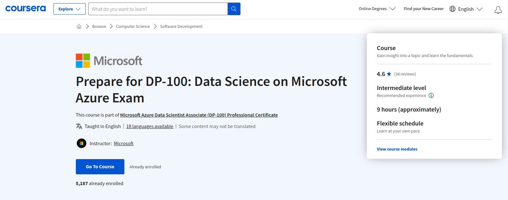

# Prepare for the DP-100: Designing and implementing a Data Science Solution on Azure Exam

Este curso es parte del [Certificado Profesional de Microsoft Azure Data Scientist Associate (DP-100)](https://www.coursera.org/professional-certificates/azure-data-scientist).



Al inscribirte en [este curso](https://www.coursera.org/learn/prepare-for-dp-100-design-a-data-science-solution-on-azure), también estarás inscrito en este Certificado Profesional.
- Aprende nuevos conceptos de expertos de la industria.
- Obtén una comprensión fundamental de un tema o herramienta.
- Desarrolla habilidades relevantes para el trabajo con proyectos prácticos.
- Obtén un certificado profesional compartible de Microsoft.

## INTRODUCTION

Las certificaciones de Microsoft te proporcionan una ventaja profesional al ofrecer evidencia reconocida a nivel mundial y respaldada por la industria de que has dominado habilidades en negocios digitales y en la nube. En este curso, te prepararás para realizar el examen de certificación DP-100 Azure Data Scientist Associate.

Actualizarás tus conocimientos sobre cómo planificar y crear un entorno de trabajo adecuado para las cargas de trabajo de ciencia de datos en Azure, ejecutar experimentos de datos y entrenar modelos predictivos. Además, repasarás cómo gestionar, optimizar e implementar modelos de aprendizaje automático en producción.

Evaluarás tus conocimientos mediante un examen de práctica vinculado a todos los temas principales cubiertos en el examen DP-100, asegurándote de estar bien preparado para el éxito en la certificación.

Obtendrás también una visión más detallada del programa de certificación de Microsoft y hacia dónde puedes dirigirte en tu carrera. También recibirás consejos, estrategias de prueba, recursos útiles e información sobre cómo inscribirte en el examen supervisado DP-100. Al finalizar este curso, estarás listo para inscribirte y realizar el examen DP-100.

Este es el quinto curso en un programa de cinco cursos que te prepara para realizar el examen de certificación DP-100: Designing and Implementing a Data Science Solution on Azure.

El examen de certificación es una oportunidad para demostrar conocimientos y experiencia en la operación de soluciones de aprendizaje automático a escala en la nube utilizando Azure Machine Learning. Esta especialización te enseña a aprovechar tus conocimientos existentes de Python y aprendizaje automático para gestionar la ingestión y preparación de datos, el entrenamiento y la implementación de modelos, y la supervisión de soluciones de aprendizaje automático en Microsoft Azure. Cada curso te enseña los conceptos y habilidades que se evalúan en el examen.

Esta especialización está destinada a científicos de datos con conocimientos previos de Python y marcos de aprendizaje automático como Scikit-Learn, PyTorch y Tensorflow, que desean construir y operar soluciones de aprendizaje automático en la nube. Enseña a los científicos de datos cómo crear soluciones de extremo a extremo en Microsoft Azure. Los estudiantes aprenderán a gestionar los recursos de Azure para el aprendizaje automático; ejecutar experimentos y entrenar modelos; implementar y operacionalizar soluciones de aprendizaje automático e implementar un aprendizaje automático responsable. También aprenderán a utilizar Azure Databricks para explorar, preparar y modelar datos; e integrar los procesos de aprendizaje automático de Databricks con Azure Machine Learning.

## INDEX 0

- [1 Welcome to the course](#1-welcome-to-the-course)
- [2 Microsoft Certification Program](#2-microsoft-certification-program)
- [3 Preparing for the exam](#3-preparing-for-the-exam)
- [4 Recap on create machine learning models](#4-recap-on-create-machine-learning-models)
- [5 Recap on create no-code models](#5-recap-on-create-no-code-models)
- [6 Recap on machine learning solutions](#6-recap-on-machine-learning-solutions)
- [7 Recap on Azure Databricks](#7-recap-on-azure-databricks)
- [8 Full practice exam](#8-full-practice-exam)
- [9 Take the exam](#9-take-the-exam)

# 1 Welcome to the course

## INDEX 1

- [1.1 Introduction to the course](#11-introduction-to-the-course)
- [1.2 Course Syllabus](#12-course-syllabus)
- [1.3 How to be successful in this course](#13-how-to-be-successful-in-this-course)
- [1.4 Sign-up for the Proctored Exam](#14-sign-up-for-the-proctored-exam)
- [1.5 Preparing for the DP-100 Exam](#15-preparing-for-the-dp-100-exam)

[<- Global Index](#index-0)

## 1.1 Introduction to the course
[<- Return to INDEX 1](#index-1)


Hola y bienvenido. En este curso, se preparará para el examen, DP100, diseño e implementación de una solución firmada de datos en Microsoft Azure.


Tendrá acceso a recursos que le ayudarán a prepararse para el examen de prática, mejorarán sus técnicas de estudio y le ayudarán a desarrollar estrategias de examen exitosas.


Actualizará sus conocimientos sobre cómo aplicar la ciencia de datos y el aprendizaje automático para implementar y ejecutar cargas de trabajo de aprendizaje automático en azure. 


Los exámenes de práctica de este curso están diseñados para ayudarle a evaluar sus conocimientos y la aplicación de los conceptos clave cubiertos en el examen DP100, diseño e implementación de una solución firmada de datos en Microsoft Azure.


Durante el examen de práctica final, revisará los temas y conceptos clave cubiertos en este programa. Estos temas se 
asignan a las cuatro áreas de dominio en el examen, DP 100 diseñar e implementar una solución firmada de datos en Microsoft 
Azure y incluyen: 

- gestionar los recursos de Azure para el aprendizaje automático, 
- ejecutar experimentos para entrenar modelos, 
- implementar y operacionalizar soluciones de aprendizaje automático, 
- implementar el aprendizaje automático responsable.


El examen práctico final incorpora los conceptos clave tratados en este programa y se asigna a las áreas de dominio que se han mencionado anteriormente. 


Imita el formato del examen de certificación, se le indicará qué preguntas ha acertado y su puntuación global, pero no obtendrá información sobre las opciones que ha seleccionado. 


A estas alturas, es posible que ya haya empezado a pensar en el aprendizaje y desarrollo o en sus objetivos profesionales, o que se pregunte cuál es el siguiente paso. 


 En este curso, tendrá la oportunidad de explorar otras certificaciones que le ayudarán en su estrategia de aprendizaje y desarrollo y que le ayudarán a prepararse para la carrera profesional que haya elegido. 


Al realizar el examen de práctica completo, podrá medir su preparación para realizar el examen de Microsoft Certified as 
your data scientists Associate Proctor. Una vez que haya completado el curso con éxito, recibirá un curso o un certificado. 
Si todo va bien, también recibirá un certificado al final de este programa.


Una vez que haya completado con éxito este programa de especialización y obtenido todos los certificados, estará listo para 
programar el examen DP100 Microsoft Certified Azure Data Scientists Associate Proctor a través de Pearson Vue. Buena suerte con su preparación.

## 1.2 Course Syllabus
[<- Return to INDEX 1](#index-1)

### Prepárese para el DP-100: Diseño e implementación de una solución de ciencia de datos en Azure Examen

En este curso, se preparará para el examen DP-100: Diseño e implementación de una solución de ciencia de datos en Azure. 

Actualizará sus conocimientos sobre cómo aplicar la ciencia de datos y el aprendizaje automático para implementar y ejecutar cargas de trabajo de aprendizaje automático en Azure

Pondrá a prueba sus conocimientos en una serie de exámenes de práctica asignados a todos los temas principales cubiertos en el examen DP-100, asegurándose de que está bien preparado para el éxito de la certificación.  

Se preparará para aprobar el examen de certificación realizando exámenes prácticos con un formato y contenido similares. 

### Módulo 1: Preparación para el DP-100: Diseño e implementación de una solución de ciencia de datos en Azure Examen 

En este módulo, también tendrá acceso a recursos que le ayudarán a prepararse para el examen supervisado, a mejorar sus técnicas de estudio y a desarrollar estrategias de examen exitosas. Tendrá la oportunidad de explorar algunas otras vías de certificación de Microsoft que pueden ayudarle a avanzar en su carrera. 

Después de completar este módulo, usted será capaz de: 

1) Identificar las oportunidades disponibles para su desarrollo futuro y la certificación de Microsoft y; 
2) Identificar las técnicas de estudio y estrategias necesarias para prepararse para un examen proctored

### Módulo 2: Examen práctico que cubre el Curso 1

En este módulo, tendrá la oportunidad de recapitular algunos de los puntos clave cubiertos en el 
**Curso 1: Crear modelos de aprendizaje automático en Microsoft Azure.** 

Después de completar este módulo, usted será capaz de: 

1) Prepararse para el examen final; 
2) Repasar los temas del examen; 
3) Realizar exámenes de práctica. 

### Módulo 3: Examen de práctica que cubre el Curso 2

En este módulo, tendrá la oportunidad de recapitular algunos de los puntos clave tratados en el 
**Curso 2: Microsoft Azure Machine Learning for Data Scientists.** 

Después de completar este módulo, usted será capaz de: 

1) Prepararse para el examen final; 
2) Repasar los temas del examen; 
3) Realizar exámenes de práctica. 

### Módulo 4: Examen práctico que cubre el Curso 3

En este módulo, tendrá la oportunidad de recapitular algunos de los puntos clave cubiertos en el 
**Curso 3: Construir y Operar Soluciones de Aprendizaje Automático con Azure Machine Learning.** 

Después de completar este módulo, usted será capaz de: 

1) Prepararse para el examen final; 
2) Repasar los temas del examen; 
3) Realizar exámenes de práctica.

### Módulo 5: Examen de práctica que cubre el Curso 4

En este módulo, tendrá la oportunidad de recapitular algunos de los puntos clave tratados en el 
**Curso 3: Realización de Ciencia de Datos con Azure Data Bricks.** 

Tras completar este módulo, será capaz de: 

1) Prepararse para el examen final; 
2) Repasar los temas del examen; 
3) Realizar exámenes de práctica. 

### Módulo 6: DP-100 Examen de Práctica

En este módulo, repasará las habilidades que se miden en el examen DP-100 y realizará el examen de práctica completo 
para medir lo que ha aprendido durante este programa. También se le proporcionará diversa información de apoyo que 
le ayudará a prepararse con éxito para el examen supervisado. 

Tras completar este módulo, será capaz de: 

1) Prepararse para el examen final; 
2) Repasar los temas del examen; 
3) Realizar exámenes de práctica

### Examen depráctica

En este curso, podrá comprobar sus progresos realizando el examen de práctica completo. Este examen se basa en un estilo 
y formato similares a los del examen DP-100 proctored

La realización del examen de prácticas le dará una buena idea de lo que puede esperar, así como la oportunidad de practicar 
la respuesta a preguntas con un formato y un contenido similares a los del examen supervisado. 

Este enfoque práctico le ayudará en su preparación para el examen **DP 100: Diseño e implementación de una solución de ciencia de datos en Azure.**

### Cuenta Microsoft

Necesita una cuenta Microsoft para iniciar sesión en el Sandbox, el portal Azure y otros servicios. Si no tiene una cuenta, puede crear una de forma gratuita. 

El Learn Sandbox permite el acceso gratuito y por tiempo determinado a una suscripción en la nube sin necesidad de 
tarjeta de crédito. Los alumnos pueden explorar, crear y gestionar recursos de forma segura sin miedo a incurrir en 
costes o "romper la producción".

### Limpieza

Siestá utilizando su propia suscripción Azure, se recomienda que siga las instrucciones de Limpieza para detener los recursos de computación después de completar cada lección. 

Cuando esté trabajando en su propia suscripción, también es una buena idea al final de un proyecto identificar si todavía necesita los recursos que creó. 

Los recursos que se quedan sin utilizar pueden costarle dinero. Puede eliminar los recursos individualmente o eliminar el grupo de recursos para eliminar todo el conjunto de recursos. 

> Nota: Si decide no completar este curso, asegúrese de detener su instancia de computación. Si está utilizando su suscripción Azure existente, esto le ayudará a evitar incurrir en cargos innecesarios. 

### Continúe su formación 

Eche un vistazo a las 
[Páginas de certificación de Microsoft](https://docs.microsoft.com/en-us/learn/azure/)
 para obtener más información sobre certificaciones y trayectorias.  

## 1.3 How to be successful in this course
[<- Return to INDEX 1](#index-1)

### ¡Su viaje de aprendizaje de Microsoft Azure comienza ahora!
Mientras se prepara para el examen o trabaja en la consecución de sus objetivos de aprendizaje, le animamos a:

Revise las directrices del examen y las habilidades medidas como punto de partida.

Trabaje a través de cada lección del itinerario de aprendizaje. Intente no saltarse ninguna actividad o lección a menos que esté seguro de que ya conoce esta información lo suficientemente bien como para seguir adelante.

Aproveche la oportunidad para volver atrás y ver un vídeo o leer la información adicional que se le proporcione antes de pasar a la siguiente lección o módulo.

Complete todos los cuestionarios, las preguntas de práctica del examen y los ejercicios. Durante las sesiones de práctica, tendrá la oportunidad de volver a repasar las preguntas para asegurarse de que está satisfecho con su progreso.

Lea atentamente los comentarios cuando responda a los cuestionarios o a los exámenes prácticos, ya que le ayudarán a reforzar lo que está aprendiendo.

Aproveche el entorno de aprendizaje práctico que le proporcionan los ejercicios. Podrá obtener un refuerzo sustancial de su aprendizaje mediante la aplicación paso a paso de sus conocimientos.

## 1.4 Sign-up for the Proctored Exam
[<- Return to INDEX 1](#index-1)

### Código de cupón del 50% de descuento para los exámenes de certificación de Microsoft

Una vez que haya completado con éxito este programa de especialización y haya obtenido sus certificados, estará listo para programar el examen Microsoft Certified: DP-100 Azure Data Scientist Associate.

Recibirá una notificación por correo electrónico que le dará la oportunidad de desbloquear un código de vale de certificación con descuento. Una vez desbloqueado el código, podrá utilizarlo para registrarse y programar el examen a través de Pearson Vue.

Además de un correo electrónico, los alumnos recibirán una notificación en la plataforma sobre el código de descuento cuando inicien sesión en Coursera.

### Canjee su vale

Le recomendamos encarecidamente que canjee su vale de descuento en un plazo de tres meses a partir de la recepción del código. 
Se trata de una oportunidad perfecta para obtener la certificación y avanzar en su carrera profesional en TI al tiempo 
que ahorra dinero.

### En persona o en línea

Una vez que esté listo para programar el examen supervisado, puede realizar los exámenes de certificación de Microsoft con Pearson VUE en persona en un Centro de Pruebas Autorizado, o en línea en la comodidad de su hogar u oficina mientras es supervisado por un supervisor externo.obtenga
[más información](https://home.pearsonvue.com/microsoft/op).

### Inscripción y programación

La programación de un examen de certificación de Microsoft con Pearson VUE comienza con la creación de un perfil de 
certificación de Microsoft. El registro es gratuito y sólo lleva unos minutos obtenga [más información](https://aka.ms/certdashboard).

Para crear un perfil de Certificación Microsoft, inicie sesión en
[Microsoft Learning](https://docs.microsoft.com/en-us/learn/certifications/)
utilizando una Cuenta Microsoft o MSA y rellene el formulario. (NOTA: El nombre de su perfil de Certificación Microsoft debe coincidir exactamente con el nombre que aparece en el documento de identidad emitido por el gobierno que presentará para acceder al examen).

Antes de programar o acceder a un examen de certificación de Microsoft, asegúrese de haber iniciado sesión en su
[panel de certificación](https://www.microsoft.com/en-us/learning/dashboard.aspx)
de Microsoft utilizando el correo electrónico asociado a su perfil de certificación de Microsoft.

Si tiene problemas para acceder a su panel de certificación de
[Microsoft](https://www.microsoft.com/en-us/learning/dashboard.aspx)
al programar o acceder a un examen de certificación, póngase en contacto con 
[el soporte de certificación de Microsoft](https://trainingsupport.microsoft.com/en-us/mcp/forum)
y un moderador de soporte le ayudará en un plazo de 24 horas.

Los pasos para registrarse y canjear su vale se han proporcionado a continuación para facilitar su consulta, junto con los términos y condiciones para utilizar el código de vale de descuento del 50%.

### Pasos para inscribirse en un examen y canjear su código de vale de descuento

1. Haga clic en el enlace del examen que desee. En la página del examen de certificación, desplácese hacia abajo y haga clic en el enlace "Programar con Pearson VUE".

2. Complete su "Perfil de certificación", acepte las Condiciones de uso y verifique su información. (NOTA: Compruebe en la esquina superior derecha de la página su número "MCID" autoasignado).

3. "EXAM DISCOUNTS page": Salte esta página haciendo clic en el botón "Schedule Exam". Esto le llevará a la plataforma de Pearson VUE para completar el registro y la compra de su examen.

4. Seleccione las opciones de examen que prefiera y haga clic en " Siguiente".

5. Acepte las políticas de examen. Haga clic en Siguiente.

6. Seleccione el idioma de examen que prefiera. Haga clic en Siguiente.

7. Seleccione el idioma que prefiere que hable su supervisor. Haga clic en Siguiente.

8. Seleccione la fecha y hora de su cita. Haga clic en Siguiente.

9. Revise su "carrito" de pedido de exámenes; a continuación, Proceda al pago.

10. Introduzca sus datos de pago y facturación, haga clic en Siguiente.

11. Introduzca su código de vale en la pantalla final de pago antes de enviar su pedido. El coste de su examen reflejará el descuento del 50%.

### Código del vale de descuento del 50% para los exámenes de certificación de Microsoft

**TÉRMINOS Y CONDICIONES**

Los códigos de vales de descuento para exámenes de certificación se rigen por las siguientes condiciones:

- Límite de un vale/código por persona- en ningún caso se distribuirá más de un vale a un mismo candidato.

- La aceptación del vale implica que, al aprobar un examen, acepta asociarse con su empleador, si procede, en el
[Centro de Socios de Microsoft](https://support.microsoft.com/en-us/help/4499930/partner-center-overview)
y declarar su ID de correo electrónico de Microsoft Learning (el utilizado para programar el examen) en el Centro de Socios de Microsoft. Las instrucciones para ello se detallan en este
[blog](https://nam06.safelinks.protection.outlook.com/?url=https%3A%2F%2Fsupport.microsoft.com%2Fen-us%2Fhelp%2F2966380%2Fprocedure-partner-center-link-or-unlink-a-microsoft-certified-professi&data=04%7C01%7Cv-mojane%40microsoft.com%7C5b6388d186974b0d802208d88a66daaf%7C72f988bf86f141af91ab2d7cd011db47%7C1%7C0%7C637411522399454593%7CUnknown%7CTWFpbGZsb3d8eyJWIjoiMC4wLjAwMDAiLCJQIjoiV2luMzIiLCJBTiI6Ik1haWwiLCJXVCI6Mn0%3D%7C1000&sdata=pmT93pvTtYiwEDyLzBYmrXDP%2BWf8qOgo6yL2G4%2FijVo%3D&reserved=0)
.

- Debe canjear el código de vale y realizar el examen antes de la Fecha de caducidad, que es de seis (6) meses a partir de la fecha de emisión.

- Cada código de vale sólo podrá canjearse una vez para realizar un examen de Certificación de Microsoft.

- Los códigos de vales son específicos del programa y, en algunos casos, específicos del examen y no pueden utilizarse para ninguna otra oferta.

- Los códigos de vale no pueden canjearse por dinero en efectivo, créditos o reembolsos.

- Los códigos de vale caducados, robados o perdidos no serán reemplazados.

- Cualquier venta o transferencia de este código de vale está expresamente prohibida y constituye un fraude.

- Este código de vale es nulo si se altera de cualquier forma.

- El código de vale no podrá aplicarse a exámenes que ya se hayan realizado.

- Microsoft, Pearson VUE y los centros de examen VUE no se responsabilizan de la pérdida o el robo de los códigos de cupón.

- Para inscribirse en un examen, visite la página
[Certificaciones Microsoft](https://docs.microsoft.com/en-us/learn/certifications/exams/az-204)
website.

- Deberá proporcionarse un código de vale al inscribirse en el examen de Certificación de Microsoft.

- Las personas que (a) no se presenten a su cita programada para el examen, o (b) cancelen o reprogramen su cita para realizar un examen con setenta y dos horas o menos de antelación a la hora programada pueden perder su código de vale (el código de vale no se puede volver a utilizar).

- Los impuestos, si los hubiera, son responsabilidad exclusiva del beneficiario.

## 1.5 Preparing for the DP-100 Exam
[<- Return to INDEX 1](#index-1)

¿Ha luchado alguna vez contra la ansiedad ante los exámenes? Existen muchas estrategias que pueden ayudarle, como una preparación minuciosa, diversas técnicas de estudio y actividades de relajación. Saber que ha hecho todo lo posible para prepararse puede ayudarle a sentirse más seguro antes de afrontar un examen

Para ayudar a sus compañeros, dedique un momento a compartir consejos o técnicas que le resulten útiles para superar la ansiedad ante los exámenes

### Temas sugeridos
Tema 1: ¿Cómo ayuda a reducir la ansiedad ante los exámenes descansar bien por la noche antes de un examen?

Tema 2: ¿Cómo puede ayudarle el hacer exámenes de práctica a templar los nervios mientras se prepara para el examen final?

Tema 3: ¿Ha creado alguna vez un resumen de una página con los conceptos e ideas clave que le ayude a repasar lo que ha estudiado?

# 2 Microsoft Certification Program

## INDEX 2

- [2.1 Lesson Introduction](#21-lesson-introduction)
- [2.2 Microsoft Certification Paths](#22-microsoft-certification-paths)
- [2.3 The Microsoft role-based certification](#23-the-microsoft-role-based-certification)
- [2.4 Jobs and Careers](#24-jobs-and-careers)
- [2.5 Additional Resources](#25-additional-resources)

[<- Global Index](#index-0)

## 2.1 Lesson Introduction
[<- Return to INDEX 2](#index-2)


En esta lección, examinará más de cerca los aspectos de la certificación de Microsoft mientras se prepara para el examen 
DP 100, diseñando e implementando una solución firmada de datos en Azure. 


Explorará las múltiples certificaciones de Microsoft, porque elegir la certificación adecuada desempeña un papel vital en el crecimiento de su carrera, y descubrirá las diversas certificaciones basadas en roles que Microsoft tiene que ofrecer. 


 Por último, examinará la gama de trabajos y carreras disponibles para aquellos que han alcanzado con éxito los niveles relevantes de certificación.

## 2.2 Microsoft Certification Paths
[<- Return to INDEX 2](#index-2)

La Certificación Microsoft proporciona acceso a certificaciones técnicas que puede adaptar a sus objetivos de aprendizaje y profesionales. Las personas obtienen la certificación aprobando uno o más exámenes que validan las habilidades necesarias para un rol o necesidad particular.

Existen múltiples certificaciones en Microsoft, elegir la certificación adecuada juega un papel vital en el crecimiento de su carrera.

### Principiante
Si desea llevar su carrera a mayores alturas en el mundo de la computación en nube, los exámenes de Fundamentos Certificados de Microsoft proporcionan una base sólida y son el punto de partida recomendado para algunas de las certificaciones de siguiente nivel.

Con el uso de los big data y la inteligencia artificial en auge, la demanda de personas con los conocimientos necesarios no deja de crecer.la oferta de científicos de datos, analistas de datos, ingenieros de IA, profesionales de la computación en nube, etc. no sigue el ritmo.

Este conjunto de exámenes proporciona un camino completo para aquellos que buscan iniciar una carrera en inteligencia artificial, ciencia de datos y computación en la nube.

- El **examen AZ-900** está diseñado para candidatos que buscan demostrar conocimientos básicos sobre las consideraciones y ventajas de adoptar servicios en la nube.este examen también cubrirá el conocimiento de las opciones disponibles y los beneficios obtenidos al implementar las ofertas de servicios en la nube de Microsoft Azure.

- El **examen DP-900** está diseñado para candidatos que buscan construir su conocimiento fundacional de los servicios de datos en la nube en Microsoft Azure. Este examen es ideal para los candidatos que quieren empezar a trabajar con datos en la nube y construir y obtener habilidades básicas en servicios de datos en la nube.

- El **examen AI-900** está diseñado para candidatos que buscan demostrar conocimientos básicos de cargas de trabajo comunes de ML e IA y cómo implementarlas en Azure.este examen es ideal para personas nuevas en la profesión de la nube y que desean iniciar su carrera en Inteligencia Artificial, Aprendizaje Automático o Ciencia de Datos.

### Intermedio

Las certificaciones de Microsoft incluyen los niveles de certificación Intermedio y Avanzado, que ofrecen a los candidatos 
la oportunidad de seguir aprendiendo nuevas habilidades y validar sus conocimientos. A continuación le ofrecemos 
una descripción de las certificaciones intermedias de Microsoft en el campo de los datos.

- El examen **DP-100** está diseñado para candidatos que buscan construir su carrera en la ciencia de datos. 
 El científico de datos de Azure aplica sus conocimientos de ciencia de datos y aprendizaje automático para implementar 
y ejecutar cargas de trabajo de aprendizaje automático en Azure; en particular, utilizando Azure Machine Learning Service.
 Esto implica planificar y crear un entorno de trabajo adecuado para las cargas de trabajo de la ciencia de datos en Azure, ejecutar experimentos de datos y entrenar modelos predictivos, gestionar y optimizar modelos, y desplegar modelos de aprendizaje automático en producción.

- El **examen DP-203** está diseñado para ingenieros de datos de Microsoft Azure. Se trata de una vía de certificación basada en roles y adaptada a quienes se encargan de implementar soluciones de datos en Azure.
 El examen se centra en poner a prueba las habilidades de los candidatos para diseñar e implementar soluciones de datos utilizando los servicios de Microsoft Azure. Tras superar con éxito este examen, los candidatos obtienen la certificación Azure Data Engineer Associate en Microsoft Azure.

- El **examen DP-300** está diseñado para profesionales que deseen desempeñar las funciones de administrador de bases de datos en la nube o especialista en gestión de bases de datos. 
El examen pone a prueba la capacidad de los candidatos para gestionar bases de datos relacionales en la nube y en las instalaciones, utilizando los servicios de datos de Microsoft Azure y Microsoft SQL Server. Tras superar con éxito este examen, los candidatos obtienen la certificación Azure Database Associate.

- El **examen AZ-220** está diseñado para desarrolladores que deseen especializarse en IoT. Las responsabilidadesde este puesto incluyen la gestión del ciclo de vida de los dispositivos -instalación, configuración y mantenimiento- utilizando servicios en la nube y otras herramientas.
Usted implementa diseños para soluciones Azure IoT incluyendo topología de dispositivos, conectividad, depuración y seguridad, así como soluciones para gestionar, supervisar y transformar canalizaciones de datos relacionadas con IoT. 
También despliega componentes de Azure IoT Edge y configura la red de dispositivos en el borde. Un desarrollador de Azure IoT trabaja con ingenieros de datos y otras partes interesadas para garantizar el éxito de la integración empresarial.

- El **examen AZ-140** está diseñado para administradores de Azurecon experiencia en la planificación, entrega y gestión de experiencias de escritorio virtual y aplicaciones remotas, para cualquier dispositivo, en Azure. 
Los candidatos a este examen deben tener experiencia en tecnologías Azure, incluyendo virtualización, redes, identidad, almacenamiento, copias de seguridad, resiliencia y recuperación ante desastres. Deberían comprender las tecnologías de infraestructura de escritorio virtual local en su relación con la migración a Windows Virtual Desktop. 
Estos profesionales utilizan el portal de Azure y las plantillas de Azure Resource Manager (ARM) para realizar muchas de sus tareas. Podrían utilizar PowerShell y la interfaz de línea de comandos (CLI) de Azure para una automatización más eficaz.

### Para obtener más información sobre la certificación de Microsoft, acceda a los siguientes enlaces:

[Examinar certificaciones y exámenes | Microsoft Docs](https://docs.microsoft.com/en-us/learn/certifications/browse/)

[Certificaciones de Fundamentos](https://docs.microsoft.com/en-us/learn/certifications/browse/?type=fundamentals)

[Preguntas frecuentes sobre el programa de certificación de Microsoft | Microsoft Docs](https://docs.microsoft.com/en-us/learn/certifications/microsoft-certification-program-faqs)

[PowerPoint | Presentación (microsoft.com)](https://query.prod.cms.rt.microsoft.com/cms/api/am/binary/RE4J5ea)

## 2.3 The Microsoft role-based certification
[<- Return to INDEX 2](#index-2)

En febrero de 2020, Microsoft anunció que eliminaría gradualmente las certificaciones MCSA, MCSE y MCSD a partir del 30 de junio de 2020, en favor de certificaciones "basadas en roles" centradas principalmente en Azure y Microsoft 365.

Microsoft ofrece nuevas certificaciones basadas en roles que se corresponden con las funciones técnicas laborales clave en el lugar de trabajo moderno. Encuentre su camino con la
[guía de certificaciones basadas en roles](https://docs.microsoft.com/en-us/learn/certifications/?WT.mc_id=certposter_poster-wwl)
.


Las credenciales Azure de nivel asociado incluyen Azure Administrator, Azure Developer Azure AI Engineer, Azure Data Scientist, Azure Data Engineer y Azure Security Engineer. El nivel experto incluye actualmente Azure DevOps Engineer y Azure Solutions Architect.

Acceda a los siguientes enlaces para explorar algunas de las certificaciones de Microsoft basadas en roles.

|                                                                                                                                                             **Certificación  basada en roles**                                                                                                                                                             |                             **Ruta de certificación**                            |
|:----------------------------------------------------------------------------------------------------------------------------------------------------------------------------------------------------------------------------------------------------------------------------------------------------------------------------------------------------------:|:--------------------------------------------------------------------------------:|
| Microsoft Certified Azure Administrator Associate: Los administradores implementan, supervisan y mantienen las soluciones de Microsoft. **Requisitos**: examen [AZ-104](https://docs.microsoft.com/en-us/learn/certifications/exams/az-104)                                                                                                                                                                                      | https://learn.microsoft.com/en-us/credentials/certifications/roles/administrator |
| Microsoft Certified Azure Developer Associate: Los desarrolladores diseñan, construyen, prueban y mantienen soluciones en la nube. **Requisitos:** examen [AZ-204 ](https://docs.microsoft.com/en-us/learn/certifications/exams/az-204)                                                                                                                                                                                              |       https://docs.microsoft.com/en-us/learn/certifications/roles/developer      |
| Microsoft Certified AI Engineer Associate: Los ingenieros de IA utilizan los servicios cognitivos, el aprendizaje automático y la minería del conocimiento para diseñar e implementar soluciones de IA de Microsoft. **Requisitos:** examen [AI-100](https://docs.microsoft.com/en-us/learn/certifications/exams/ai-100)                                                                                                             | https://docs.microsoft.com/en-us/learn/certifications/roles/ai-engineer          |
| Microsoft Certified Azure Data Science Associate: Los científicos de datos aplican técnicas de aprendizaje automático para entrenar, evaluar y desplegar modelos que resuelvan problemas empresariales. **Requisitos:** examen [DP-100 ](https://docs.microsoft.com/en-us/learn/certifications/exams/dp-100)                                                                                                                         | https://docs.microsoft.com/en-us/learn/certifications/roles/data-scientist       |
| Microsoft Certified Data Engineer Associate: Los ingenieros de datos diseñan e implementan la gestión, supervisión, seguridad y privacidad de los datos utilizando la pila completa de servicios de datos. **Requisitos:** examen [DP-203 ](https://docs.microsoft.com/en-us/learn/certifications/exams/dp-203)                                                                                                                      | https://docs.microsoft.com/en-us/learn/certifications/roles/data-engineer        |
| Microsoft Certified Azure Security Engineer Associate: Los ingenieros de seguridad de Azure implementan controles de seguridad y protección frente a amenazas, gestionan la identidad y el acceso y protegen los datos, las aplicaciones y las redes en entornos de nube e híbridos como parte de una infraestructura integral.  **Requisitos:** examen [AZ-500](https://docs.microsoft.com/en-us/learn/certifications/exams/az-500) | https://docs.microsoft.com/en-us/learn/certifications/roles/security-engineer    |
| Microsoft DevOps Engineer Expert: Los ingenieros DevOps combinan personas, procesos y tecnologías para ofrecer continuamente productos y servicios valiosos que satisfagan las necesidades de los usuarios finales y los objetivos empresariales. **Requisitos:** Examen [AZ-400](https://docs.microsoft.com/en-us/learn/certifications/exams/az-400)                                                                                | https://docs.microsoft.com/en-us/learn/certifications/roles/devops-engineer      |
| Microsoft Certified Azure Solutions Architect Expert: Los Arquitectos de Soluciones Azure diseñan e implementan soluciones que se ejecutan en Microsoft Azure, incluyendo aspectos como computación, red, almacenamiento y seguridad.  **Requisitos:** examen [AZ-303](https://docs.microsoft.com/en-us/learn/certifications/exams/az-303),[AZ-304](https://docs.microsoft.com/en-us/learn/certifications/exams/az-304)                                                                                    | https://docs.microsoft.com/en-us/learn/certifications/roles/solutions-architect  |

Recuerde visitar la página web de Certificación de Microsoft
[Examinar certificaciones y exámenes | Microsoft Docs](https://docs.microsoft.com/en-us/learn/certifications/browse/)
para obtener más información sobre cómo obtener la certificación Microsoft y todas las certificaciones disponibles en la actualidad.

## 2.4 Jobs and Careers
[<- Return to INDEX 2](#index-2)


Las organizaciones confían cada vez más en la ciencia de datos y el aprendizaje automático para tomar mejores decisiones, 
crecer y ser más eficientes en la gestión de cargas de trabajo cada vez mayores y en constante cambio.


 Los científicos de datos realizan análisis avanzados para extraer valor de los datos. 


Normalmente, el trabajo de un científico de datos puede variar de análisis descriptivo a análisis predictivo. 


Utilizan una metodología científica rigurosa y algoritmos para descubrir y resolver problemas empresariales y buscar 
oportunidades que ayuden a alcanzar los objetivos de su organización. 


El científico de datos de Microsoft Azure aplica los conocimientos de la ciencia de datos y el aprendizaje automático 
para implementar y ejecutar cargas de trabajo de aprendizaje automático en Azure. 


En concreto, utilizan el servicio de aprendizaje automático de Azure. Certificarse para estar al día de los últimos avances es clave para un científico de datos de Azure. 


Las responsabilidades de este puesto incluyen la planificación y la creación de un entorno de trabajo adecuado para las cargas de trabajo de ciencia de datos en Azure, la ejecución de experimentos de datos y el entrenamiento de modelos predictivos, y la gestión de la optimización y el despliegue de modelos de aprendizaje automático en producción. 


Ahora que ya conoce algunas de las funciones y responsabilidades relacionadas con una carrera como científico de datos de 
Microsoft Azure, siga adelante y consulte información útil sobre el examen. Y asegúrese de completar el examen de 
práctica, para estar mejor preparado para realizar el examen DP 100 diseño e implementación de una solución de ciencia 
de datos en Azure.

## 2.5 Additional Resources
[<- Return to INDEX 2](#index-2)

Los recursos que figuran a continuación le proporcionarán más información sobre las certificaciones de Microsoft, más concretamente en lo que se refiere a las funciones en los servicios de datos de Microsoft Azure. 

Certificación Microsoft: Administrador Asociado de Base de Datos Azure
https://docs.microsoft.com/en-us/learn/certifications/azure-database-administrator-associate/

Certificado por Microsoft: Azure Data Engineer Associate
https://docs.microsoft.com/en-us/learn/certifications/azure-data-engineer/

Certificado por Microsoft: Azure Data Scientist Associate
https://docs.microsoft.com/en-us/learn/certifications/azure-data-scientist/

Certificaciones Microsoft:
Certificaciones Microsoft | Microsoft Docs

Microsoft Azure Core Skill:
https://aka.ms/AzureCerts_Poster 

# 3 Preparing for the exam

## INDEX 3

- [3.1 Lesson Introduction](#31-lesson-introduction)
- [3.2 How to prepare for the Proctored Examination](#32-how-to-prepare-for-the-proctored-examination)
- [3.3 Topics covered in the Exam](#33-topics-covered-in-the-exam)
- [3.4 How the exam is administered](#34-how-the-exam-is-administered)
- [3.5 Exam strategy](#35-exam-strategy)
- [3.6 Tips and tricks](#36-tips-and-tricks)
- [3.7 Have you found any good exam prep materials?](#37-have-you-found-any-good-exam-prep-materials)
- [3.8 Additional Resources](#38-additional-resources)

[<- Global Index](#index-0)

## 3.1 Lesson Introduction
[<- Return to INDEX 3](#index-3)


En esta lección, podrás prepárese para el examen DP-100, diseñando e implementando una ciencia de datos solución en Azure.


Esto te ayudará para demostrar el dominio de las habilidades medido en el examen.


Verás los temas tratados en el examen, cómo se administra el examen y cómo prepararse para el examen supervisado, además de explorar la estrategia del examen y obtener algunos consejos y trucos útiles.

## 3.2 How to prepare for the Proctored Examination
[<- Return to INDEX 3](#index-3)

Puede realizar el examen con Pearson VUE utilizando su plataforma de entrega en línea OnVue. A continuación se ofrece un resumen de los requisitos de preparación para realizar el DP-100 como examen supervisado:

### Comprobación del equipo y del sistema
- Realice una prueba del sistema y complete las comprobaciones del sistema que sean necesarias

- Revise las guías de estudio y los materiales de preparación; sin embargo, no se le permite llevarlos consigo al examen.

- Asegúrese de que dispone de todo el hardware y el software adecuados, como un navegador web, una cámara web y un micrófono que funcione.

### Identificación y entorno
- Asegúrese de revisar todas las políticas del examen, especialmente las relativas al proceso de identificación.

- Debe disponer de una habitación o zona tranquila y libre de distracciones en su casa u oficina.

- Asegúrese de que dispone de una sala o espacio de pruebas limpio. No puede haber materiales de estudio, papel, libros u otros objetos que puedan infringir la política de examen.

### Registro y comienzo
- Si lo desea, puede registrarse hasta 30 minutos antes de su cita.

- Asegúrese de que su ordenador está configurado de acuerdo con las normas de examen. Desconecte los monitores adicionales e instale el software necesario.

Para conocer la lista completa de requisitos y la política de exámenes, consulte la página oficial de [PearsonVue.](https://home.pearsonvue.com/Clients/Microsoft/Online-proctored.aspx)

## 3.3 Topics covered in the Exam
[<- Return to INDEX 3](#index-3)

### Perfil del público
Los candidatos a la certificación Azure Jo Associate deben tener experiencia en la materia aplicando la ciencia de datos y el aprendizaje automático para implementar y ejecutar cargas de trabajo de aprendizaje automático
en Azure.

Las responsabilidades de este puesto incluyen la planificación y creación de un entorno de trabajo adecuado para las cargas de trabajo de ciencia de datos en Azure. Usted ejecuta experimentos de datos y entrena modelos predictivos. Además, usted gestiona, optimiza y despliega modelos de aprendizaje automático en producción.

El candidato a esta certificación debe tener conocimientos y experiencia en ciencia de datos y en el uso de Azure Machine Learning y Azure Databricks.

### Habilidades que se miden 

> NOTA: Las viñetas que aparecen debajo de cada una de las habilidades medidas pretenden ilustrar cómo estamos evaluando esa habilidad. Esta lista NO es definitiva ni exhaustiva. 

> NOTA: La mayoría de las preguntas cubren características que están en Disponibilidad General (GA). El examen puede contener preguntas sobre características Preview si dichas características se utilizan habitualmente.

### Administrar recursos de Azure para el aprendizaje automático (25-30%)

**Crear un espacio de trabajo de Azure Machine Learning**

- Configurar ajustes del espacio de trabajo
- Gestionar un espacio de trabajo utilizando Azure Machine Learning Studio

**Gestionar datos en un espacio de trabajo de Azure Machine Learning**

- Seleccionar recursos de almacenamiento de Azure
- Registrar y mantener almacenes de datos
- Crear y gestionar conjuntos de datos

**Gestionar cómputo para experimentos en Azure Machine Learning**

- Determinar las especificaciones de cómputo apropiadas para una carga de trabajo de entrenamiento
- Crear objetivos de cómputo para experimentos y entrenamiento
- Configurar recursos de cómputo adjuntos, incluido Azure Databricks
- Monitorizar la utilización de cómputo

**Implementar seguridad y control de acceso en Azure Machine Learning**

- Determinar los requisitos de acceso y asignar requisitos a roles integrados
- Crear roles personalizados
- Gestionar la membresía de roles
- Gestionar credenciales utilizando Azure Key Vault

**Configurar un entorno de desarrollo de Azure Machine Learning**

- Crear instancias de cómputo
- Compartir instancias de cómputo
- Acceder a espacios de trabajo de Azure Machine Learning desde otros entornos de desarrollo

**Configurar un espacio de trabajo de Azure Databricks**

- Crear un espacio de trabajo de Azure Databricks
- Crear un clúster de Azure Databricks
- Crear y ejecutar cuadernos en Azure Databricks
- Vincular un espacio de trabajo de Azure Databricks a un espacio de trabajo de Azure Machine Learning

### Ejecutar experimentos y entrenar modelos (20-25%)

**Crear modelos utilizando el diseñador de Azure Machine Learning**

- Crear un pipeline de entrenamiento utilizando el diseñador de Azure Machine Learning
- Ingerir datos en un pipeline de diseñador
- Utilizar módulos de diseñador para definir un flujo de datos del pipeline
- Utilizar módulos de código personalizado en el diseñador

**Ejecutar scripts de entrenamiento de modelos**

- Crear y ejecutar un experimento utilizando el SDK de Azure Machine Learning
- Configurar ajustes de ejecución para un script
- Consumir datos de un conjunto de datos en un experimento utilizando el SDK de Azure Machine Learning
- Ejecutar un script de entrenamiento en Azure Databricks Compute
- Ejecutar código para entrenar un modelo en un cuaderno de Azure Databricks

**Generar métricas a partir de la ejecución de un experimento**

- Registrar métricas de la ejecución de un experimento
- Recuperar y ver salidas de experimentos
- Utilizar registros para solucionar problemas de errores de ejecución de experimentos
- Utilizar MLflow para rastrear experimentos
- Rastrear experimentos en ejecución en Azure Databricks

**Utilizar el Aprendizaje Automático Automatizado para crear modelos óptimos**

- Utilizar la interfaz de Aprendizaje Automático Automatizado en Azure Machine Learning Studio
- Utilizar el Aprendizaje Automático Automatizado desde el SDK de Azure Machine Learning
- Seleccionar opciones de preprocesamiento
- Seleccionar los algoritmos a buscar
- Definir una métrica principal
- Obtener datos para una ejecución de Aprendizaje Automático Automatizado
- Recuperar el mejor modelo

**Ajustar hiperparámetros con Azure Machine Learning**

- Seleccionar un método de muestreo
- Definir el espacio de búsqueda
- Definir la métrica principal
- Definir opciones de terminación anticipada
- Encontrar el modelo con valores óptimos de hiperparámetros

### Implementar y operativizar soluciones de aprendizaje automático (35-40%)

**Seleccionar cómputo para el despliegue de modelos**

- Considerar la seguridad para servicios desplegados
- Evaluar opciones de cómputo para el despliegue

**Desplegar un modelo como un servicio**

- Configurar ajustes de despliegue
- Desplegar un modelo registrado
- Desplegar un modelo entrenado en Azure Databricks en un punto de conexión de Azure Machine Learning
- Consumir un servicio desplegado
- Solucionar problemas de contenedor de despliegue

**Gestionar modelos en Azure Machine Learning**

- Registrar un modelo entrenado
- Supervisar el uso del modelo
- Supervisar el cambio de datos

**Crear un pipeline de Azure Machine Learning para inferencia por lotes**

- Configurar un ParallelRunStep
- Configurar cómputo para un pipeline de inferencia por lotes
- Publicar un pipeline de inferencia por lotes
- Ejecutar un pipeline de inferencia por lotes y obtener salidas
- Obtener salidas de un ParallelRunStep

**Publicar un pipeline de diseñador de Azure Machine Learning como un servicio web**

- Crear un recurso de cómputo de destino
- Configurar un pipeline de inferencia
- Consumir un punto de conexión desplegado

**Implementar prácticas de ML Ops**

- Desencadenar un pipeline de Azure Machine Learning desde Azure DevOps
- Automatizar la reentrenamiento del modelo basado en nuevas adiciones de datos o cambios en los datos
- Refactorizar cuadernos en scripts
- Implementar control de fuente para scripts

### Implementar aprendizaje automático responsable (5-10%)

**Utilizar intérpretes de modelos para interpretar modelos**

- Seleccionar un intérprete de modelo
- Generar datos de importancia de características

**Describir consideraciones de equidad para modelos**

- Evaluar la equidad del modelo basada en disparidad de predicción
- Mitigar la inequidad del modelo

**Describir consideraciones de privacidad para datos**

- Describir los principios de la privacidad diferencial
- Especificar niveles aceptables de ruido en los datos y los efectos en la privacidad


## 3.4 How the exam is administered
[<- Return to INDEX 3](#index-3)

### En un centro de pruebas con Pearson VUE
Puede realizar su examen con Pearson VUE en uno de sus centros de pruebas repartidos por todo el mundo. Estos centros proporcionan un entorno de pruebas tranquilo con todas las instalaciones necesarias como aparcamiento, almacenamiento seguro, zona de facturación y espera, acceso para discapacitados, etc. 

Desde el punto de vista técnico, tendrá acceso a una estación de trabajo segura y supervisada con todo el hardware y el software necesarios.

Puede encontrar todos los detalles de los requisitos de las instalaciones del PVTC de Pearson VUE haciendo clic en 
[este enlace](https://home.pearsonvue.com/Documents/Test-center/pearsonvue_facility_reqs.aspx).

### Examen en línea supervisado con Pearson VUE
Puede realizar cualquier examen basado en roles o fundamentos de la Certificación Microsoft en Pearson VUE en línea, en su casa u oficina.

### Protocolo de la sesión de examen
Para mantener la integridad de los exámenes supervisados en un entorno en línea/con cámara web, se aplican políticas, prácticas y procedimientos específicos.

**Entorno de oficina o domicilio**

El entorno de su oficina o domicilio debe cumplir los siguientes requisitos:

- La oficina o sala de conferencias debe estar amurallada, tener una puerta cerrada y estar libre de interrupciones.

- Si realiza el examen en su domicilio, la sala debe estar libre de interrupciones.

- Nadie más puede estar o entrar en la sala durante su sesión de examen.

**Comunicación con la persona encargada de recibirle y con el supervisor:**

- Teléfono. Durante el proceso de registro, el saludador le pedirá su número de teléfono para comunicarse con usted mientras se registra para su examen. Una vez que haya completado el proceso de registro, se le pedirá que coloque su teléfono fuera de su alcance, pero lo suficientemente cerca como para ser escuchado.

- Ventana de chat. La mayor parte de la comunicación con el recepcionista y el supervisor se produce a través de la ventana de chat.

- Micrófono. Durante el proceso de registro y, en caso necesario, mientras realiza su examen, puede comunicarse con el saludador y el supervisor a través del micrófono.

- Idioma. Toda la comunicación con el saludador y el supervisor se lleva a cabo en un número limitado de idiomas que pueden ser diferentes del idioma en el que usted está realizando el examen.

**Verificación de identidad:**

- Deberá presentar un documento de identidad vigente expedido por el gobierno, como uno de los siguientes:

- Permiso de conducir

- Cartilla militar

- Pasaporte

- Documento de identidad (nacional/estatal/provincial)

- Tarjeta de registro de extranjeros (tarjeta verde, residente permanente, visado)

- Documento de identidad en el idioma local emitido por el gobierno (no en caracteres romanos)-sólo se aceptasi está emitido por el país en el que el candidato está realizando las pruebas

- Se le tomará una fotografía con cámara web junto con su documento de identidad.

- El nombre que figure en el documento de identidad emitido por el gobierno que presente para acceder al examen debe coincidir exactamente con el nombre que figure en su perfil de certificación de Microsoft. Si necesita cambiar el nombre de su perfil de Certificación Microsoft póngase en contacto con
[Soporte de Certificación](https://aka.ms/mcpforum)
antes del día del examen y un moderador del foro le ayudará.

- Los menores de 18 años pueden presentar un carné de estudiante válido como forma de identificación. El tutor del candidato también deberá presentar una identificación válida y deberá dar su consentimiento verbal durante el proceso de registro.

**Escaneado del área de trabajo:**

- Con su cámara web, teléfono u ordenador portátil, se le pedirá que escanee lentamente de izquierda a derecha para mostrar las paredes circundantes y que escanee hacia arriba y hacia abajo para mostrar el suelo y el techo. 
Si no es capaz de completar el escaneado del área de trabajo, no se le permitirá seguir adelante ni realizar el examen.

- A continuación, deberá escanear toda su área de trabajo. El supervisor buscará riesgos de seguridad, entre otros

- Monitores adicionales (deben estar desenchufados y alejados de usted)

- Ordenadores adicionales (deben estar apagados y los monitores deben estar a oscuras)

- El área de trabajo debe estar despejada de todos los materiales, incluidos los siguientes artículos que no están permitidos al alcance de la mano: libros, blocs de notas, notas Post-it, notas/papeles mecanografiados o instrumentos de escritura como bolígrafos, rotuladores, pizarras o lápices.

**Prohibido llevar efectos personales**

- Durante el examen, no podrá acceder a los siguientes tipos de objetos personales: ordenadores de mano u otros dispositivos electrónicos, localizadores, relojes, carteras, monederos, sombreros (u otros objetos que cubran la cabeza), bolsos, abrigos, libros, apuntes o cualquier otro material no aprobado específicamente.

- En caso de que surja algún problema de asistencia, el supervisor puede intentar ponerse en contacto con usted a través de su teléfono móvil en el número que le facilite durante el registro del examen. Asegúrese de que el número de su teléfono móvil incluye el prefijo del país. Es aceptable mantener el teléfono móvil cerca pero no al alcance de la mano.

- Es posible que se le pida que saque todos los bolsillos (los del pantalón y los de la americana/suéter) para que el encargado de recibirle pueda comprobar que están vacíos.

- Si lleva manga larga, puede que le pidan que se remangue para mostrar que no lleva nada escrito en los brazos.

- Si lleva corbata, puede que le pidan que se levante la corbata para mostrar al saludador que no hay nada oculto bajo la corbata.

- Si lleva el pelo largo que le cubra las orejas, se le podrá pedir que se eche el pelo hacia atrás para mostrar al encargado de saludarle que no lleva nada pegado a la oreja (como un auricular Bluetooth).

**No se permiten pausas/comer/beber**

- No se permiten pausas durante el examen por ningún motivo. Usted comprende y acepta que, si se toma un descanso, se invalidará la puntuación obtenida en el examen y no se le permitirá reanudarlo más tarde.

- Está prohibido comer, beber, fumar y mascar chicle durante el examen.

**Prohibida la asistencia al examen**

- Nadie puede entrar en la sala durante su sesión de examen. Si esto ocurre, su examen se dará por terminado.

- No puede recibir ayuda o asesoramiento de otras personas mientras realiza el examen, y no puede permitir que otras personas vean la pantalla del ordenador durante el examen.

- No se le permite utilizar libros u otros recursos, papel de borrador, pizarras borrables o cualquier otro objeto de escritura durante el examen. Tampoco se le permite utilizar ningún instrumento de escritura, como bolígrafo, rotulador o lápiz, durante la realización del examen.

- El supervisor no puede responder a preguntas relacionadas con el contenido del examen. Si tiene preguntas relacionadas con el contenido del examen, póngase en contacto con Microsoft una vez finalizado el examen.

**Política de comparación facial**

- Al inscribirse para la entrega de exámenes en línea, usted comprende y acepta que Pearson VUE puede utilizar tecnología de comparación facial con el fin de verificar su identidad durante el proceso de examen. 
Comparará su imagen facial con la de su identificación y con las imágenes faciales capturadas durante el proceso de examen para ayudarnos a seguir desarrollando, actualizando y mejorando esta aplicación.

- Si no está de acuerdo con esto, póngase en contacto con el centro de llamadas de Pearson VUE para programar el examen en un centro de pruebas.

**Grabación durante el examen**
- Al realizar este examen, el supervisor le vigilará continuamente por vídeo y audio, y se grabará su rostro, su voz, la sala física en la que está sentado y el lugar durante la realización del examen. 
Si no desea ser grabado (ni por vídeo ni por audio), notifíquelo inmediatamente al supervisor. NO podrá continuar con el examen.

## 3.5 Exam strategy
[<- Return to INDEX 3](#index-3)


Aprobar el examen con una buena nota es un objetivo alcanzable si está bien preparado y pone en práctica algunas 
estrategias básicas. Como ocurre con todos los exámenes, las distintas evaluaciones pueden requerir estrategias 
diferentes. A continuación, hablaremos de la estrategia principal que debe emplear para maximizar sus posibilidades de 
aprobar el examen DP-100. 


Una de las mejores formas de prepararse es realizar una prueba de práctica antes del examen. De este modo, podrá supervisar 
su progreso e identificar las áreas que podrían requerir un poco más de estudio o atención. 


A lo largo de este programa, habrá realizado comprobaciones de conocimientos y pruebas de práctica de preparación para 
el examen. Éstas están específicamente diseñadas para ayudarle a supervisar su progreso mientras le preparan para el 
examen real. 


Más adelante en este curso, realizará cuatro exámenes de práctica, donde cada uno de ellos se centrará en los temas y 
conceptos clave tratados en los cuatro cursos anteriores. Cada contenido del examen de práctica está asociado a un curso 
individual, por ejemplo, examen de práctica 1 al contenido del curso 1, y así sucesivamente. 

Los exámenes deben realizarse en orden secuencial, lo que significa que deberá completarlos en orden 1, 2, 3 y 4. 
Sólo podrá pasar al siguiente examen una vez que haya aprobado el anterior. 


Además de los cuatro exámenes prácticos, podrá comprobar su progreso realizando un examen práctico completo. Este examen 
se basa en un estilo y formato similares a los del examen DP-100 proctored. 


Dispondrá de 90 minutos para completar el examen práctico final. Al finalizar el examen, verá su puntuación global y 
las preguntas que ha contestado correctamente. 


No recibirá comentarios específicos sobre las opciones. Para que sea más realista, puede practicar utilizando su cámara 
para la experiencia completa del examen supervisado. Esta es una buena manera de familiarizarse con la experiencia de 
realizar un examen.


Recuerde que puede volver sobre cualquier lección en cualquier momento para repasar. Sólo tiene que hacer clic en 
cualquiera de los cuatro cursos y volver a estudiar la lección deseada. Una vez que haya completado con éxito los exámenes prácticos, es el momento de centrar su atención en el examen real.


 Una buena estrategia para el examen DP-100 puede resumirse con una lista de comprobación de lo que debe hacer el día del examen. 


Cuando llegue el día del examen, se recomienda que haga lo siguiente. 

- Esté bien descansado y tome una comida o un tentempié. 
- Intente evitar beber demasiada agua para que no necesite ir al baño durante el examen. 
- Dese tiempo suficiente para prepararse. Lo último que desea es sentirse apurado o llegar tarde al examen. 
- Lleve consigo la identificación adecuada. Si no está seguro, consulte la documentación oficial de Microsoft y Pearson VUE.
- El DP-100 es un examen a libro cerrado, lo que significa que no puede llevar ningún material de estudio o examen al examen con usted. Para obtener una lista completa, consulte el Contrato de Programa de Microsoft. 
- Asegúrese de leer detenidamente todas las instrucciones del examen y las normas del candidato. 
- Y, por último, tómese su tiempo y lea detenidamente las preguntas del examen. 

Si es posible, intente dejar algo de tiempo al final para revisar sus respuestas. 


Para proteger la seguridad del examen, Microsoft 

- no especifica los formatos de examen ni los tipos de preguntas antes del examen. 
- Microsoft introduce continuamente tecnologías de evaluación y tipos de preguntas innovadores, y 
- se reserva el derecho de incorporar cualquiera de ellos a los exámenes en cualquier momento sin previo aviso. 

Para hacerse una idea de lo que podría ver en un examen, le animamos a que revise algunos posibles formatos de examen y 
tipos de preguntas de la documentación de Microsoft. 


El examen puede contener cualquiera de los siguientes tipos de preguntas. 

1. Pantalla activa, 
2. mejor respuesta, 
3. lista de construcción, 
4. casos prácticos, 
5. arrastrar y soltar, 
6. área caliente, 
7. opción múltiple, 
8. opciones de respuesta repetidas, 
9. respuesta corta, 
10. laboratorios, 
11. revisión de marcas y 
12. pantalla de revisión. 


A la hora de responder a las preguntas del examen, he aquí algunas estrategias. 

Mantenga la calma y lea la pregunta en su totalidad antes de comprobar las opciones de respuesta. Los alumnos suelen elegir la opción incorrecta porque han leído mal la pregunta. Si hay varias opciones de respuesta, intente eliminar las respuestas que sabe que son un 100% incorrectas. Mediante este proceso de eliminación, podrá tachar todas las respuestas incorrectas. Esta herramienta visual le ayudará a centrarse en las respuestas restantes, y esto le ayudará a encontrar la respuesta correcta. Si no está seguro entre una o más respuestas posibles, intente encontrar la mejor respuesta a la pregunta planteada. Puede que ésta no sea siempre la respuesta que parece más correcta de forma aislada. Asegúrese de leer todas las opciones de respuesta antes de elegir una respuesta definitiva. Un error común que cometen los estudiantes es precipitarse y elegir esa primera respuesta que parece correcta sin leer todas las opciones disponibles. Si tiene dificultades con la pregunta, siga adelante y vuelva cuando haya respondido a todas las preguntas que sepa. Recuerde jugar al juego de los porcentajes. Intente no dedicar demasiado tiempo a una sola pregunta, lo que podría dejarle sin tiempo para el resto. Asegúrese de que dispone de tiempo suficiente para intentar todas las preguntas. Intente dejar algo de tiempo para repasar sus respuestas. Dependiendo del formato de la pregunta, es posible que no pueda cambiar su respuesta, pero para aquellas que sí pueda, querrá asegurarse de que las ha contestado correctamente. Durante este repaso, es posible que a veces sienta la tentación de dudar de sí mismo y cambiar su respuesta. Aunque esto puede funcionar en determinadas circunstancias, puede ser contraproducente. Tenga cuidado e intente confiar en sus instintos. Una vez más, tenga en cuenta que, dependiendo del formato de la pregunta, algunas respuestas no pueden cambiarse. El examen DP-100 no emplea la calificación negativa, lo que significa que no se le penalizará por hacer una conjetura incorrecta. Si no está seguro de una pregunta, intente hacer la mejor conjetura que pueda. Intente aplicar la lógica Azure que ya conoce, y elija la mejor respuesta posible. Tenga en cuenta que algunas preguntas aplicarán una calificación parcial, ya que puede haber más de una respuesta correcta requerida. Recuerde que una combinación acertada de preparación, estrategia de examen y técnica de examen le ayudará a maximizar sus posibilidades de obtener la certificación. Buena suerte.

## 3.6 Tips and tricks
[<- Return to INDEX 3](#index-3)


## 3.7 Have you found any good exam prep materials?
[<- Return to INDEX 3](#index-3)

¿Ha encontrado algún buen material de preparación para los exámenes?

¿Tiene una rutina de preparación o incluso algunos consejos y trucos que considere dignos de compartir? Comparta con sus compañeros de clase sus ideas sobre las estrategias que considera beneficiosas para preparar el examen DP-100.

## 3.8 Additional Resources
[<- Return to INDEX 3](#index-3)

Para más información sobre la resolución de problemas, formatos de examen y acuerdos, le recomendamos que acceda a los siguientes enlaces

Revise algunos de los posibles formatos del examen DP-100

https://docs.microsoft.com/en-us/learn/certifications/certification-exams#exam-formats-and-question-
tipos

Revise el acuerdo del programa de Microsoft

https://docs.microsoft.com/en-us/learn/certifications/microsoft-certification-program-agreement

Lea los requisitos de solución de problemas a nivel de administrador de red que se encuentran en el sitio web de PearsonVue

https://home.pearsonvue.com/op/OnVUE-min-specs-Network-Admin-Requirements

# 4 Recap on create machine learning models

## INDEX 4

- [4.1 Lesson Introduction](#41-lesson-introduction)
- [4.2 Recap on topics and key concepts covered in Create machine learning models](#42-recap-on-topics-and-key-concepts-covered-in-create-machine-learning-models)
- [4.3 Practice exam covering Course 1: Create machine learning models](#43-practice-exam-covering-course-1-create-machine-learning-models)

[<- Global Index](#index-0)

## 4.1 Lesson Introduction
[<- Return to INDEX 4](#index-4)


Hola de nuevo y bienvenidos a esta lección. A lo largo de este curso, tienes que familiarizarte con la creación de 
aprendizaje automático modelos en Microsoft Azure. El aprendizaje automático es la base del modelado predictivo y 
inteligencia artificial. 


 En esta lección, repasarás los conceptos clave y realizarás un examen práctico sobre los temas incluidos en el curso, 
 cree aprendizaje automático modelos en Microsoft Azure.

## 4.2 Recap on topics and key concepts covered in Create machine learning models
[<- Return to INDEX 4](#index-4)


En esta parte, resumirás los temas y los conceptos clave tratados en el curso. A estas alturas ya deberías tener un buen 
comprensión de los conceptos básicos del mundo de la ciencia de datos de Azure. Para ayudarlo a prepararse para el examen 
práctico, ahora resumiremos los temas que se trataron en el curso: crea una máquina modelos de aprendizaje en Microsoft 
Azure.


En el primer módulo, exploras los datos y creó modelos para predecir valores numéricos. Empezamos la lección explorando y 
analizando datos con Python y cómo puede usarlos para explorar, visualizar y manipular datos. 


Continuaste analizando el entrenamiento y evaluar los modelos de regresión. Y cómo funciona al establecer un relación 
entre las variables de los datos que representan características de lo que se observa y de la variable que estamos 
intentando predecir. 


También descubriste que la regresión es una técnica estadística de importancia fundamental para la ciencia. 
Por su facilidad de interpretación, robustez y rapidez en el cálculo. Los modelos de regresión proporcionan una excelente 
base para entender cómo funcionan las técnicas de aprendizaje automático más complejas. En situaciones del mundo real, 
particularmente cuando hay pocos datos disponibles, los modelos de regresión son muy útiles para hacer predicciones. 


Aprendiste que luego usas el scikit aprenda un marco en Python para entrenar y evaluar un modelo de regresión. Y cómo 
también puedes crear soluciones de aprendizaje automático para la regresión utilizando las herramientas gráficas en 
Microsoft Azure Machine Learning. 


Para ayudarlo a prepararse para el examen, también completó tres ejercicios de este módulo, que abarcan explore datos 
con NumPy y Pandas, visualice datos con Matlotlib y examina datos del mundo real.


 A continuación, exploraste cómo entrenar y evalúe los modelos de clasificación y agrupamiento y cómo son un formulario 
 de aprendizaje automático en el que se entrena un modelo para predecir qué categoría o clase y artículo a los que pertenecen.


Descubriste que una clasificación El algoritmo se usa para ajustar los datos de un subconjunto a una función que puede 
calcular la probabilidad. 


A continuación, pasó a descubriendo cómo la agrupación en clústeres es una forma de aprendizaje automático no supervisado, 
en la que las observaciones se agrupan en clústeres basados en similitudes.


En este módulo, tuvo la oportunidad de completar varios ejercicios, como 

- entrenar y evaluar un modelo de clasificación. 
- Realizar la clasificación con métricas alternativas. 
- Entrene y evalúe múltiples modelos de clasificación de clases. 
- Entrene y evalúe un modelo de agrupamiento. 
- Y entrena y evalúe los modelos avanzados de agrupamiento en clústeres. 


En el módulo final, aprendió a entrenar y evaluar los modelos de aprendizaje profundo. 


En la primera lección, exploraste cómo entrenar una red neuronal profunda. 
 Y aprendí que el aprendizaje profundo es una forma avanzada de aprendizaje automático que intenta emular el camino el 
 cerebro humano aprende.


Luego exploras lo básico principios del aprendizaje profundo. También aprendiste a entrenar una red neuronal profunda o 
DNN usando PyTorch o Tensorflow. 


Finalmente, completaste una neurona profunda establezca una red utilizando un cuaderno Júpiter mediante la definición 
de múltiples iteraciones también llamadas épocas. 


En la siguiente lección aprendiste cómo para entrenar una red neuronal convolucional o CNN. 


 Una CNN normalmente funciona extrayendo características de las imágenes y, a continuación, introducir esas características en un sistema totalmente conectado red neuronal para generar una predicción. 


Primer paso, aprendiste a entrenar una red neuronal convolucional CNN, usando PyTorch o Tensorflow. 


Luego aprendiste a usar la transferencia aprendiendo a entrenar una red neuronal convolucional (CNN) con PyTorch o Tensorflow. 


Finalmente, como parte de este módulo, tenías la oportunidad de completar ejercicios que le ayudarán a comprender de 
redes neuronales profundas. Cubre el entrenamiento de una red neuronal profunda, el entrenamiento de una neurona 
convolucional establecer redes y utilizar el aprendizaje por transferencia. 


Ahora ha resumido este curso y debería poder revisar los conceptos clave y realizar un examen práctico sobre los temas 
tratados en el curso, crean aprendizaje automático modelos en Microsoft Azure. Ya está listo para realizar un examen 
práctico, buena suerte.

## 4.3 Practice exam covering Course 1: Create machine learning models
[<- Return to INDEX 4](#index-4)


**Question 1**
Your manager has asked you to create a binary classification model to predict whether a person has a disease. You need to detect possible classification errors.

Which error type should you choose for the following description?

“A person has a disease. The model classifies the case as having a disease”.

- False negatives
- True positives
- True negatives
- False positives

*Correct: A true positive is an outcome where the model correctly predicts the positive class.*


**Question 2**
Your manager has asked you to create a binary classification model to predict whether a person has a disease. You need to detect possible classification errors.

Which error type should you choose for the following description?

“A person has a disease. The model classifies the case as having no disease”.

- True negatives
- True positives
- False negatives
- False positives

*Correct: A false negative is an outcome where the model incorrectly predicts the negative class.*


**Question 3**
You are tasked to analyze a dataset containing historical data from a local taxi company. You are developing a regression model for this. Your goal is to predict the fare of a taxi trip. You need to select performance metrics to correctly evaluate the regression model.

Which two metrics can you use?

- An R-Squared value close to 0
- An R-Squared value close to 1
- An F1 score that is low
- A Root Mean Square Error value that is low

*Correct: RMSE and R2 are both metrics for regression models. Root mean squared error (RMSE) creates a single value that summarizes the error in the model.
An R-Squared value close to 1: RMSE and R2 are both metrics for regression models. Coefficient of determination, often referred to as R2, represents the predictive power of the model as a value between 0 and 1.*


**Question 4**
You are creating a binary classification by using a two-class logistic regression model. You need to evaluate the model results for imbalance. Which evaluation metric should you use?

- AUC Curve
- Relative Absolute Error
- Relative Squared Error
- Mean Absolute Error

*Correct: One can inspect the true positive rate vs. the false positive rate in the Receiver Operating Characteristic (ROC) curve and the corresponding Area Under the Curve (AUC) value.*

**Question 5**
Your manager has provided you a dataset created for multiclass classification tasks that contains a normalized numerical feature set with 10,000 data points and 150 features. You use 75 percent of the data points for training and 25 percent for testing.

| Name    | Description            |
|---------|------------------------|
| X_train | Training feature set   |
| Y_train | Training class labels  |
| x_train | Testing feature set    |
| y_train | Testing class labels   |

You need to apply the Principal Component Analysis (PCA) method to reduce the dimensionality of the feature set to 10 features in both training and testing sets.

You are using the scikit-learn machine learning library in Python.

You use `X` to denote the feature set and `Y` to denote class labels.

You create the following Python data frames:

```python
from sklearn.decomposition import PCA

pca = PCA(n_components=___)
x_train = ___.fit_transform(X_train)
x_test = pca.___(X_test)
```
How should you complete the code segment?

- Box1: PCA(n_components=10000); Box2: pca; Box3: X_train
- Box1: PCA(n_components=150); Box2: pca; Box3: x_test
- Box1: PCA(n_components=10); Box2: model; Box3: transform(x_test)
- Box1: PCA(n_components=10); Box2: pca; Box3: transform(x_test)

Correct: Box 1: PCA(n_components = 10). Need to reduce the dimensionality of the feature set to 10 features in both 
training and testing sets. B
ox 2: pca fit_transform(X) fits the model with X and applies the dimensionality reduction on X. 
Box 3: transform(x_test) transforms(X) applies dimensionality reduction to X.


**Question 6**
You are creating a model to predict the price of a student’s artwork depending on the following variables: the student’s length of education, degree type, and art form.

You start by creating a linear regression model. You need to evaluate the linear regression model.

Solution: Use the following metrics: Mean Absolute Error, Root Mean Absolute Error, Relative Absolute Error, Accuracy, Precision, Recall, F1 score, and AUC:

Does the solution meet the goal?

- Yes
- No

*Correct: No. Accuracy, Precision, Recall, F1 score, and AUC are metrics for evaluating classification models; Mean Absolute Error, Root Mean Absolute Error, Relative Absolute Error are OK for the linear regression model.*


**Question 7**
What happens when a NumPy array is multiplied by 5?

- A: The new array will be 5 times longer, with the sequence repeated 5 times.
- B: Array stays the same size, but each element is multiplied by 5.
- C: The new array will be 5 times longer, with the sequence repeated 5 times and also all the elements are also multiplied by 5.

*Correct: B, This is how a list behaves when multiplied.*


**Question 8**
You are creating a model and you want to evaluate it. For this, you take a look at a specific metric which is directly proportional to how well the model fits.

Which evaluation model is described?

- Root Mean Square Error (RMSE)
- Coefficient of Determination (known as R-squared or R2)
- Mean Square Error (MSE)

*Correct: Coefficient of Determination (known as R-squared or R2). This is the described metric. In essence, this metric represents how much of the variance between predicted and actual label values the model is able to explain.*


**Question 9**
Complete the sentence:
Decision trees algorithms are examples of machine learning __________ type model.

- Clustering
- Regression
- Classification

*Correct:Regression, Decision trees take a step-by-step approach to predicting a variable.*

**Question 10**
It is well known that Python provides extensive functionality with powerful and statistical numerical libraries. What is 
tensorflow useful for?

- Providing attractive data visualizations
- Offering simple and effective predictive data analysis
- Supplying machine learning and deep learning capabilities
- Analyzing and manipulating data

*Correct: TensorFlow supplies machine learning and deep learning capabilities.*


# 5 Recap on create no-code models

## INDEX 5

- [5.1 Lesson Introduction](#51-lesson-introduction)
- [5.2 Recap of topics and key concepts covered in Create no-code predictive models with Azure Machine Learning](#52-recap-of-topics-and-key-concepts-covered-in-create-no-code-predictive-models-with-azure-machine-learning)
- [5.3 Practice exam covering Course 2: Create no-code predictive models with Azure Machine Learning](#53-practice-exam-covering-course-2-create-no-code-predictive-models-with-azure-machine-learning)

[<- Global Index](#index-0)

## 5.1 Lesson Introduction
[<- Return to INDEX 5](#index-5)


Hola de nuevo y bienvenido a esta lección. A lo largo de este curso, ha aprendido los principios fundamentales del aprendizaje automático en Azure.


Ha aprendido a aprovechar las capacidades del aprendizaje automático de Azure para entrenar e implementar un modelo predictivo. 


También exploró escenarios de aprendizaje automático de regresión, clasificación y agrupación.


A continuación, recapitulará los temas y conceptos clave tratados en el curso Aprendizaje automático de Microsoft Azure para científicos de datos. 


Por último, al final de la recapitulación del curso, tendrá la oportunidad de realizar un examen de práctica.

## 5.2 Recap of topics and key concepts covered in Create no-code predictive models with Azure Machine Learning
[<- Return to INDEX 5](#index-5)


## 5.3 Practice exam covering Course 2: Create no-code predictive models with Azure Machine Learning
[<- Return to INDEX 5](#index-5)

# 6 Recap on machine learning solutions

## INDEX 6

- [6.1 Lesson Introduction](#61-lesson-introduction)
- [6.2 Recap of topics and key concepts covered in Build and operate machine learning solutions with Azure Machine Learning](#62-recap-of-topics-and-key-concepts-covered-in-build-and-operate-machine-learning-solutions-with-azure-machine-learning)
- [6.3 Practice exam covering Course 3: Build and Operate Machine Learning Solutions with Azure Machine Learning](#63-practice-exam-covering-course-3-build-and-operate-machine-learning-solutions-with-azure-machine-learning)

[<- Global Index](#index-0)

## 6.1 Lesson Introduction
[<- Return to INDEX 6](#index-6)

## 6.2 Recap of topics and key concepts covered in Build and operate machine learning solutions with Azure Machine Learning
[<- Return to INDEX 6](#index-6)

## 6.3 Practice exam covering Course 3: Build and Operate Machine Learning Solutions with Azure Machine Learning
[<- Return to INDEX 6](#index-6)

# 7 Recap on Azure Databricks

## INDEX 7

- [7.1 Lesson Introduction](#71-lesson-introduction)
- [7.2 Recap of topics and key concepts covered in Perform data science with Azure Databricks](#72-recap-of-topics-and-key-concepts-covered-in-perform-data-science-with-azure-databricks)
- [7.3 Practice exam covering Course 4: Perform data science with Azure Databricks](#73-practice-exam-covering-course-4-perform-data-science-with-azure-databricks)

[<- Global Index](#index-0)

## 7.1 Lesson Introduction
[<- Return to INDEX 7](#index-7)

## 7.2 Recap of topics and key concepts covered in Perform data science with Azure Databricks
[<- Return to INDEX 7](#index-7)

## 7.3 Practice exam covering Course 4: Perform data science with Azure Databricks
[<- Return to INDEX 7](#index-7)

# 8 Full practice exam

## INDEX 8

- [8.1 Lesson Introduction](#81-lesson-introduction)
- [8.2 Weighted Core Concepts - Skills Measured](#82-weighted-core-concepts---skills-measured)
- [8.3 Full Practice Exam](#83-full-practice-exam)

[<- Global Index](#index-0)

## 8.1 Lesson Introduction
[<- Return to INDEX 8](#index-8)

## 8.2 Weighted Core Concepts - Skills Measured
[<- Return to INDEX 8](#index-8)

## 8.3 Full Practice Exam
[<- Return to INDEX 8](#index-8)

# 9 Take the exam

## INDEX 9

- [9.1 Career Support Information](#91-career-support-information)
- [9.2 Congratulations - What's Next?](#92-congratulations---whats-next)
- [9.3 Sign-up for the Proctored Exam](#93-sign-up-for-the-proctored-exam)
- [9.4 COVID-19 relief for taking the exam](#94-covid-19-relief-for-taking-the-exam)
- [9.5 Additional Reading](#95-additional-reading)
- [9.6 Course Review](#96-course-review)
- [9.7 What to Expect Next](#97-what-to-expect-next)

[<- Global Index](#index-0)

## 9.1 Career Support Information
[<- Return to INDEX 9](#index-9)

## 9.2 Congratulations - What's Next?
[<- Return to INDEX 9](#index-9)

## 9.3 Sign-up for the Proctored Exam
[<- Return to INDEX 9](#index-9)

## 9.4 COVID-19 relief for taking the exam
[<- Return to INDEX 9](#index-9)

## 9.5 Additional Reading
[<- Return to INDEX 9](#index-9)

## 9.6 Course Review
[<- Return to INDEX 9](#index-9)

## 9.7 What to Expect Next
[<- Return to INDEX 9](#index-9)
