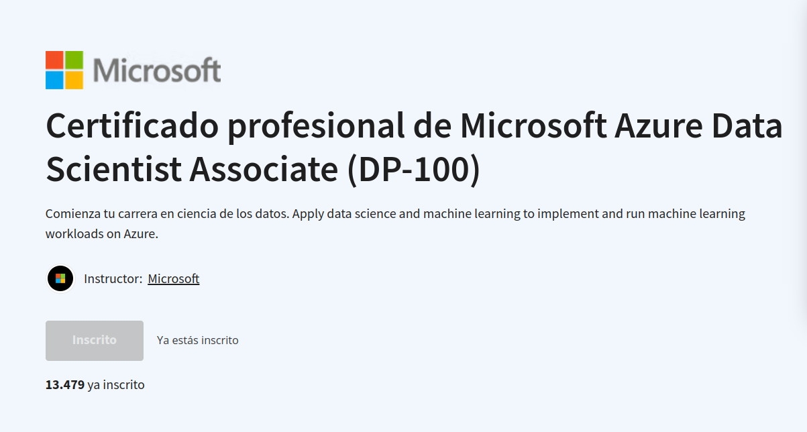

# Certificado profesional de Microsoft Azure Data Scientist Associate (DP-100)

## PROGRESO GENERAL: 

## INDICE:

-  [1 Create Machine Learning Models in Microsoft Azure](1%20Create%20Machine%20Learning%20Models%20in%20Microsoft%20Azure)
-  [2 Microsoft Azure Machine Learning for Data Scientists](2%20Microsoft%20Azure%20Machine%20Learning%20for%20Data%20Scientists)
-  [3 Build and Operate Machine Learning Solution with Azure](3%20Build%20and%20Operate%20Machine%20Learning%20Solution%20with%20Azure)
-  [4 Perform data science with Azure Databricks](4%20Perform%20data%20science%20with%20Azure%20Databricks)
-  [5 Prepare for DP-100 Data Science on Microsoft Azure Exam](5%20Prepare%20for%20DP-100%20Data%20Science%20on%20Microsoft%20Azure%20Exam)

Este Certificado Profesional está diseñado para científicos de datos con conocimientos previos de Python y marcos de trabajo de aprendizaje automático como Scikit-Learn, PyTorch y TensorFlow, que desean construir y operar soluciones de aprendizaje automático en la nube. Este Certificado Profesional enseña a los estudiantes cómo crear soluciones de extremo a extremo en Microsoft Azure. Aprenderán cómo gestionar recursos de Azure para el aprendizaje automático; ejecutar experimentos y entrenar modelos; implementar y operacionalizar soluciones de aprendizaje automático; e implementar un aprendizaje automático responsable. También aprenderán a utilizar Azure Databricks para explorar, preparar y modelar datos; e integrar procesos de aprendizaje automático de Databricks con Azure Machine Learning.

[Azure Data Scientist Associate (DP-100)](https://www.coursera.org/professional-certificates/azure-data-scientist)

Este programa consta de 5 cursos para ayudarte a prepararte para el Examen DP-100: Diseño e Implementación de una Solución de Ciencia de Datos en Azure. El examen de certificación es una oportunidad para demostrar conocimientos y experiencia en la operación de soluciones de aprendizaje automático a escala en la nube utilizando Azure Machine Learning. Este Certificado Profesional te enseña a aprovechar tus conocimientos existentes de Python y aprendizaje automático para gestionar la ingestión y preparación de datos, el entrenamiento y la implementación de modelos, y la monitorización de soluciones de aprendizaje automático en Microsoft Azure. Cada curso te enseña los conceptos y habilidades que se evalúan en el examen.

Al final de este programa, estarás listo para tomar el examen DP-100: Diseño e Implementación de una Solución de Ciencia de Datos en Azure.

## Proyecto de aprendizaje aplicado

Los estudiantes participarán en ejercicios interactivos a lo largo de este programa que ofrecen oportunidades para practicar e implementar lo que están aprendiendo. Trabajarán directamente en el Portal de Azure y utilizarán el Entorno de Pruebas de Microsoft Learn. Este es un entorno gratuito que permite a los estudiantes explorar Microsoft Azure y trabajar prácticamente con recursos y servicios reales de Microsoft Azure.

Por ejemplo, cuando aprendas sobre el entrenamiento de una red neuronal profunda, trabajarás en un entorno temporal de Azure llamado Sandbox. Lo interesante de esto es que trabajarás con tecnología real pero en un entorno controlado, lo que te permite aplicar lo que aprendes y hacerlo a tu propio ritmo.

Necesitarás una cuenta de Microsoft. Si no tienes una, puedes crear una de forma gratuita. El Entorno de Pruebas de Aprendizaje permite el acceso gratuito a una suscripción en la nube por un tiempo limitado y no requiere tarjeta de crédito. Los estudiantes pueden explorar, crear y gestionar recursos de forma segura sin el temor de incurrir en costos o "afectar la producción".

